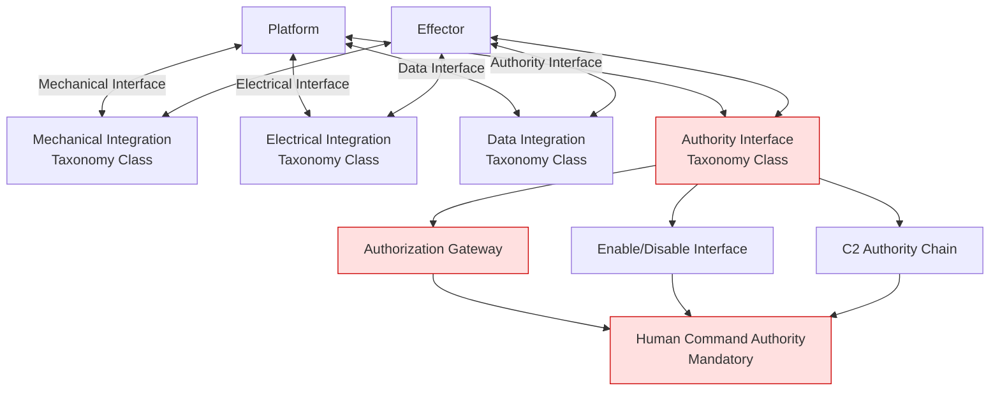

# DTTA 200-209 · 00.201.005 — Platform Integration and Authority Interfaces

## §1 Purpose

This document defines the taxonomy of platform integration points and authority interface boundaries for effector-to-platform integration governance within DTTA subsection 201. All interface classifications are at governance and taxonomy level only.

**Non-operational boundary:** This document classifies platform integration and authority interface taxonomy for governance purposes only. It does not define detailed engineering specifications, electrical schematics, mechanical installation parameters, or operational procedures. No system integration procedures or operational employment sequences are specified.

## §2 Scope

**In scope:**
- Integration interface taxonomy: mechanical, electrical, data, authority.
- Authority interface classification: authorization gateway, enable/disable interface, C2 authority chain taxonomy.
- Integration governance requirements: which interface types trigger which governance review gates.
- Interface boundary declarations between integration taxonomy classes.

**Out of scope:**
- Detailed engineering specifications, electrical schematics, or mechanical installation parameters.
- Connector pinouts, bus protocols at implementation level, or software API specifications.
- Operational employment procedures, integration test protocols, or maintenance schedules.

## §3 Diagram

> **Note:** All interface nodes represent governance taxonomy classifications only. No engineering implementation, wiring diagram, or operational procedure is defined or implied. Human command authority is a mandatory governance constraint at all authority interface points.

## §4 Footprint

| Field | Value |
|---|---|
| Architecture | Defence Technology Type Architecture (DTTA) |
| Master range | 200–299 |
| Code range | 200-209 |
| Section | 00 |
| Subsection | 201 |
| Subsubject | 005 |
| Primary Q-Division | Q-DATAGOV[^qdiv] |
| Support Q-Divisions | Q-SPACE, Q-HORIZON, Q-HPC, Q-STRUCTURES, Q-INDUSTRY |
| ORB support | ORB-LEG, ORB-PMO, ORB-FIN |
| Governance class | restricted[^gov] |
| Restricted rule | N-006[^n006] |
| Folder path | `Q+ATLANTIDE/200-299_DTTA/200-209_Sistemas-de-Combate-y-Armamento/201_Clasificacion-de-Efectores-y-Capacidades/` |
| Document | `005_Platform-Integration-and-Authority-Interfaces.md` |
| Parent subsection | [README.md](./README.md) · [000_Overview.md](./000_Overview.md) |
| Parent section | [../README.md](../README.md) |
| Parent architecture | [../../README.md](../../README.md) |
| Parent baseline | [organization/Q+ATLANTIDE.md](../../../../organization/Q+ATLANTIDE.md) |

## §5 References

[^baseline]: Q+ATLANTIDE controlled baseline — [organization/Q+ATLANTIDE.md](../../../../organization/Q+ATLANTIDE.md)
[^archtable]: §3 Architecture Table — parent architecture index [../../README.md](../../README.md)
[^qdiv]: Q-DATAGOV primary authority; Q-SPACE, Q-HORIZON, Q-HPC, Q-STRUCTURES, Q-INDUSTRY support.
[^gov]: Governance class `restricted` per N-006 for DTTA band documents.
[^n001]: Note N-001: taxonomy/traceability ecosystem only.
[^n004]: Note N-004 (No-AAA Rule).
[^n006]: Note N-006 (Restricted bands) — DTTA 200-299.

**Applicable standards:** STANAG 4586 · MIL-STD-1553 · IEC 61508 · NATO STANAG 2090.
