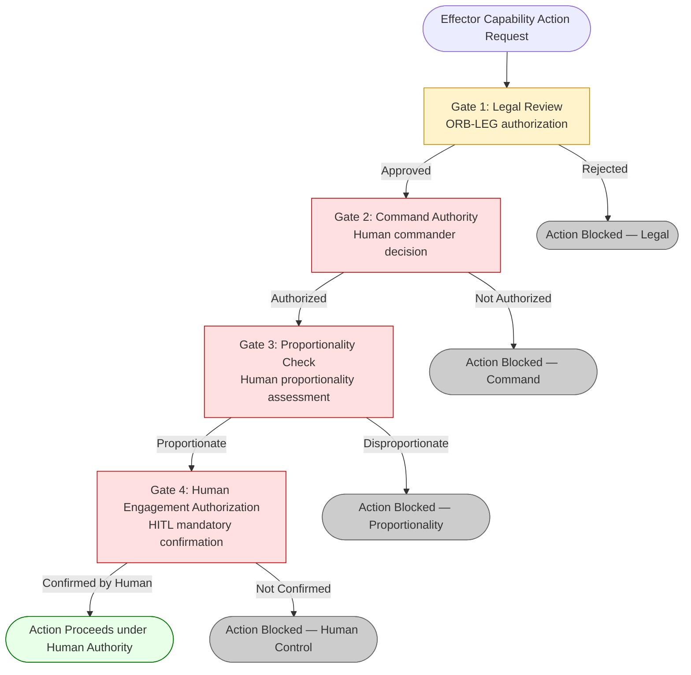

# DTTA 201 · 006 — Human Control, Rules-of-Use and Authorization Gates

## §1 Purpose

This document defines the human control framework, rules-of-use taxonomy, and authorization gate structure for effector capabilities within DTTA subsection 201. Mandatory human authority at all engagement-relevant decision points is a non-negotiable governance constraint. All definitions are at governance and taxonomy level only.

**Non-operational boundary:** This document defines human control and authorization gate taxonomy for governance purposes only. It does not define specific rules of engagement (ROE), operational authorization decisions, targeting authority chains, or operational command procedures. All human control taxonomy entries are governance instruments.

## §2 Scope

**In scope:**
- Human control taxonomy: Human-In-The-Loop (HITL), Human-On-The-Loop (HOTL), supervisory control classifications.
- Rules-of-use declaration framework for effector capability labelling.
- Authorization gate structure: legal review gate, command authority gate, proportionality check gate.
- ROE interface taxonomy at abstract level (governance boundary only; no specific ROE content).

**Out of scope:**
- Specific rules of engagement content, classified or otherwise.
- Operational authorization decisions, mission-specific authority chains.
- Targeting authority structures, fire control procedures.

## §3 Diagram

> **Note:** This diagram represents governance authorization gate taxonomy only. All gate nodes require human decision-making authority. No autonomous, automated, or algorithmic engagement authorization is defined, implied, or permitted[^n004].

## §4 Footprint

| Field | Value |
|---|---|
| Architecture | Defence Technology Type Architecture (DTTA) |
| Master range | 200–299 |
| Code range | 200-209 |
| Section | 00 |
| Subsection | 201 |
| Subsubject | 006 |
| Primary Q-Division | Q-DATAGOV[^qdiv] |
| Support Q-Divisions | Q-SPACE, Q-HORIZON, Q-HPC, Q-STRUCTURES, Q-INDUSTRY |
| ORB support | ORB-LEG, ORB-PMO, ORB-FIN |
| Governance class | restricted[^gov] |
| Restricted rule | N-006[^n006] |
| Folder path | `Q+ATLANTIDE/200-299_DTTA/200-209_Sistemas-de-Combate-y-Armamento/201_Clasificacion-de-Efectores-y-Capacidades/` |
| Document | `006_Human-Control-Rules-of-Use-and-Authorization-Gates.md` |
| Parent subsection | [README.md](./README.md) · [000_Overview.md](./000_Overview.md) |
| Parent section | [../README.md](../README.md) |
| Parent architecture | [../../README.md](../../README.md) |
| Parent baseline | [organization/Q+ATLANTIDE.md](../../../../organization/Q+ATLANTIDE.md) |

## §5 References

[^baseline]: Q+ATLANTIDE controlled baseline — [organization/Q+ATLANTIDE.md](../../../../organization/Q+ATLANTIDE.md)
[^archtable]: §3 Architecture Table — parent architecture index [../../README.md](../../README.md)
[^qdiv]: Q-DATAGOV primary authority; Q-SPACE, Q-HORIZON, Q-HPC, Q-STRUCTURES, Q-INDUSTRY support.
[^gov]: Governance class `restricted` per N-006 for DTTA band documents.
[^n001]: Note N-001: taxonomy/traceability ecosystem only.
[^n004]: Note N-004 (No-AAA Rule) — No autonomous, automated, or algorithmic attack authorization is defined, implied, or permitted within this subsection.
[^n006]: Note N-006 (Restricted bands) — DTTA 200-299.

**Applicable standards:** UN CCW Group of Governmental Experts on LAWS · NATO AJP-01 · STANAG 4586 · IEC 61508 · IHL principles (Additional Protocol I) · NATO AAP-06.
