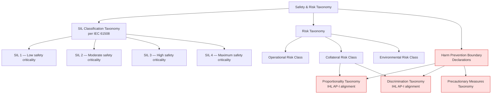

# DTTA 201 · 007 — Safety, Risk and Collateral Harm Prevention Boundaries

## §1 Purpose

This document defines safety classification, risk taxonomy, and collateral harm prevention framework for effector governance within DTTA subsection 201. Proportionality and discrimination principles are addressed at governance and taxonomy level only.

**Non-operational boundary:** This document defines safety and risk taxonomy at governance level only. It does not constitute an operational risk assessment, classified targeting harm assessment, live operation procedure, or mission-specific collateral damage estimation. All proportionality and discrimination entries are abstract governance taxonomy instruments aligned to IHL principles.

## §2 Scope

**In scope:**
- Safety SIL (Safety Integrity Level) classification taxonomy per IEC 61508 (abstract, for governance routing).
- Risk taxonomy: operational risk class, collateral risk class, environmental risk class.
- Proportionality assessment framework at abstract taxonomy level.
- Harm prevention boundary declarations aligned with IHL distinction and proportionality principles.
- Discrimination principle taxonomy for governance classification.

**Out of scope:**
- Operational risk assessments for specific systems or missions.
- Classified targeting harm assessment data or collateral damage estimation methodologies.
- Live operation procedures, mission planning, or operational ROE application.

## §3 Diagram

> **Note:** All nodes represent non-operational governance taxonomy labels aligned to IHL principles. No operational harm assessment, specific system risk evaluation, or live targeting procedure is defined or implied.

## §4 Footprint

| Field | Value |
|---|---|
| Architecture | Defence Technology Type Architecture (DTTA) |
| Master range | 200–299 |
| Code range | 200-209 |
| Section | 00 |
| Subsection | 201 |
| Subsubject | 007 |
| Primary Q-Division | Q-DATAGOV[^qdiv] |
| Support Q-Divisions | Q-SPACE, Q-HORIZON, Q-HPC, Q-STRUCTURES, Q-INDUSTRY |
| ORB support | ORB-LEG, ORB-PMO, ORB-FIN |
| Governance class | restricted[^gov] |
| Restricted rule | N-006[^n006] |
| Folder path | `Q+ATLANTIDE/200-299_DTTA/200-209_Sistemas-de-Combate-y-Armamento/201_Clasificacion-de-Efectores-y-Capacidades/` |
| Document | `007_Safety-Risk-and-Collateral-Harm-Prevention-Boundaries.md` |
| Parent subsection | [README.md](./README.md) · [000_Overview.md](./000_Overview.md) |
| Parent section | [../README.md](../README.md) |
| Parent architecture | [../../README.md](../../README.md) |
| Parent baseline | [organization/Q+ATLANTIDE.md](../../../../organization/Q+ATLANTIDE.md) |

## §5 References

[^baseline]: Q+ATLANTIDE controlled baseline — [organization/Q+ATLANTIDE.md](../../../../organization/Q+ATLANTIDE.md)
[^archtable]: §3 Architecture Table — parent architecture index [../../README.md](../../README.md)
[^qdiv]: Q-DATAGOV primary authority; Q-SPACE, Q-HORIZON, Q-HPC, Q-STRUCTURES, Q-INDUSTRY support.
[^gov]: Governance class `restricted` per N-006 for DTTA band documents.
[^n001]: Note N-001: taxonomy/traceability ecosystem only.
[^n004]: Note N-004 (No-AAA Rule).
[^n006]: Note N-006 (Restricted bands) — DTTA 200-299.

**Applicable standards:** IEC 61508 · MIL-STD-882E · Additional Protocol I (Geneva Conventions) — IHL proportionality and discrimination principles · Convention on Certain Conventional Weapons (CCW) · UN Arms Trade Treaty (ATT) · NATO AAP-06.
