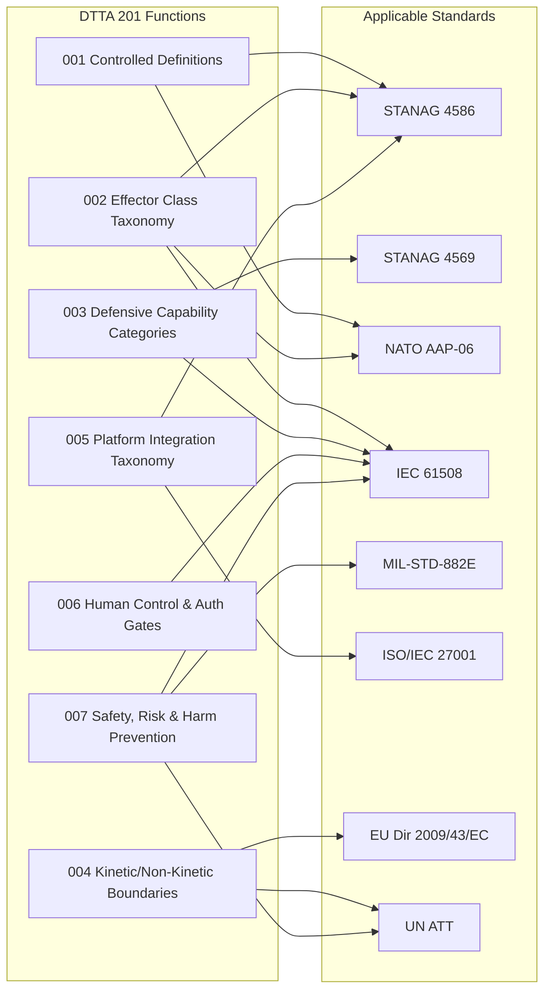

# DTTA 201 · 008 — Interoperability, NATO, EU and Standards Mapping

## §1 Purpose

This document maps the effector and capability taxonomy functions defined in subsubjects 001–007 to applicable NATO, EU, and international standards. It serves as the single reference for standards applicability and function-to-standard traceability within Q+ATLANTIDE DTTA subsection 201.

**Non-operational boundary:** This document provides standards mapping and interoperability taxonomy only. It does not define classified NATO tactical standards, operational employment standards, or mission-specific interoperability requirements. All mappings are governance-level traceability instruments.

## §2 Scope

**In scope:**
- STANAG applicability matrix for effector classification subsubjects 001–007.
- EU directive mapping to DTTA 201 governance functions.
- ISO/IEC standards applicability per governance function.
- Function-to-standard traceability for audit and evidence purposes.

**Out of scope:**
- Classified NATO tactical interoperability standards.
- Operational employment standards, mission-level interface specifications.
- System-level implementation standards (referenced by document ID only, not reproduced).

## §3 Diagram

> **Note:** This diagram represents governance-level standards traceability mapping only. Standards are referenced for compliance and audit purposes; their content is not reproduced here.

## §4 Applicable Standards Table

| Standard | Designation | Applicability in DTTA 201 |
|---|---|---|
| STANAG 4586 | NATO STANAG 4586 | Effector interface taxonomy, platform integration taxonomy |
| STANAG 4569 | NATO STANAG 4569 | Defensive capability categories, survivability taxonomy |
| NATO AAP-06 | NATO Glossary of Terms | Controlled definitions, terminology alignment |
| MIL-STD-882E | System Safety | Safety SIL taxonomy, risk taxonomy, harm prevention |
| IEC 61508 | Functional Safety | SIL classification, safety assurance taxonomy |
| ISO/IEC 27001 | Information Security | Data interface governance, authority interface security |
| EU Directive 2009/43/EC | EU Defence Products | Export control taxonomy, intra-EU transfer governance |
| UN ATT | UN Arms Trade Treaty | Kinetic/non-kinetic boundary legal escalation |

## §5 Footprint

| Field | Value |
|---|---|
| Architecture | Defence Technology Type Architecture (DTTA) |
| Master range | 200–299 |
| Code range | 200-209 |
| Section | 00 |
| Subsection | 201 |
| Subsubject | 008 |
| Primary Q-Division | Q-DATAGOV[^qdiv] |
| Support Q-Divisions | Q-SPACE, Q-HORIZON, Q-HPC, Q-STRUCTURES, Q-INDUSTRY |
| ORB support | ORB-LEG, ORB-PMO, ORB-FIN |
| Governance class | restricted[^gov] |
| Restricted rule | N-006[^n006] |
| Folder path | `Q+ATLANTIDE/200-299_DTTA/200-209_Sistemas-de-Combate-y-Armamento/201_Clasificacion-de-Efectores-y-Capacidades/` |
| Document | `008_Interoperability-NATO-EU-and-Standards-Mapping.md` |
| Parent subsection | [README.md](./README.md) · [000_Overview.md](./000_Overview.md) |
| Parent section | [../README.md](../README.md) |
| Parent architecture | [../../README.md](../../README.md) |
| Parent baseline | [organization/Q+ATLANTIDE.md](../../../../organization/Q+ATLANTIDE.md) |

## §6 References

[^baseline]: Q+ATLANTIDE controlled baseline — [organization/Q+ATLANTIDE.md](../../../../organization/Q+ATLANTIDE.md)
[^archtable]: §3 Architecture Table — parent architecture index [../../README.md](../../README.md)
[^qdiv]: Q-DATAGOV primary authority; Q-SPACE, Q-HORIZON, Q-HPC, Q-STRUCTURES, Q-INDUSTRY support.
[^gov]: Governance class `restricted` per N-006 for DTTA band documents.
[^n001]: Note N-001: taxonomy/traceability ecosystem only.
[^n004]: Note N-004 (No-AAA Rule).
[^n006]: Note N-006 (Restricted bands) — DTTA 200-299.

**Applicable standards:** STANAG 4586 · STANAG 4569 · NATO AAP-06 · MIL-STD-882E · IEC 61508 · ISO/IEC 27001 · EU Directive 2009/43/EC · UN Arms Trade Treaty (ATT).
