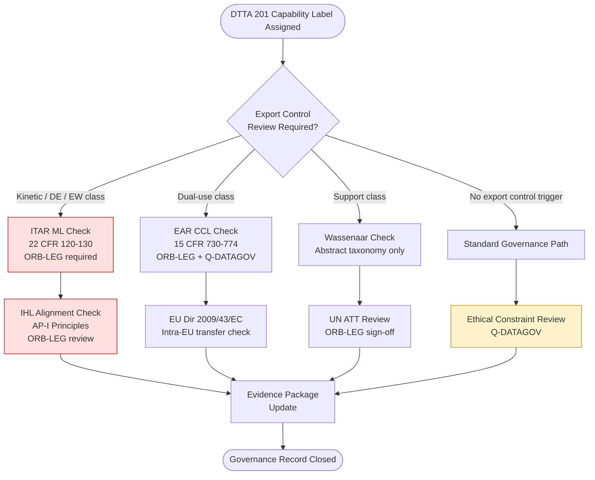

# DTTA 200-209 · 00.201.009 — Export Control, Legal and Ethical Constraints

## §1 Purpose

This document defines export control classification, legal boundary obligations, and ethical constraints for DTTA subsection 201 effector and capability taxonomy. Non-proliferation obligations are addressed at governance and taxonomy level only.

**Non-operational boundary:** This document addresses export control taxonomy, legal boundary obligations, and ethical constraint governance only. It does not reproduce classified control list items, country-specific export licence decisions, or specific product licence numbers. All export control taxonomy entries are abstract governance routing instruments referencing applicable regulatory frameworks by name only.

## §2 Scope

**In scope:**
- Export control taxonomy: ITAR Munitions List (ML) categories at abstract governance level, EAR Commerce Control List (CCL) taxonomy, Wassenaar Arrangement effector control list mapping at abstract level.
- IHL alignment requirements for effector classification labels.
- Ethical constraint framework: proportionality governance, discrimination governance, human dignity preservation taxonomy.
- Legal boundary declarations triggering ORB-LEG review.

**Out of scope:**
- Specific product licence numbers, export authorization codes, or classified control list line items.
- Country-specific trade decisions, individual export approvals, or denied-party determinations.
- Detailed ITAR/EAR compliance procedures (referenced by regulatory citation only).

## §3 Diagram

> **Note:** This diagram represents export control and legal boundary governance routing only. No specific licence decision, country determination, or classified control list item is defined or implied.

## §4 Footprint

| Field | Value |
|---|---|
| Architecture | Defence Technology Type Architecture (DTTA) |
| Master range | 200–299 |
| Code range | 200-209 |
| Section | 00 |
| Subsection | 201 |
| Subsubject | 009 |
| Primary Q-Division | Q-DATAGOV[^qdiv] |
| Support Q-Divisions | Q-SPACE, Q-HORIZON, Q-HPC, Q-STRUCTURES, Q-INDUSTRY |
| ORB support | ORB-LEG, ORB-PMO, ORB-FIN |
| Governance class | restricted[^gov] |
| Restricted rule | N-006[^n006] |
| Folder path | `Q+ATLANTIDE/200-299_DTTA/200-209_Sistemas-de-Combate-y-Armamento/201_Clasificacion-de-Efectores-y-Capacidades/` |
| Document | `009_Export-Control-Legal-and-Ethical-Constraints.md` |
| Parent subsection | [README.md](./README.md) · [000_Overview.md](./000_Overview.md) |
| Parent section | [../README.md](../README.md) |
| Parent architecture | [../../README.md](../../README.md) |
| Parent baseline | [organization/Q+ATLANTIDE.md](../../../../organization/Q+ATLANTIDE.md) |

## §5 References

[^baseline]: Q+ATLANTIDE controlled baseline — [organization/Q+ATLANTIDE.md](../../../../organization/Q+ATLANTIDE.md)
[^archtable]: §3 Architecture Table — parent architecture index [../../README.md](../../README.md)
[^qdiv]: Q-DATAGOV primary authority; Q-SPACE, Q-HORIZON, Q-HPC, Q-STRUCTURES, Q-INDUSTRY support.
[^gov]: Governance class `restricted` per N-006 for DTTA band documents.
[^n001]: Note N-001: taxonomy/traceability ecosystem only.
[^n004]: Note N-004 (No-AAA Rule).
[^n006]: Note N-006 (Restricted bands) — DTTA 200-299.

**Applicable standards:** ITAR (22 CFR 120-130) · EAR (15 CFR 730-774) · Wassenaar Arrangement · EU Directive 2009/43/EC · UN Arms Trade Treaty (ATT) · IHL Additional Protocol I (Geneva Conventions) · Convention on Certain Conventional Weapons (CCW).
