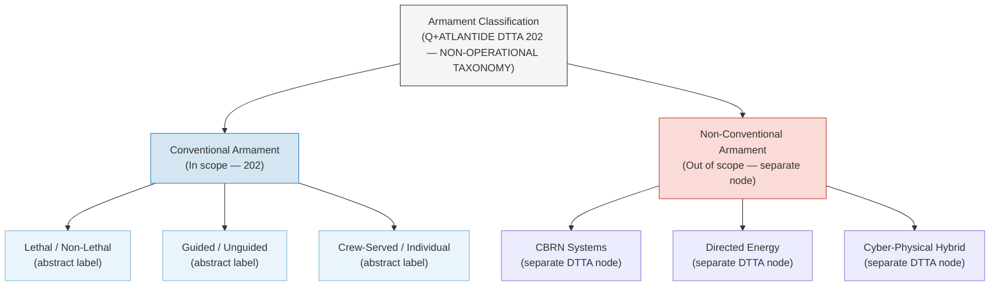

# DTTA 202 · Subsubject 001 — Conventional Armament Controlled Definition

## §1 Purpose

This document establishes the Q+ATLANTIDE[^baseline] controlled definition of "conventional armament" for DTTA 202. It is strictly non-operational and provides only governance taxonomy.

**Non-operational boundary:** This subsection is restricted to classification, governance, custody, safety, accountability and legal-control taxonomy. It does not define construction details, deployment methods, targeting logic, tactical employment, optimization for harm, performance enhancement or operational weapon procedures.

The definition aligns with the Wassenaar Arrangement ML-category framework as an abstract taxonomy reference only — no specific items, control list entries or operational specifications are reproduced. Armament classifications within Q+ATLANTIDE must remain abstract, legally reviewable and non-operational.

This document provides:

- Q+ATLANTIDE normative definition of "conventional armament" within DTTA 202 scope.
- Disambiguation boundary between conventional armament and non-conventional / CBRN systems.
- Abstract macro-class labels for governance classification purposes.
- Normative terminology binding all subsubjects 002–010.

## §2 Scope

**In scope:**
- Controlled definition of conventional armament within DTTA 202 governance context.
- Disambiguation from non-conventional systems and CBRN (Chemical, Biological, Radiological, Nuclear) armament.
- Abstract taxonomy of conventional armament macro-classes (guided/unguided, lethal/non-lethal, crew-served/individual — abstract labels only for governance classification).
- Q+ATLANTIDE normative terminology for use across subsubjects 002–010.

**Out of scope:**
- Construction parameters, materials or engineering specifications of any armament.
- Specific weapon system descriptions, model numbers or platform configurations.
- Performance data, range data, payload specifications or lethality assessments.
- Operational employment, targeting logic or engagement procedures.
- Specific Wassenaar ML-list entries (classified content).

### Normative Definition

> **Conventional armament** (Q+ATLANTIDE DTTA 202): Any kinetic, explosive, or directed-mechanical system designed, manufactured or adapted for use in armed conflict or security operations, which is not classified as chemical, biological, radiological or nuclear (CBRN), and which is subject to applicable national and international legal control regimes. For DTTA governance purposes, classification is based on legal-control applicability, not on operational characteristics.

### Disambiguation Boundary

| Category | Classification | DTTA 202 Scope |
|---|---|---|
| Small arms (abstract) | Conventional | In scope |
| Light weapons (abstract) | Conventional | In scope |
| Crew-served weapons (abstract) | Conventional | In scope |
| Heavy weapons (abstract) | Conventional | In scope |
| Guided munitions (abstract) | Conventional | In scope |
| CBRN systems | Non-conventional | Out of scope |
| Directed energy weapons | Contested/separate | Out of scope |
| Cyber-physical hybrid systems | Separate taxonomy | Out of scope |

## §3 Diagram

> **Note:** This diagram represents abstract governance taxonomy only. No operational, construction, or performance information is conveyed.

## §4 Footprint

| Field | Value |
|---|---|
| Architecture | Defence Technology Type Architecture (DTTA) |
| Master range | 200–299 |
| Code range | 200-209 |
| Section | 00 |
| Subsection | 202 |
| Subsubject | 001 |
| Primary Q-Division | Q-DATAGOV[^qdiv] |
| Support Q-Divisions | Q-SPACE, Q-HORIZON, Q-HPC, Q-STRUCTURES, Q-INDUSTRY |
| ORB support | ORB-LEG, ORB-PMO, ORB-FIN |
| Governance class | restricted[^gov] |
| Restricted rule | N-006[^n006] |
| Folder path | `Q+ATLANTIDE/200-299_DTTA/200-209_Sistemas-de-Combate-y-Armamento/202_Armamento-Convencional-Clasificacion-y-Control/` |
| Document | `001_Conventional-Armament-Controlled-Definition.md` |
| Parent subsection | [README.md](./README.md) · [000_Overview.md](./000_Overview.md) |
| Parent section | [../README.md](../README.md) |
| Parent architecture | [../../README.md](../../README.md) |
| Parent baseline | [organization/Q+ATLANTIDE.md](../../../../organization/Q+ATLANTIDE.md) |

## §5 References

[^baseline]: Q+ATLANTIDE controlled baseline — [organization/Q+ATLANTIDE.md](../../../../organization/Q+ATLANTIDE.md)
[^archtable]: §3 Architecture Table (parent) — [../../README.md](../../README.md)
[^qdiv]: Q-DATAGOV primary; Q-SPACE, Q-HORIZON, Q-HPC, Q-STRUCTURES, Q-INDUSTRY support.
[^gov]: Governance class `restricted` per N-006.
[^n001]: Note N-001: taxonomy/traceability ecosystem only — no operational, construction or performance content.
[^n004]: Note N-004 (No-AAA Rule): No autonomous armament activation, targeting or engagement logic permitted.
[^n006]: Note N-006 (Restricted bands) — DTTA 200-299.

- Wassenaar Arrangement — Munitions List (ML) abstract framework reference. <https://www.wassenaar.org>
- UN Arms Trade Treaty (ATT) — Article 2 scope and definitions. <https://www.thearmstradetreaty.org>
- ITAR 22 CFR 121 — United States Munitions List abstract category reference.
- NATO AAP-06 — NATO Glossary of Terms and Definitions (controlled terminology).
- OSCE Best Practices Guide for Conventional Ammunition — governance reference.
