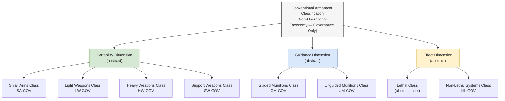

# DTTA 202 · Subsubject 002 — Conventional Armament Classes, Non-Operational Taxonomy

## §1 Purpose

This document defines the non-operational taxonomy of conventional armament classes for governance, classification and traceability within DTTA 202.

**Non-operational boundary:** This subsection is restricted to classification, governance, custody, safety, accountability and legal-control taxonomy. It does not define construction details, deployment methods, targeting logic, tactical employment, optimization for harm, performance enhancement or operational weapon procedures. All class labels in this document are abstract governance identifiers only — they carry no construction, performance or operational specifications.

The taxonomy established here is used across subsubjects 003–010 as the canonical class reference for:

- Assigning governance escalation triggers based on class membership.
- Mapping class labels to applicable legal and export-control regimes (→ subsubject 008).
- Determining storage and handling governance requirements (→ subsubject 004).
- Assigning risk classification triggers (→ subsubject 007).

## §2 Scope

**In scope:**
- Armament class taxonomy hierarchy (abstract governance labels only).
- Non-operational labels for classification governance — e.g., light weapons class, heavy weapons class, support weapons class — as abstract governance identifiers.
- Class boundary definitions for governance and escalation purposes.
- Governance escalation triggers based on class assignment.

**Out of scope:**
- Detailed specifications, performance parameters or construction data for any class.
- Targeting parameters, accuracy data, or operational range specifications.
- Classified specifications or controlled technical data.
- Specific weapon system models, programmes or platform configurations.

### Armament Class Taxonomy (Non-Operational, Governance Labels Only)

| Class Label | Governance Identifier | Escalation Trigger |
|---|---|---|
| Small Arms Class | SA-GOV | Standard restricted |
| Light Weapons Class | LW-GOV | Elevated — additional legal review |
| Heavy Weapons Class | HW-GOV | High — mandatory ORB-LEG clearance |
| Support Weapons Class | SW-GOV | Elevated — additional safety governance |
| Guided Munitions Class | GM-GOV | High — mandatory export-control review |
| Unguided Munitions Class | UM-GOV | Standard restricted |
| Non-Lethal Systems Class | NL-GOV | Standard restricted |

> **Note:** Class labels are abstract governance identifiers. No construction, performance or operational content is implied or conveyed by these labels.

## §3 Diagram

> **Note:** This diagram is a non-operational governance classification hierarchy. No operational, construction, or performance information is conveyed.

## §4 Footprint

| Field | Value |
|---|---|
| Architecture | Defence Technology Type Architecture (DTTA) |
| Master range | 200–299 |
| Code range | 200-209 |
| Section | 00 |
| Subsection | 202 |
| Subsubject | 002 |
| Primary Q-Division | Q-DATAGOV[^qdiv] |
| Support Q-Divisions | Q-SPACE, Q-HORIZON, Q-HPC, Q-STRUCTURES, Q-INDUSTRY |
| ORB support | ORB-LEG, ORB-PMO, ORB-FIN |
| Governance class | restricted[^gov] |
| Restricted rule | N-006[^n006] |
| Folder path | `Q+ATLANTIDE/200-299_DTTA/200-209_Sistemas-de-Combate-y-Armamento/202_Armamento-Convencional-Clasificacion-y-Control/` |
| Document | `002_Conventional-Armament-Classes-Non-Operational-Taxonomy.md` |
| Parent subsection | [README.md](./README.md) · [000_Overview.md](./000_Overview.md) |
| Parent section | [../README.md](../README.md) |
| Parent architecture | [../../README.md](../../README.md) |
| Parent baseline | [organization/Q+ATLANTIDE.md](../../../../organization/Q+ATLANTIDE.md) |

## §5 References

[^baseline]: Q+ATLANTIDE controlled baseline — [organization/Q+ATLANTIDE.md](../../../../organization/Q+ATLANTIDE.md)
[^archtable]: §3 Architecture Table (parent) — [../../README.md](../../README.md)
[^qdiv]: Q-DATAGOV primary; Q-SPACE, Q-HORIZON, Q-HPC, Q-STRUCTURES, Q-INDUSTRY support.
[^gov]: Governance class `restricted` per N-006.
[^n001]: Note N-001: taxonomy/traceability ecosystem only — no operational, construction or performance content.
[^n004]: Note N-004 (No-AAA Rule): No autonomous armament activation, targeting or engagement logic permitted.
[^n006]: Note N-006 (Restricted bands) — DTTA 200-299.

- Wassenaar Arrangement — Munitions List abstract taxonomy reference. <https://www.wassenaar.org>
- NATO AAP-06 — NATO Glossary of Terms and Definitions.
- OSCE Best Practices Guide for Conventional Ammunition.
- MIL-STD-882E — System Safety (hazard classification reference).
- ITAR (22 CFR 121) — abstract category taxonomy reference.
