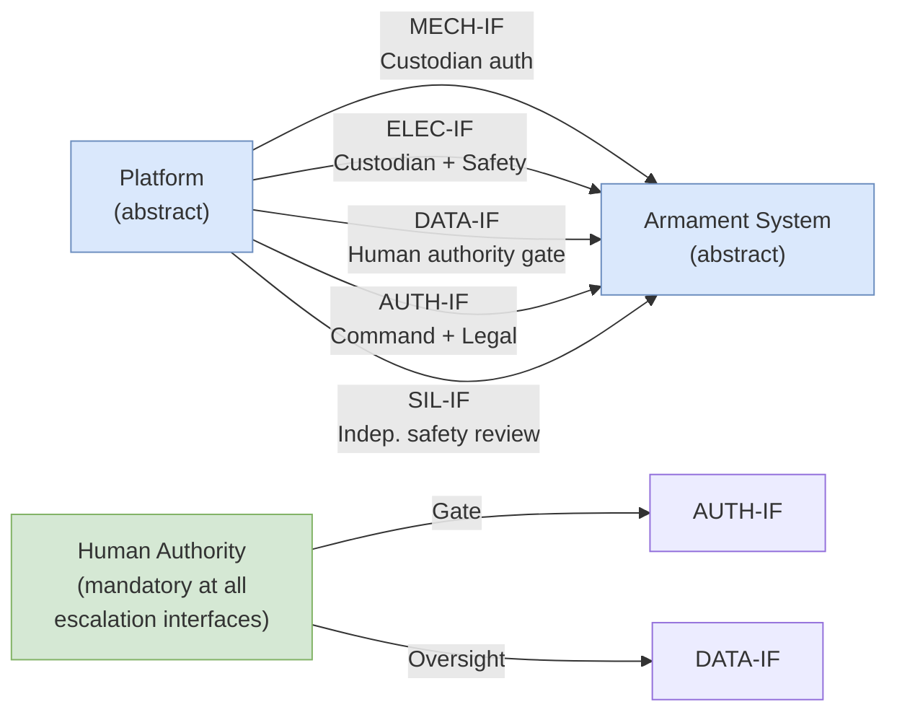

# DTTA 202 · Subsubject 003 — Platform Compatibility and Integration Boundaries

## §1 Purpose

This document defines the taxonomy of platform compatibility interfaces and integration boundary declarations for conventional armament governance within DTTA 202. It is strictly non-operational.

**Non-operational boundary:** This subsection is restricted to classification, governance, custody, safety, accountability and legal-control taxonomy. It does not define construction details, deployment methods, targeting logic, tactical employment, optimization for harm, performance enhancement or operational weapon procedures. Compatibility interface labels are abstract governance identifiers only — no electrical schematics, mechanical drawings, software protocols or operational integration procedures are contained herein.

This document provides:

- Abstract taxonomy of platform-armament interface boundary types for governance classification.
- Integration boundary declaration framework for custody and authorization traceability.
- Human authority interface taxonomy ensuring mandatory human control at integration boundaries.
- Compatibility assessment governance framework for classification and legal review.

## §2 Scope

**In scope:**
- Compatibility interface taxonomy — mechanical, electrical, data and authorization interface types (abstract governance labels only).
- Integration boundary declarations for traceability and custody governance.
- Compatibility assessment governance framework: classification triggers, review requirements, human authority checkpoints.
- Human authority interface taxonomy at integration boundaries (mandatory for all class-escalation events).

**Out of scope:**
- Detailed technical specifications, electrical schematics, connector specifications or mechanical drawings.
- Software communication protocols, data encoding or network configuration.
- Operational integration procedures, field assembly or platform-specific configuration.
- Classified NATO or national integration standards content.

### Interface Boundary Taxonomy (Abstract, Governance Only)

| Interface Type | Governance Label | Authorization Requirement |
|---|---|---|
| Mechanical mounting interface | MECH-IF | Custodian authorization required |
| Electrical power interface | ELEC-IF | Custodian + safety officer authorization |
| Data/control interface | DATA-IF | Human authority gate mandatory |
| Authorization enable interface | AUTH-IF | Command authority + legal clearance required |
| Safety interlock interface | SIL-IF | Independent safety review mandatory |

## §3 Diagram

> **Note:** This diagram represents abstract governance interface taxonomy only. No technical specifications, schematics or operational procedures are conveyed.

## §4 Footprint

| Field | Value |
|---|---|
| Architecture | Defence Technology Type Architecture (DTTA) |
| Master range | 200–299 |
| Code range | 200-209 |
| Section | 00 |
| Subsection | 202 |
| Subsubject | 003 |
| Primary Q-Division | Q-DATAGOV[^qdiv] |
| Support Q-Divisions | Q-SPACE, Q-HORIZON, Q-HPC, Q-STRUCTURES, Q-INDUSTRY |
| ORB support | ORB-LEG, ORB-PMO, ORB-FIN |
| Governance class | restricted[^gov] |
| Restricted rule | N-006[^n006] |
| Folder path | `Q+ATLANTIDE/200-299_DTTA/200-209_Sistemas-de-Combate-y-Armamento/202_Armamento-Convencional-Clasificacion-y-Control/` |
| Document | `003_Platform-Compatibility-and-Integration-Boundaries.md` |
| Parent subsection | [README.md](./README.md) · [000_Overview.md](./000_Overview.md) |
| Parent section | [../README.md](../README.md) |
| Parent architecture | [../../README.md](../../README.md) |
| Parent baseline | [organization/Q+ATLANTIDE.md](../../../../organization/Q+ATLANTIDE.md) |

## §5 References

[^baseline]: Q+ATLANTIDE controlled baseline — [organization/Q+ATLANTIDE.md](../../../../organization/Q+ATLANTIDE.md)
[^archtable]: §3 Architecture Table (parent) — [../../README.md](../../README.md)
[^qdiv]: Q-DATAGOV primary; Q-SPACE, Q-HORIZON, Q-HPC, Q-STRUCTURES, Q-INDUSTRY support.
[^gov]: Governance class `restricted` per N-006.
[^n001]: Note N-001: taxonomy/traceability ecosystem only — no operational, construction or performance content.
[^n004]: Note N-004 (No-AAA Rule): No autonomous armament activation, targeting or engagement logic permitted.
[^n006]: Note N-006 (Restricted bands) — DTTA 200-299.

- STANAG 4586 — NATO Unmanned Control System Standard (interface taxonomy reference — abstract).
- MIL-STD-1553 — Digital Time Division Command/Response Multiplex Data Bus (abstract reference).
- IEC 61508 — Functional Safety of E/E/PE Safety-Related Systems (SIL classification framework).
- NATO STANAG 2090 — abstract reference for platform-armament compatibility governance.
