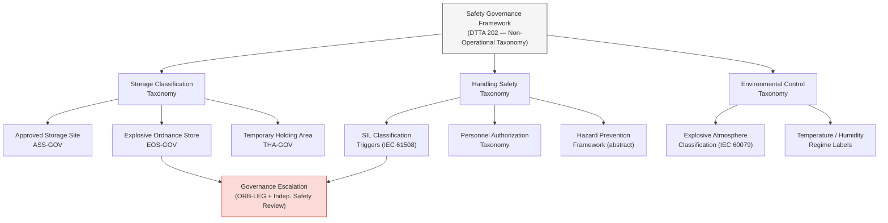

# DTTA 200-209 · 00.202.004 — Storage, Handling and Safety Governance

## §1 Purpose

This document defines the safety governance framework, storage taxonomy and handling control requirements for conventional armament within DTTA 202. It is non-operational — governance and taxonomy only.

**Non-operational boundary:** This subsection is restricted to classification, governance, custody, safety, accountability and legal-control taxonomy. It does not define construction details, deployment methods, targeting logic, tactical employment, optimization for harm, performance enhancement or operational weapon procedures. No facility engineering designs, classified storage directives or operational storage/handling procedures are included.

This document provides:

- Storage classification taxonomy: abstract facility type labels, hazard class labels, and separation requirement governance.
- Handling safety taxonomy: SIL classification triggers, hazard prevention framework and personnel authorization taxonomy.
- Environmental control taxonomy: temperature, humidity, electrostatic and explosive-atmosphere classification.
- Safety governance escalation triggers linked to armament class taxonomy (→ subsubject 002).

## §2 Scope

**In scope:**
- Storage classification taxonomy — facility types (abstract labels: Approved Storage Site, Explosive Ordnance Store, Temporary Holding Area), hazard class labels per armament class, separation requirement framework (abstract).
- Handling safety taxonomy — SIL classification assignment triggers per IEC 61508 (abstract), hazard prevention framework (design, procedural, training — abstract labels), personnel authorization taxonomy (Custodian, Armourer, Authorized Handler — abstract roles).
- Environmental control taxonomy — explosive atmosphere classification per IEC 60079 (abstract), temperature and humidity regime labels.
- Safety governance escalation: triggers for mandatory ORB-LEG and independent safety review.

**Out of scope:**
- Detailed facility engineering designs, construction specifications or facility approval processes.
- Classified NATO or national storage directives and operating procedures.
- Specific hazard-class quantities or explosive limits data.
- Operational storage or movement procedures.

### Storage Facility Taxonomy (Abstract, Governance Labels)

| Facility Type Label | Governance Identifier | Required Authorization |
|---|---|---|
| Approved Storage Site | ASS-GOV | Custodian + Safety Officer |
| Explosive Ordnance Store | EOS-GOV | Custodian + Safety Officer + ORB-LEG |
| Temporary Holding Area | THA-GOV | Custodian (time-limited) |

### Handling Personnel Authorization Taxonomy (Abstract)

| Role Label | Authorization Scope | Governance Requirement |
|---|---|---|
| Custodian | Custody transfer, inventory access | Chain-of-custody record |
| Armourer | Handling, maintenance classification | Safety qualification record |
| Authorized Handler | Transport, access | Access-control record |

## §3 Diagram

> **Note:** This diagram is a non-operational governance taxonomy hierarchy. No operational, facility engineering or classified content is conveyed.

## §4 Footprint

| Field | Value |
|---|---|
| Architecture | Defence Technology Type Architecture (DTTA) |
| Master range | 200–299 |
| Code range | 200-209 |
| Section | 00 |
| Subsection | 202 |
| Subsubject | 004 |
| Primary Q-Division | Q-DATAGOV[^qdiv] |
| Support Q-Divisions | Q-SPACE, Q-HORIZON, Q-HPC, Q-STRUCTURES, Q-INDUSTRY |
| ORB support | ORB-LEG, ORB-PMO, ORB-FIN |
| Governance class | restricted[^gov] |
| Restricted rule | N-006[^n006] |
| Folder path | `Q+ATLANTIDE/200-299_DTTA/200-209_Sistemas-de-Combate-y-Armamento/202_Armamento-Convencional-Clasificacion-y-Control/` |
| Document | `004_Storage-Handling-and-Safety-Governance.md` |
| Parent subsection | [README.md](./README.md) · [000_Overview.md](./000_Overview.md) |
| Parent section | [../README.md](../README.md) |
| Parent architecture | [../../README.md](../../README.md) |
| Parent baseline | [organization/Q+ATLANTIDE.md](../../../../organization/Q+ATLANTIDE.md) |

## §5 References

[^baseline]: Q+ATLANTIDE controlled baseline — [organization/Q+ATLANTIDE.md](../../../../organization/Q+ATLANTIDE.md)
[^archtable]: §3 Architecture Table (parent) — [../../README.md](../../README.md)
[^qdiv]: Q-DATAGOV primary; Q-SPACE, Q-HORIZON, Q-HPC, Q-STRUCTURES, Q-INDUSTRY support.
[^gov]: Governance class `restricted` per N-006.
[^n001]: Note N-001: taxonomy/traceability ecosystem only — no operational, construction or performance content.
[^n004]: Note N-004 (No-AAA Rule): No autonomous armament activation, targeting or engagement logic permitted.
[^n006]: Note N-006 (Restricted bands) — DTTA 200-299.

- NATO STANAG 4187 — Ammunition Safety (abstract reference for storage/handling governance).
- IEC 61508 — Functional Safety of E/E/PE Safety-Related Systems (SIL classification framework).
- MIL-STD-882E — System Safety (hazard prevention framework reference).
- OSCE Best Practices Guide for Conventional Ammunition.
- IEC 60079 — Explosive atmospheres (environmental control taxonomy reference).
- IMSMA (International Mine Action Standards) — analogous governance framework reference.
