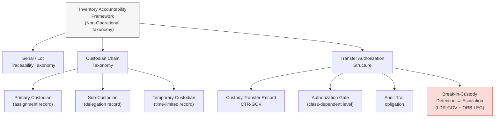

# DTTA 202 · Subsubject 005 — Inventory Accountability and Chain of Custody

## §1 Purpose

This document defines the inventory accountability framework and chain-of-custody governance taxonomy for conventional armament within DTTA 202. It is non-operational — accountability and traceability taxonomy only.

**Non-operational boundary:** This subsection is restricted to classification, governance, custody, safety, accountability and legal-control taxonomy. It does not define construction details, deployment methods, targeting logic, tactical employment, optimization for harm, performance enhancement or operational weapon procedures. No specific stock records, classified inventory data or operational deployment accountability are included.

This document provides:

- Inventory taxonomy: serial number traceability, lot accountability and custodian chain taxonomy.
- Chain-of-custody governance framework: transfer authorization, handover record structure and break-in-custody escalation.
- Accountability record taxonomy: record types, retention requirements and non-conformance triggers.
- Transfer of custody authorization structure: authorization levels, documentation requirements and audit trace.

## §2 Scope

**In scope:**
- Inventory taxonomy — serial number traceability (abstract traceability structure), lot accountability (lot-level governance taxonomy), custodian chain taxonomy (custodian role hierarchy and assignment governance).
- Chain-of-custody governance framework — transfer authorization structure, handover record taxonomy, break-in-custody detection and escalation.
- Accountability record taxonomy — record types (receipt, transfer, inspection, disposal), retention governance, non-conformance record triggers.
- Transfer authorization structure — authorization levels per armament class, documentation requirements, audit trail obligations.

**Out of scope:**
- Specific inventory system implementations, database schemas or platform configurations.
- Classified stock records, active inventory quantities or location data.
- Operational deployment accountability, mission-specific custody records.
- Individual custodian identity data (PII excluded per governance policy).

### Inventory Record Taxonomy (Abstract)

| Record Type | Governance Label | Authorization Level |
|---|---|---|
| Initial Classification Record | ICR-GOV | Custodian + ORB-LEG |
| Custody Transfer Record | CTR-GOV | Transferring + Receiving Custodian |
| Inspection Record | INR-GOV | Authorized Inspector |
| Loss/Discrepancy Record | LDR-GOV | Custodian + ORB-LEG + Audit trigger |
| Disposal Authorization Record | DAR-GOV | Command Authority + ORB-LEG |

## §3 Diagram

> **Note:** This diagram is a non-operational governance taxonomy. No specific stock, location or operational data is conveyed.

## §4 Footprint

| Field | Value |
|---|---|
| Architecture | Defence Technology Type Architecture (DTTA) |
| Master range | 200–299 |
| Code range | 200-209 |
| Section | 00 |
| Subsection | 202 |
| Subsubject | 005 |
| Primary Q-Division | Q-DATAGOV[^qdiv] |
| Support Q-Divisions | Q-SPACE, Q-HORIZON, Q-HPC, Q-STRUCTURES, Q-INDUSTRY |
| ORB support | ORB-LEG, ORB-PMO, ORB-FIN |
| Governance class | restricted[^gov] |
| Restricted rule | N-006[^n006] |
| Folder path | `Q+ATLANTIDE/200-299_DTTA/200-209_Sistemas-de-Combate-y-Armamento/202_Armamento-Convencional-Clasificacion-y-Control/` |
| Document | `005_Inventory-Accountability-and-Chain-of-Custody.md` |
| Parent subsection | [README.md](./README.md) · [000_Overview.md](./000_Overview.md) |
| Parent section | [../README.md](../README.md) |
| Parent architecture | [../../README.md](../../README.md) |
| Parent baseline | [organization/Q+ATLANTIDE.md](../../../../organization/Q+ATLANTIDE.md) |

## §5 References

[^baseline]: Q+ATLANTIDE controlled baseline — [organization/Q+ATLANTIDE.md](../../../../organization/Q+ATLANTIDE.md)
[^archtable]: §3 Architecture Table (parent) — [../../README.md](../../README.md)
[^qdiv]: Q-DATAGOV primary; Q-SPACE, Q-HORIZON, Q-HPC, Q-STRUCTURES, Q-INDUSTRY support.
[^gov]: Governance class `restricted` per N-006.
[^n001]: Note N-001: taxonomy/traceability ecosystem only — no operational, construction or performance content.
[^n004]: Note N-004 (No-AAA Rule): No autonomous armament activation, targeting or engagement logic permitted.
[^n006]: Note N-006 (Restricted bands) — DTTA 200-299.

- UN Arms Trade Treaty (ATT) — Article 12 record-keeping obligations. <https://www.thearmstradetreaty.org>
- OSCE Best Practices Guide for Conventional Ammunition — inventory accountability guidance.
- ITAR import/export accountability framework (abstract reference).
- NATO STANAG 4187 — Ammunition Safety (accountability governance reference).
- MIL-STD-882E — System Safety (accountability framework reference).
