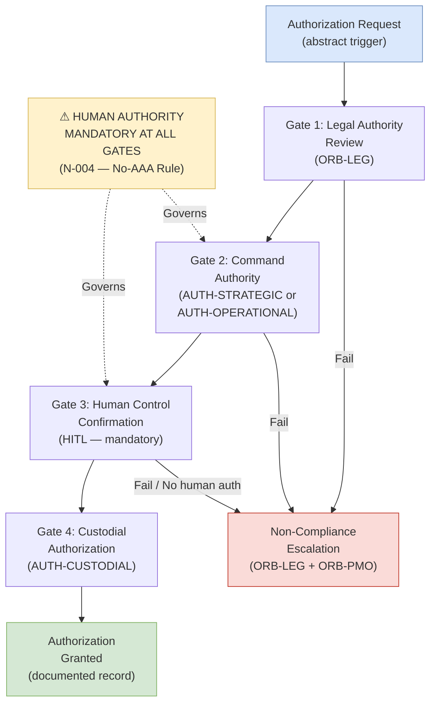

# DTTA 200-209 · 00.202.006 — Authorization, Rules-of-Use and Human Control

## §1 Purpose

This document defines the authorization framework, rules-of-use taxonomy and human control requirements for conventional armament governance within DTTA 202. Mandatory human authority is a non-negotiable governance requirement at every authorization gate.

**Non-operational boundary:** This subsection is restricted to classification, governance, custody, safety, accountability and legal-control taxonomy. It does not define construction details, deployment methods, targeting logic, tactical employment, optimization for harm, performance enhancement or operational weapon procedures. No specific ROE documents, classified operational command authority structures or operational authorization criteria are included.

**Human control requirement:** All authorization gates within DTTA 202 require explicit, documented human authority. Autonomous, semi-autonomous or AI-mediated authorization is not permitted at any gate in this framework. This implements Note N-004 (No-AAA Rule)[^n004].

This document provides:

- Authorization taxonomy: command authority levels, legal authority taxonomy and enablement condition structure.
- Rules-of-use declaration framework: abstract structure for declaring applicable use restrictions.
- Human control requirement taxonomy: Human-in-the-Loop (HITL), supervisory and custodial control types.
- Authorization gate structure: mandatory checkpoints, documentation requirements and non-compliance escalation.

## §2 Scope

**In scope:**
- Authorization taxonomy — command authority levels (abstract: Strategic, Operational, Custodial), legal authority taxonomy (ROE applicable framework — abstract structure only), enablement condition taxonomy (authorization preconditions — abstract labels).
- Rules-of-use declaration framework — structure for declaring applicable use restrictions (abstract framework only, not specific ROE content).
- Human control requirement taxonomy — HITL (Human-in-the-Loop) control type, supervisory control type, custodial control type; assignment criteria per armament class.
- Authorization gate structure — mandatory gate types, documentation requirements at each gate, non-compliance escalation triggers.

**Out of scope:**
- Specific ROE documents or classified operational rules of engagement.
- Operational command authority structures or force command chains.
- Classified authorization criteria, targeting authority delegations.
- Automated or autonomous authorization mechanisms (explicitly prohibited by N-004[^n004]).

### Authorization Level Taxonomy (Abstract, Governance Only)

| Level Label | Governance Identifier | Human Control Type |
|---|---|---|
| Strategic Authority | AUTH-STRATEGIC | HITL mandatory |
| Operational Authority | AUTH-OPERATIONAL | HITL mandatory |
| Custodial Authority | AUTH-CUSTODIAL | Supervisory mandatory |
| Emergency Safing Authority | AUTH-SAFE | HITL mandatory |

### Human Control Type Taxonomy

| Control Type | Label | Trigger |
|---|---|---|
| Human-in-the-Loop (HITL) | HITL | Required at all AUTH-STRATEGIC and AUTH-OPERATIONAL gates |
| Supervisory Control | SUPER-CTRL | Required at all custodial and handling gates |
| Custodial Control | CUST-CTRL | Required at all inventory and transfer events |

## §3 Diagram

> **Note:** This diagram is a non-operational governance framework. No specific ROE, operational command or classified authorization criteria are conveyed.

## §4 Footprint

| Field | Value |
|---|---|
| Architecture | Defence Technology Type Architecture (DTTA) |
| Master range | 200–299 |
| Code range | 200-209 |
| Section | 00 |
| Subsection | 202 |
| Subsubject | 006 |
| Primary Q-Division | Q-DATAGOV[^qdiv] |
| Support Q-Divisions | Q-SPACE, Q-HORIZON, Q-HPC, Q-STRUCTURES, Q-INDUSTRY |
| ORB support | ORB-LEG, ORB-PMO, ORB-FIN |
| Governance class | restricted[^gov] |
| Restricted rule | N-006[^n006] |
| Folder path | `Q+ATLANTIDE/200-299_DTTA/200-209_Sistemas-de-Combate-y-Armamento/202_Armamento-Convencional-Clasificacion-y-Control/` |
| Document | `006_Authorization-Rules-of-Use-and-Human-Control.md` |
| Parent subsection | [README.md](./README.md) · [000_Overview.md](./000_Overview.md) |
| Parent section | [../README.md](../README.md) |
| Parent architecture | [../../README.md](../../README.md) |
| Parent baseline | [organization/Q+ATLANTIDE.md](../../../../organization/Q+ATLANTIDE.md) |

## §5 References

[^baseline]: Q+ATLANTIDE controlled baseline — [organization/Q+ATLANTIDE.md](../../../../organization/Q+ATLANTIDE.md)
[^archtable]: §3 Architecture Table (parent) — [../../README.md](../../README.md)
[^qdiv]: Q-DATAGOV primary; Q-SPACE, Q-HORIZON, Q-HPC, Q-STRUCTURES, Q-INDUSTRY support.
[^gov]: Governance class `restricted` per N-006.
[^n001]: Note N-001: taxonomy/traceability ecosystem only — no operational, construction or performance content.
[^n004]: Note N-004 (No-AAA Rule): No autonomous armament activation, targeting or engagement logic permitted in any DTTA 202 document.
[^n006]: Note N-006 (Restricted bands) — DTTA 200-299.

- UN CCW GGE on LAWS — Group of Governmental Experts on Lethal Autonomous Weapons Systems (human control principles).
- NATO AJP-01 — Allied Joint Doctrine (command authority taxonomy — abstract reference).
- IHL Geneva Additional Protocol I — proportionality, distinction and precaution (legal authority framework).
- MIL-STD-882E — System Safety (authorization framework integration).
- IEC 61508 — Functional Safety (SIL and human-control interface taxonomy).
- NATO STANAG 4187 — Ammunition Safety (authorization governance reference).
