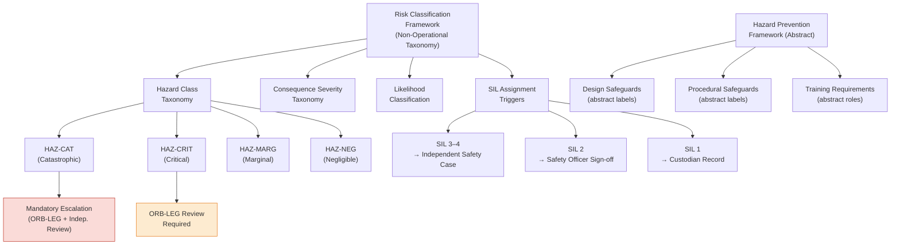

# DTTA 200-209 · 00.202.007 — Risk Classification and Hazard Prevention

## §1 Purpose

This document defines the risk classification taxonomy and hazard prevention framework for conventional armament governance within DTTA 202. It is non-operational — taxonomy and governance only.

**Non-operational boundary:** This subsection is restricted to classification, governance, custody, safety, accountability and legal-control taxonomy. It does not define construction details, deployment methods, targeting logic, tactical employment, optimization for harm, performance enhancement or operational weapon procedures. No specific hazard assessments, classified risk data or operational risk mitigation procedures are included.

This document provides:

- Risk classification taxonomy: hazard class labels, consequence severity taxonomy, likelihood classification, and SIL assignment triggers.
- Hazard prevention framework: design safeguards taxonomy (abstract), procedural safeguards taxonomy (abstract), training requirements taxonomy (abstract).
- Collateral risk taxonomy: legal classification of collateral risk categories per IHL proportionality principle.
- Governance escalation triggers linked to risk classification outcomes.

## §2 Scope

**In scope:**
- Risk classification taxonomy — hazard class labels (per MIL-STD-882E abstract categories: Catastrophic, Critical, Marginal, Negligible), consequence severity taxonomy, likelihood classification taxonomy, SIL assignment triggers per IEC 61508.
- Hazard prevention framework taxonomy — design safeguards (abstract labels), procedural safeguards (abstract labels), training requirement taxonomy (abstract roles and obligations).
- Collateral risk taxonomy — IHL proportionality principle alignment (abstract legal taxonomy), collateral risk classification triggers for ORB-LEG escalation.
- Governance escalation: mandatory review triggers for high-risk and SIL-3/SIL-4 classified items.

**Out of scope:**
- Specific hazard assessments for any armament system or configuration.
- Classified risk data, accident reports or incident records.
- Operational risk mitigation procedures or tactical risk management.
- Specific casualty data, lethality assessments or weapons effects modelling.

### Risk Classification Taxonomy (Abstract, Per MIL-STD-882E)

| Hazard Class Label | Governance Identifier | Consequence Severity | Governance Escalation |
|---|---|---|---|
| Catastrophic | HAZ-CAT | Life-threatening, irreversible | Mandatory ORB-LEG + independent review |
| Critical | HAZ-CRIT | Severe injury or major loss | ORB-LEG review required |
| Marginal | HAZ-MARG | Minor injury or loss | Safety officer review |
| Negligible | HAZ-NEG | Minimal consequence | Standard custodian record |

### SIL Assignment Trigger Taxonomy (Per IEC 61508, Abstract)

| Risk Level | SIL Assignment | Authorization Consequence |
|---|---|---|
| HAZ-CAT or HAZ-CRIT | SIL 3–4 | Mandatory independent safety case |
| HAZ-MARG | SIL 2 | Safety officer sign-off |
| HAZ-NEG | SIL 1 | Custodian record sufficient |

## §3 Diagram

> **Note:** This diagram is a non-operational governance taxonomy. No specific hazard assessments or classified risk data are conveyed.

## §4 Footprint

| Field | Value |
|---|---|
| Architecture | Defence Technology Type Architecture (DTTA) |
| Master range | 200–299 |
| Code range | 200-209 |
| Section | 00 |
| Subsection | 202 |
| Subsubject | 007 |
| Primary Q-Division | Q-DATAGOV[^qdiv] |
| Support Q-Divisions | Q-SPACE, Q-HORIZON, Q-HPC, Q-STRUCTURES, Q-INDUSTRY |
| ORB support | ORB-LEG, ORB-PMO, ORB-FIN |
| Governance class | restricted[^gov] |
| Restricted rule | N-006[^n006] |
| Folder path | `Q+ATLANTIDE/200-299_DTTA/200-209_Sistemas-de-Combate-y-Armamento/202_Armamento-Convencional-Clasificacion-y-Control/` |
| Document | `007_Risk-Classification-and-Hazard-Prevention.md` |
| Parent subsection | [README.md](./README.md) · [000_Overview.md](./000_Overview.md) |
| Parent section | [../README.md](../README.md) |
| Parent architecture | [../../README.md](../../README.md) |
| Parent baseline | [organization/Q+ATLANTIDE.md](../../../../organization/Q+ATLANTIDE.md) |

## §5 References

[^baseline]: Q+ATLANTIDE controlled baseline — [organization/Q+ATLANTIDE.md](../../../../organization/Q+ATLANTIDE.md)
[^archtable]: §3 Architecture Table (parent) — [../../README.md](../../README.md)
[^qdiv]: Q-DATAGOV primary; Q-SPACE, Q-HORIZON, Q-HPC, Q-STRUCTURES, Q-INDUSTRY support.
[^gov]: Governance class `restricted` per N-006.
[^n001]: Note N-001: taxonomy/traceability ecosystem only — no operational, construction or performance content.
[^n004]: Note N-004 (No-AAA Rule): No autonomous armament activation, targeting or engagement logic permitted.
[^n006]: Note N-006 (Restricted bands) — DTTA 200-299.

- IEC 61508 — Functional Safety of E/E/PE Safety-Related Systems (SIL classification).
- MIL-STD-882E — System Safety (hazard classification: Catastrophic, Critical, Marginal, Negligible).
- IEC 60079 — Explosive atmospheres (hazard prevention reference).
- NATO STANAG 4187 — Ammunition Safety (risk governance reference).
- OSCE Best Practices Guide for Conventional Ammunition.
- IHL Geneva Additional Protocol I — proportionality principle (collateral risk legal taxonomy).
