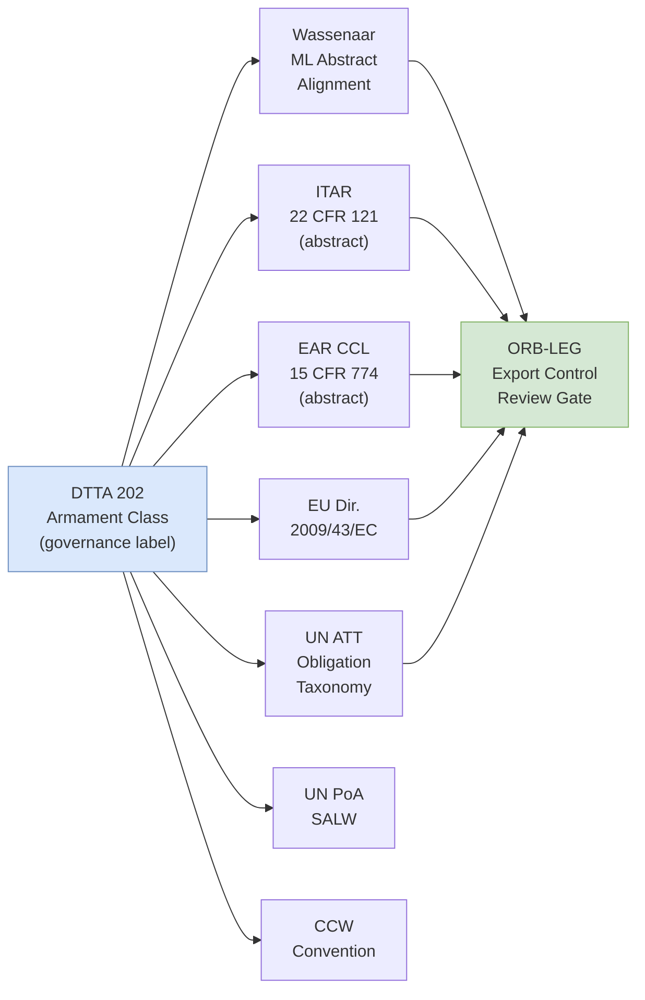

# DTTA 202 · Subsubject 008 — Export Control, Legal and Non-Proliferation Mapping

## §1 Purpose

This document maps the conventional armament classification taxonomy to applicable export control regimes, legal frameworks and non-proliferation obligations. It serves as the single reference for export-control and legal applicability within Q+ATLANTIDE DTTA 202. It is strictly non-operational.

**Non-operational boundary:** This subsection is restricted to classification, governance, custody, safety, accountability and legal-control taxonomy. It does not define construction details, deployment methods, targeting logic, tactical employment, optimization for harm, performance enhancement or operational weapon procedures. No specific control list numbers (classified), country-specific export licenses, or operational trade data are included.

This document provides:

- Export control regime mapping: Wassenaar ML abstract taxonomy alignment, ITAR abstract category alignment, EAR CCL alignment, EU Directive 2009/43/EC alignment.
- Non-proliferation obligation taxonomy: UN ATT article applicability, SALW (Small Arms and Light Weapons) protocol applicability.
- Function-to-regulation traceability: maps DTTA 202 armament class governance labels to applicable regime categories.
- Waiver and exception framework taxonomy: abstract structure for governance review of waiver/exception applicability.

## §2 Scope

**In scope:**
- Export control regime mapping — Wassenaar Arrangement Munitions List (ML) abstract taxonomy alignment (no specific list entries), ITAR 22 CFR 121 abstract category alignment, EAR 15 CFR 774 CCL alignment, EU Directive 2009/43/EC intra-EU transfers applicability.
- Non-proliferation obligation taxonomy — UN ATT article applicability taxonomy, UN Programme of Action on SALW (PoA) article applicability, CCW Convention applicability.
- Function-to-regulation traceability matrix — maps DTTA 202 armament class labels (→ subsubject 002) to applicable regime categories.
- Waiver and exception framework taxonomy — abstract governance structure for identifying waiver/exception applicability, ORB-LEG review trigger.

**Out of scope:**
- Specific Wassenaar ML control list entries (classified content).
- Country-specific export licenses, end-user certificates or import authorizations.
- Operational trade transactions, shipment records or commercial data.
- Classified ITAR or EAR determination records.

### Applicable Standards and Regimes

| Regime / Standard | Scope within DTTA 202 |
|---|---|
| Wassenaar Arrangement (ML) | Abstract ML-category alignment for governance classification |
| ITAR (22 CFR 121) | US Munitions List abstract category applicability |
| EAR (15 CFR 774 CCL) | Commerce Control List dual-use boundary taxonomy |
| EU Directive 2009/43/EC | Intra-EU transfer control applicability |
| UN ATT | Arms Trade Treaty obligation taxonomy |
| UN PoA SALW | Programme of Action on Small Arms and Light Weapons |
| CCW Convention | Convention on Certain Conventional Weapons applicability |
| Geneva AP-I | IHL legal framework — export responsibility principle |

### Function-to-Regulation Traceability Matrix (Abstract)

| DTTA 202 Class Label | Wassenaar | ITAR | EAR | EU 2009/43/EC | UN ATT |
|---|---|---|---|---|---|
| SA-GOV (Small Arms) | ML1/ML2 (abstract) | Cat. I (abstract) | CCL-applicable | Applicable | Art. 2 applicable |
| LW-GOV (Light Weapons) | ML2 (abstract) | Cat. I (abstract) | CCL-applicable | Applicable | Art. 2 applicable |
| HW-GOV (Heavy Weapons) | ML2/ML4 (abstract) | Cat. II (abstract) | CCL-applicable | Applicable | Art. 2 applicable |
| GM-GOV (Guided Munitions) | ML4/ML10 (abstract) | Cat. IV (abstract) | CCL-applicable | Applicable | Art. 2 applicable |
| UM-GOV (Unguided Munitions) | ML3 (abstract) | Cat. III (abstract) | CCL-applicable | Applicable | Art. 2 applicable |

> **Note:** All regime references are abstract governance alignment labels only. Specific control list numbers are classified and must not be reproduced in this document.

## §3 Diagram

> **Note:** This diagram maps governance class labels to applicable legal regimes for traceability purposes only. No specific control list entries, license data or classified content is conveyed.

## §4 Footprint

| Field | Value |
|---|---|
| Architecture | Defence Technology Type Architecture (DTTA) |
| Master range | 200–299 |
| Code range | 200-209 |
| Section | 00 |
| Subsection | 202 |
| Subsubject | 008 |
| Primary Q-Division | Q-DATAGOV[^qdiv] |
| Support Q-Divisions | Q-SPACE, Q-HORIZON, Q-HPC, Q-STRUCTURES, Q-INDUSTRY |
| ORB support | ORB-LEG, ORB-PMO, ORB-FIN |
| Governance class | restricted[^gov] |
| Restricted rule | N-006[^n006] |
| Folder path | `Q+ATLANTIDE/200-299_DTTA/200-209_Sistemas-de-Combate-y-Armamento/202_Armamento-Convencional-Clasificacion-y-Control/` |
| Document | `008_Export-Control-Legal-and-Non-Proliferation-Mapping.md` |
| Parent subsection | [README.md](./README.md) · [000_Overview.md](./000_Overview.md) |
| Parent section | [../README.md](../README.md) |
| Parent architecture | [../../README.md](../../README.md) |
| Parent baseline | [organization/Q+ATLANTIDE.md](../../../../organization/Q+ATLANTIDE.md) |

## §5 References

[^baseline]: Q+ATLANTIDE controlled baseline — [organization/Q+ATLANTIDE.md](../../../../organization/Q+ATLANTIDE.md)
[^archtable]: §3 Architecture Table (parent) — [../../README.md](../../README.md)
[^qdiv]: Q-DATAGOV primary; Q-SPACE, Q-HORIZON, Q-HPC, Q-STRUCTURES, Q-INDUSTRY support.
[^gov]: Governance class `restricted` per N-006.
[^n001]: Note N-001: taxonomy/traceability ecosystem only — no operational, construction or performance content.
[^n004]: Note N-004 (No-AAA Rule): No autonomous armament activation, targeting or engagement logic permitted.
[^n006]: Note N-006 (Restricted bands) — DTTA 200-299.

- Wassenaar Arrangement — Munitions List. <https://www.wassenaar.org>
- ITAR (22 CFR 121) — International Traffic in Arms Regulations, US Munitions List.
- EAR (15 CFR 774) — Export Administration Regulations, Commerce Control List.
- EU Directive 2009/43/EC — Simplifying terms and conditions of transfers of defence-related products within the Community.
- UN Arms Trade Treaty (ATT). <https://www.thearmstradetreaty.org>
- UN Programme of Action on Small Arms and Light Weapons (PoA SALW).
- CCW Convention — Convention on Certain Conventional Weapons. <https://www.un.org/disarmament/wmd/ccw/>
- Geneva Additional Protocol I — IHL legal framework, export responsibility.
