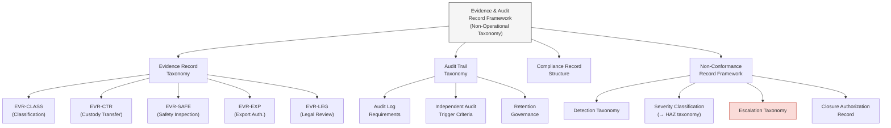

# DTTA 200-209 · 00.202.009 — Evidence, Audit and Compliance Records

## §1 Purpose

This document defines the evidence package structure, audit record taxonomy and compliance record requirements for conventional armament classification and control within DTTA 202. It is non-operational.

**Non-operational boundary:** This subsection is restricted to classification, governance, custody, safety, accountability and legal-control taxonomy. It does not define construction details, deployment methods, targeting logic, tactical employment, optimization for harm, performance enhancement or operational weapon procedures. No specific audit findings, classified inspection records or operational compliance assessments are included.

This document provides:

- Evidence record taxonomy: classification records, custody transfer records, safety inspection records, export authorization records, legal review records.
- Audit trail taxonomy: audit log requirements, independent audit trigger criteria, audit record retention governance.
- Compliance record structure: compliance obligation taxonomy and record linkage to applicable regimes (→ subsubject 008).
- Non-conformance record framework: non-conformance detection, categorization, escalation and closure records.

## §2 Scope

**In scope:**
- Evidence record taxonomy — classification records (governance classification evidence), custody transfer records (chain-of-custody evidence), safety inspection records (hazard prevention evidence), export authorization records (legal compliance evidence), legal review records (ORB-LEG evidence).
- Audit trail taxonomy — audit log requirements (mandatory fields, integrity requirements), independent audit trigger criteria (class-based, event-based, periodic), audit record retention governance (retention periods per regime obligation).
- Compliance record structure — compliance obligation record types per regime (UN ATT, ITAR, EAR, EU Directive 2009/43/EC, Wassenaar), record linkage to function-to-regulation traceability matrix (→ subsubject 008).
- Non-conformance record framework — detection taxonomy, severity classification (aligned to HAZ classes → subsubject 007), escalation taxonomy, corrective action record, closure authorization.

**Out of scope:**
- Specific audit findings, inspection outcomes or classified investigation records.
- Operational compliance assessments or mission-specific evidence.
- Individual inspector or custodian identity data (PII excluded per governance policy).
- Classified regime-specific compliance determinations.

### Evidence Record Taxonomy (Abstract)

| Record Type | Governance Label | Triggering Event | Retention |
|---|---|---|---|
| Classification Record | EVR-CLASS | Armament classification assignment | Lifecycle + 10 years |
| Custody Transfer Record | EVR-CTR | Any custody transfer | Lifecycle + 10 years |
| Safety Inspection Record | EVR-SAFE | Scheduled or triggered inspection | 10 years minimum |
| Export Authorization Record | EVR-EXP | Export/transfer authorization | 10 years (per ATT Art.12) |
| Legal Review Record | EVR-LEG | ORB-LEG review completion | Lifecycle + 10 years |
| Non-Conformance Record | EVR-NCR | Non-conformance detection | Until closure + 5 years |

### Audit Trigger Taxonomy

| Trigger Type | Label | Authorization |
|---|---|---|
| Class-based (HW-GOV, GM-GOV) | AUD-CLASS | ORB-LEG mandatory |
| Event-based (NCR, LDR-GOV) | AUD-EVENT | ORB-LEG + ORB-PMO |
| Periodic | AUD-PERIODIC | Q-DATAGOV scheduling |
| Export-gate | AUD-EXPORT | ORB-LEG prior to transfer |

## §3 Diagram

> **Note:** This diagram is a non-operational evidence and audit record taxonomy. No specific findings, classified data or operational records are conveyed.

## §4 Footprint

| Field | Value |
|---|---|
| Architecture | Defence Technology Type Architecture (DTTA) |
| Master range | 200–299 |
| Code range | 200-209 |
| Section | 00 |
| Subsection | 202 |
| Subsubject | 009 |
| Primary Q-Division | Q-DATAGOV[^qdiv] |
| Support Q-Divisions | Q-SPACE, Q-HORIZON, Q-HPC, Q-STRUCTURES, Q-INDUSTRY |
| ORB support | ORB-LEG, ORB-PMO, ORB-FIN |
| Governance class | restricted[^gov] |
| Restricted rule | N-006[^n006] |
| Folder path | `Q+ATLANTIDE/200-299_DTTA/200-209_Sistemas-de-Combate-y-Armamento/202_Armamento-Convencional-Clasificacion-y-Control/` |
| Document | `009_Evidence-Audit-and-Compliance-Records.md` |
| Parent subsection | [README.md](./README.md) · [000_Overview.md](./000_Overview.md) |
| Parent section | [../README.md](../README.md) |
| Parent architecture | [../../README.md](../../README.md) |
| Parent baseline | [organization/Q+ATLANTIDE.md](../../../../organization/Q+ATLANTIDE.md) |

## §5 References

[^baseline]: Q+ATLANTIDE controlled baseline — [organization/Q+ATLANTIDE.md](../../../../organization/Q+ATLANTIDE.md)
[^archtable]: §3 Architecture Table (parent) — [../../README.md](../../README.md)
[^qdiv]: Q-DATAGOV primary; Q-SPACE, Q-HORIZON, Q-HPC, Q-STRUCTURES, Q-INDUSTRY support.
[^gov]: Governance class `restricted` per N-006.
[^n001]: Note N-001: taxonomy/traceability ecosystem only — no operational, construction or performance content.
[^n004]: Note N-004 (No-AAA Rule): No autonomous armament activation, targeting or engagement logic permitted.
[^n006]: Note N-006 (Restricted bands) — DTTA 200-299.

- AS9100D — Quality Management Systems: Requirements for Aviation, Space, and Defence Organizations.
- NATO STANAG 4187 — Ammunition Safety (audit and evidence governance reference).
- MIL-STD-882E — System Safety (non-conformance and audit record reference).
- ISO 19011 — Guidelines for auditing management systems.
- UN ATT Article 12 — Record-keeping obligations. <https://www.thearmstradetreaty.org>
- IEC 61508 — Functional Safety (evidence package requirements for SIL-classified items).
- EU Directive 2009/43/EC — compliance record obligations for intra-EU transfers.
