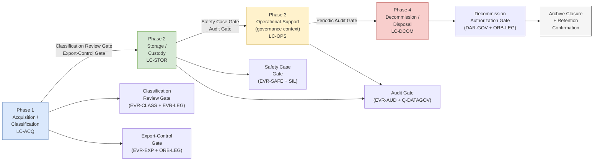

# DTTA 200-209 · 00.202.010 — Traceability, Evidence and Lifecycle Governance

## §1 Purpose

This document defines the traceability obligations, evidence package requirements and lifecycle governance for the Armamento Convencional subsection (DTTA 202). It specifies the required artefacts at each lifecycle phase from acquisition classification through decommissioning and disposal. It is non-operational.

**Non-operational boundary:** This subsection is restricted to classification, governance, custody, safety, accountability and legal-control taxonomy. It does not define construction details, deployment methods, targeting logic, tactical employment, optimization for harm, performance enhancement or operational weapon procedures. No operational mission evidence, classified test data or operational disposal procedures are included.

This document provides:

- Lifecycle taxonomy: four phases — Acquisition/Classification, Storage/Custody, Operational-Support (non-operational governance context), Decommission/Disposal.
- Evidence package structure per lifecycle phase: mandatory artefacts, authorization requirements and review gates.
- Review gate requirements: Classification Review Gate, Export-Control Gate, Safety Case Gate, Audit Gate, Decommission Authorization Gate.
- Traceability matrix: maps evidence artefacts to applicable governance obligations and regime requirements.
- Archive closure and disposal records: mandatory closure artefacts and ORB-LEG authorization for archive closure.

## §2 Scope

**In scope:**
- Lifecycle taxonomy (four phases): Phase 1 — Acquisition/Classification; Phase 2 — Storage/Custody; Phase 3 — Operational-Support (governance documentation context only, non-operational); Phase 4 — Decommission/Disposal.
- Evidence package structure per phase: mandatory evidence artefacts, custodian chain records, authorization records, review gate records.
- Review gate requirements: Classification Review Gate (→ subsubject 001/002), Export-Control Gate (→ subsubject 008), Safety Case Gate (→ subsubject 007), Audit Gate (→ subsubject 009), Decommission Authorization Gate.
- Traceability matrix: evidence artefact to governance obligation and applicable legal regime mapping.
- Archive closure and disposal records: mandatory closure artefacts, ORB-LEG authorization requirement for archive closure, retention obligations.

**Out of scope:**
- Operational mission evidence, tactical deployment records or classified programme data.
- Classified test data, acceptance test results or classified performance records.
- Operational disposal procedures, demilitarization technical procedures.
- Individual personnel data (PII excluded per governance policy).

### Lifecycle Phase Taxonomy

| Phase | Label | Key Governance Events | Mandatory Gate |
|---|---|---|---|
| 1 — Acquisition/Classification | LC-ACQ | Classification assignment, legal review, export-control review | Classification Review Gate + Export-Control Gate |
| 2 — Storage/Custody | LC-STOR | Custody transfer, safety inspection, inventory audit | Safety Case Gate + Audit Gate |
| 3 — Operational-Support (governance) | LC-OPS | Authorization record maintenance, compliance monitoring | Audit Gate (periodic) |
| 4 — Decommission/Disposal | LC-DCOM | Disposal authorization, archive closure, retention confirmation | Decommission Authorization Gate |

### Evidence Package Structure per Phase

| Phase | Mandatory Artefacts |
|---|---|
| LC-ACQ | EVR-CLASS, EVR-LEG, EVR-EXP (if applicable), Classification Review Record |
| LC-STOR | EVR-CTR (all transfers), EVR-SAFE (all inspections), Audit trigger records |
| LC-OPS | Authorization maintenance records, compliance monitoring records, periodic EVR-AUD |
| LC-DCOM | Disposal Authorization Record (DAR-GOV), Archive Closure Record, Retention Confirmation |

### Traceability Matrix (Abstract)

| Evidence Artefact | Governance Obligation | Applicable Regime |
|---|---|---|
| EVR-CLASS | Classification completeness | DTTA 202 baseline |
| EVR-CTR | Chain-of-custody | UN ATT Art. 12, OSCE |
| EVR-SAFE | Hazard prevention evidence | STANAG 4187, MIL-STD-882E |
| EVR-EXP | Export authorization | ITAR, EAR, EU 2009/43/EC, Wassenaar |
| EVR-LEG | Legal review completion | UN ATT, IHL |
| DAR-GOV | Disposal authorization | OSCE, UN ATT |
| Archive Closure Record | Retention compliance | AS9100D, ISO/IEC 15026 |

## §3 Diagram

> **Note:** This diagram is a non-operational lifecycle governance flow. No operational mission data, classified programme information or disposal procedures are conveyed.

## §4 Footprint

| Field | Value |
|---|---|
| Architecture | Defence Technology Type Architecture (DTTA) |
| Master range | 200–299 |
| Code range | 200-209 |
| Section | 00 |
| Subsection | 202 |
| Subsubject | 010 |
| Primary Q-Division | Q-DATAGOV[^qdiv] |
| Support Q-Divisions | Q-SPACE, Q-HORIZON, Q-HPC, Q-STRUCTURES, Q-INDUSTRY |
| ORB support | ORB-LEG, ORB-PMO, ORB-FIN |
| Governance class | restricted[^gov] |
| Restricted rule | N-006[^n006] |
| Folder path | `Q+ATLANTIDE/200-299_DTTA/200-209_Sistemas-de-Combate-y-Armamento/202_Armamento-Convencional-Clasificacion-y-Control/` |
| Document | `010_Traceability-Evidence-and-Lifecycle-Governance.md` |
| Parent subsection | [README.md](./README.md) · [000_Overview.md](./000_Overview.md) |
| Parent section | [../README.md](../README.md) |
| Parent architecture | [../../README.md](../../README.md) |
| Parent baseline | [organization/Q+ATLANTIDE.md](../../../../organization/Q+ATLANTIDE.md) |

## §5 References

[^baseline]: Q+ATLANTIDE controlled baseline — [organization/Q+ATLANTIDE.md](../../../../organization/Q+ATLANTIDE.md)
[^archtable]: §3 Architecture Table (parent) — [../../README.md](../../README.md)
[^qdiv]: Q-DATAGOV primary; Q-SPACE, Q-HORIZON, Q-HPC, Q-STRUCTURES, Q-INDUSTRY support.
[^gov]: Governance class `restricted` per N-006.
[^n001]: Note N-001: taxonomy/traceability ecosystem only — no operational, construction or performance content.
[^n004]: Note N-004 (No-AAA Rule): No autonomous armament activation, targeting or engagement logic permitted.
[^n006]: Note N-006 (Restricted bands) — DTTA 200-299.

- AS9100D — Quality Management Systems: Requirements for Aviation, Space, and Defence Organizations.
- MIL-STD-882E — System Safety (lifecycle evidence requirements).
- IEC 61508 — Functional Safety (lifecycle phase and evidence package framework).
- NATO STANAG 4187 — Ammunition Safety (lifecycle governance reference).
- OSCE Best Practices Guide for Conventional Ammunition.
- UN ATT Article 12 — Record-keeping and lifecycle traceability. <https://www.thearmstradetreaty.org>
- EU Directive 2009/43/EC — transfer records and lifecycle evidence.
- ISO/IEC 15026 — Systems and Software Assurance (evidence package and integrity framework).
