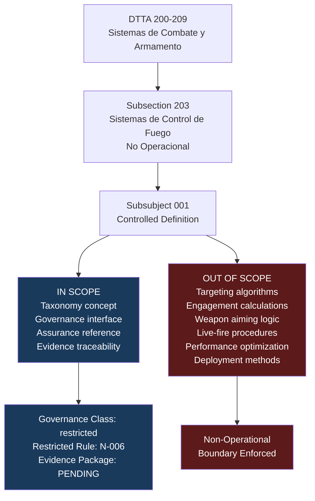

# DTTA 200-209 · Section 00 · Subsection 203 · Subsubject 001 — Fire-Control Systems Non-Operational Definition

## 1. Purpose

This subsubject establishes the controlled, non-operational definition of *fire-control systems* within the Q+ATLANTIDE DTTA taxonomy. It provides the authoritative baseline definition used across all subsequent subsubjects (`002`–`010`) in subsection `203` and across the DTTA `200-209` section.

The definition is intentionally scoped as a governance and taxonomy concept. It does not constitute a technical specification, operational specification, engineering design document, or system requirement. It supports legal admissibility review, evidence packaging and proportionality governance only.

## 2. Scope

- Covers the *Fire-Control Systems Non-Operational Definition* subsubject (`001`) of subsection `203`.
- Concepts in scope:
  - **Controlled definition boundary** — The explicit limits of what constitutes a "fire-control system" for governance and taxonomy purposes within this baseline.
  - **Non-operational qualifier** — The formal meaning of "non-operational" as applied to fire-control system references in DTTA documentation: abstract, governance-layer, non-activatable, evidence-traceable.
  - **Taxonomy placement** — How fire-control systems are positioned within the DTTA `200-209` section relative to adjacent nodes (`200`–`202`, `204`–`209`).
  - **Governance class inheritance** — The rule by which all documents referencing fire-control systems within this subsection inherit `restricted` governance class and N-006 constraints.
  - **Definition exclusions** — An explicit enumeration of what is excluded: targeting algorithms, engagement logic, weapon aiming, live-fire procedures, performance parameters, tactical employment and deployment methods.
  - **Admissibility qualifier** — The requirement that this definition remains legally reviewable, evidence-backed and bounded by humanitarian, proportionality, safety and de-escalation constraints.
- Out of scope: operational fire-control system engineering, system performance specifications, engagement sequence design, targeting logic, weapon control software architecture, and any information derivable as operational capability from governance documents.

## 3. Diagram — Fire-Control System Definition Boundary

## 4. Footprint

| Metric | Value |
|---|---|
| Architecture | `DTTA` — Defence Technology Type Architecture |
| Master range | `200–299` |
| Code range | `200-209` |
| Section | `00` — Sistemas de Combate y Armamento |
| Subsection | `203` — Sistemas de Control de Fuego No Operacional |
| Subsubject | `001` — Fire-Control Systems Non-Operational Definition |
| Primary Q-Division | Q-DATAGOV |
| Support Q-Divisions | Q-SPACE, Q-HORIZON, Q-HPC, Q-STRUCTURES, Q-INDUSTRY |
| ORB support | ORB-LEG, ORB-PMO, ORB-FIN |
| Governance class | `restricted` |
| Document | `001_Fire-Control-Systems-Non-Operational-Definition.md` (this file) |
| Subsection index | [`README.md`](./README.md) |
| Parent section | [`../README.md`](../README.md) |
| Parent baseline | [`organization/Q+ATLANTIDE.md`](../../../../organization/Q+ATLANTIDE.md) |

## 5. References & Citations

[^milstd882e]: **MIL-STD-882E** — Department of Defense Standard Practice: System Safety (2012). §3 definitions provide system safety terminology context for fire-control system classification.
[^defstan]: **DEF STAN 00-056 Issue 5** — Safety Management Requirements for Defence Systems. Clause 1 scope definitions inform governance-layer system definitions.
[^stanag4119]: **NATO STANAG 4119 Ed. 4** — Common NATO Fuze Design Safety and Suitability for Service Standards. §2 provides fire-control-relevant safety definition context.
[^stanag4187]: **NATO STANAG 4187** — Fuze Safety Design Criteria. Relevant to non-operational boundary definition for fire-control safety governance.
[^geneva]: **Geneva Conventions Additional Protocol I, Art. 36** — Obligation to review new weapons; informs the admissibility-qualifier requirement for fire-control governance definitions.
[^n006]: **Note N-006 (Restricted bands)** — Defence-related (`200-299` DTTA) bands require additional governance, evidence packages and access controls. See [`organization/Q+ATLANTIDE.md` §5.3](../../../../organization/Q+ATLANTIDE.md#53-restricted-band-templates-n-006).
