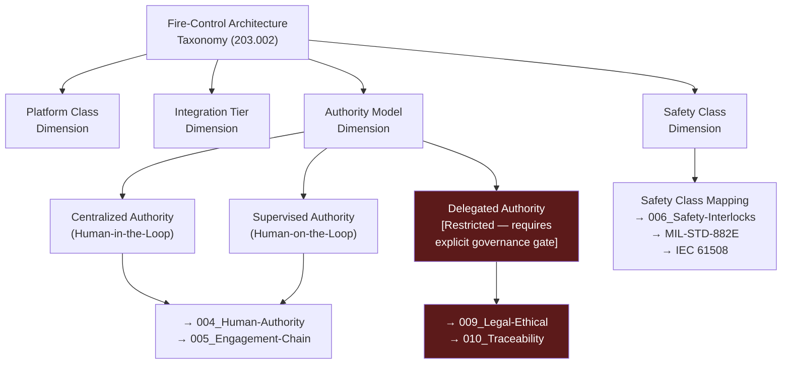

# DTTA 200-209 · Section 00 · Subsection 203 · Subsubject 002 — Fire-Control Architecture Taxonomy

## 1. Purpose

This subsubject establishes the governance-layer taxonomy of fire-control architecture types within the Q+ATLANTIDE DTTA `200-209` subsection `203`. It provides a structured classification framework used for traceability, evidence packaging and regulatory reference — not for engineering design or operational configuration.

The taxonomy supports legal admissibility review, auditor navigation and interface-governance mapping across adjacent DTTA nodes.

## 2. Scope

- Covers the *Fire-Control Architecture Taxonomy* subsubject (`002`) of subsection `203`.
- Concepts in scope:
  - **Taxonomy classification levels** — The hierarchy of classification dimensions (platform class, integration tier, authority model, safety class) used to categorise fire-control architecture types at the governance layer.
  - **Architecture type identifiers** — Abstract identifiers assigned to governance-relevant fire-control architecture classes (e.g., centralized vs. distributed authority models) for traceability purposes only.
  - **Interface governance mapping** — How taxonomy types map to interface-governance requirements in subsubjects `003`–`008`.
  - **Taxonomy inheritance rules** — The rules by which sub-types inherit governance constraints, restricted-band classification and evidence requirements from parent taxonomy entries.
  - **Adjacent node relationships** — Governance cross-references to `204_Integracion-Plataforma-Efector` and `205_Seguridad-de-Armamento-y-Control-de-Riesgos` from the taxonomy layer.
- Out of scope: specific fire-control system engineering architectures, software architecture designs, hardware configurations, network topologies, engagement logic, weapon guidance taxonomy and any operational characterization of architecture types.

## 3. Diagram — Fire-Control Architecture Taxonomy Structure

## 4. Footprint

| Metric | Value |
|---|---|
| Architecture | `DTTA` — Defence Technology Type Architecture |
| Master range | `200–299` |
| Code range | `200-209` |
| Section | `00` — Sistemas de Combate y Armamento |
| Subsection | `203` — Sistemas de Control de Fuego No Operacional |
| Subsubject | `002` — Fire-Control Architecture Taxonomy |
| Primary Q-Division | Q-DATAGOV |
| Support Q-Divisions | Q-SPACE, Q-HORIZON, Q-HPC, Q-STRUCTURES, Q-INDUSTRY |
| ORB support | ORB-LEG, ORB-PMO, ORB-FIN |
| Governance class | `restricted` |
| Document | `002_Fire-Control-Architecture-Taxonomy.md` (this file) |
| Subsection index | [`README.md`](./README.md) |
| Parent section | [`../README.md`](../README.md) |
| Parent baseline | [`organization/Q+ATLANTIDE.md`](../../../../organization/Q+ATLANTIDE.md) |

## 5. References & Citations

[^milstd882e]: **MIL-STD-882E** — DoD Standard Practice: System Safety (2012). Task 102 (Preliminary Hazard List), Task 202 (Subsystem Hazard Analysis) provide taxonomy context for safety classification dimensions.
[^iec61508]: **IEC 61508-1:2010** — Functional Safety of E/E/PE Safety-related Systems: Part 1 General Requirements. Safety Integrity Level (SIL) classification informs safety-class taxonomy dimensions.
[^defstan]: **DEF STAN 00-056 Issue 5** — Safety Management Requirements for Defence Systems. Part 2 system safety activities support taxonomy classification governance.
[^stanag4119]: **NATO STANAG 4119 Ed. 4** — Common NATO Fuze Design Safety and Suitability for Service. Provides interface classification context for fire-control taxonomy entries.
[^n006]: **Note N-006 (Restricted bands)** — Defence-related (`200-299` DTTA) bands require additional governance, evidence packages and access controls. See [`organization/Q+ATLANTIDE.md` §5.3](../../../../organization/Q+ATLANTIDE.md#53-restricted-band-templates-n-006).
