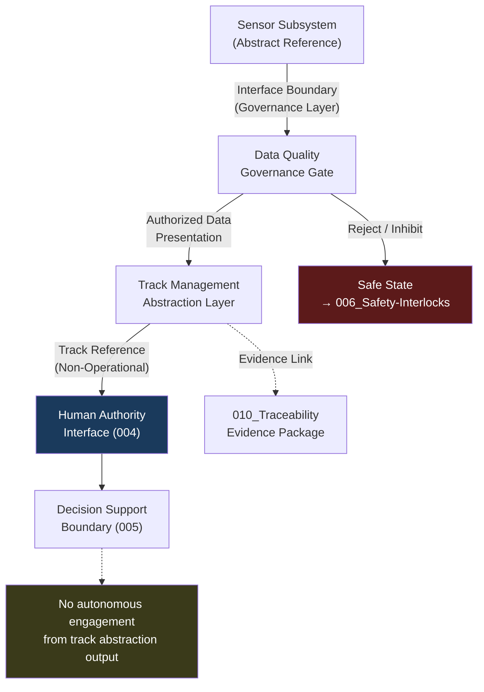

# DTTA 200-209 · Section 00 · Subsection 203 · Subsubject 003 — Sensor Input and Track Management Abstraction

## 1. Purpose

This subsubject defines the abstract governance representation of sensor input pipelines and track-management interfaces within fire-control system governance. It establishes the conceptual boundary between sensor data provision and fire-control decision-support at the governance layer, for traceability and interface-governance purposes only.

No sensor system architectures, sensor fusion algorithms, track quality metrics or operational track parameters are defined herein.

## 2. Scope

- Covers the *Sensor Input and Track Management Abstraction* subsubject (`003`) of subsection `203`.
- Concepts in scope:
  - **Sensor input interface boundary** — The abstract governance demarcation between sensor subsystems and fire-control governance layer; used for interface traceability only.
  - **Track management abstraction** — The governance-layer representation of track management functions: designation, correlation, classification and handoff — treated as abstract process references without operational parameters.
  - **Data quality governance gate** — The conceptual requirement that sensor data entering fire-control governance processes must pass defined quality and authorization gates before being presented to human decision authorities.
  - **Human presentation boundary** — The governance concept that all sensor-derived tracks presented to human decision authorities must be filtered through authority-validated presentation layers.
  - **Abstraction-to-authority handoff** — The governance rule that track abstraction outputs are only valid inputs to human authority interfaces (`004`) and not to autonomous engagement logic.
- Out of scope: sensor hardware specifications, track algorithm designs, sensor fusion implementations, track quality calculations, operational track libraries, real-time track data formats, sensor network architectures and any data that could constitute operational targeting information.

## 3. Diagram — Sensor Input Governance Abstraction

## 4. Footprint

| Metric | Value |
|---|---|
| Architecture | `DTTA` — Defence Technology Type Architecture |
| Master range | `200–299` |
| Code range | `200-209` |
| Section | `00` — Sistemas de Combate y Armamento |
| Subsection | `203` — Sistemas de Control de Fuego No Operacional |
| Subsubject | `003` — Sensor Input and Track Management Abstraction |
| Primary Q-Division | Q-DATAGOV |
| Support Q-Divisions | Q-SPACE, Q-HORIZON, Q-HPC, Q-STRUCTURES, Q-INDUSTRY |
| ORB support | ORB-LEG, ORB-PMO, ORB-FIN |
| Governance class | `restricted` |
| Document | `003_Sensor-Input-and-Track-Management-Abstraction.md` (this file) |
| Subsection index | [`README.md`](./README.md) |
| Parent section | [`../README.md`](../README.md) |
| Parent baseline | [`organization/Q+ATLANTIDE.md`](../../../../organization/Q+ATLANTIDE.md) |

## 5. References & Citations

[^milstd882e]: **MIL-STD-882E** — DoD Standard Practice: System Safety. Task 207 (Interface Hazard Analysis) provides the interface-governance framework for sensor-to-fire-control boundary definitions.
[^stanag4119]: **NATO STANAG 4119 Ed. 4** — Fuze Design Safety Standards. Interface and data handoff governance context relevant to sensor-to-control system boundaries.
[^iec61508]: **IEC 61508-2:2010** — Hardware aspects of functional safety. Safety function requirements for data quality gates in safety-related systems.
[^defstan]: **DEF STAN 00-056 Issue 5** — Safety Management Requirements for Defence Systems. Interface Hazard Analysis methodology (Annex B) informs sensor boundary governance.
[^n006]: **Note N-006 (Restricted bands)** — Defence-related (`200-299` DTTA) bands require additional governance, evidence packages and access controls. See [`organization/Q+ATLANTIDE.md` §5.3](../../../../organization/Q+ATLANTIDE.md#53-restricted-band-templates-n-006).
