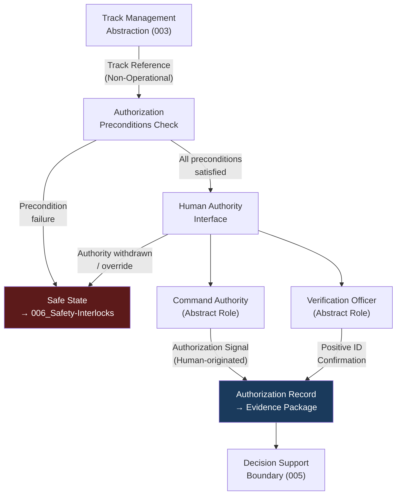

# DTTA 200-209 · Section 00 · Subsection 203 · Subsubject 004 — Human Authority and Authorization Interface

## 1. Purpose

This subsubject defines the governance principles governing human authority and authorization interfaces in fire-control system governance. It establishes the mandatory human-authority governance requirements: the rules by which qualified human decision-makers must be positioned in the authorization chain, and the governance preconditions for any authorization signal.

This document does not describe the engineering implementation of any human-machine interface, nor any operational protocols.

## 2. Scope

- Covers the *Human Authority and Authorization Interface* subsubject (`004`) of subsection `203`.
- Concepts in scope:
  - **Human authority mandate** — The governance principle that all authorization signals in fire-control governance chains must originate from a qualified human authority. No autonomous authorization is recognized in any governance-compliant process.
  - **Authorization preconditions** — The governance-layer preconditions that must be satisfied before a human authority interface is considered valid: operator qualification, Rules of Engagement (RoE) verification, and positive identification confirmation.
  - **Interface governance roles** — The abstract governance roles (Command Authority, Verification Officer, Authorization Executor) defined for traceability purposes at the governance layer; not operational designations.
  - **Authorization signal governance** — The governance requirements for how an authorization signal is recorded, time-stamped, attributed to a named human authority and linked to an evidence package.
  - **Authority withdrawal and override** — The governance requirement that human authority can be withdrawn or overridden at any point in the authorization chain, and that such withdrawal triggers safe-state conditions per subsubject `006`.
- Out of scope: engineering designs of human-machine interfaces, operational HMI configurations, specific RoE text, operational command chains, biometric identification systems, communications network designs and any real-time authorization protocols.

## 3. Diagram — Human Authority Governance Chain

## 4. Footprint

| Metric | Value |
|---|---|
| Architecture | `DTTA` — Defence Technology Type Architecture |
| Master range | `200–299` |
| Code range | `200-209` |
| Section | `00` — Sistemas de Combate y Armamento |
| Subsection | `203` — Sistemas de Control de Fuego No Operacional |
| Subsubject | `004` — Human Authority and Authorization Interface |
| Primary Q-Division | Q-DATAGOV |
| Support Q-Divisions | Q-SPACE, Q-HORIZON, Q-HPC, Q-STRUCTURES, Q-INDUSTRY |
| ORB support | ORB-LEG, ORB-PMO, ORB-FIN |
| Governance class | `restricted` |
| Document | `004_Human-Authority-and-Authorization-Interface.md` (this file) |
| Subsection index | [`README.md`](./README.md) |
| Parent section | [`../README.md`](../README.md) |
| Parent baseline | [`organization/Q+ATLANTIDE.md`](../../../../organization/Q+ATLANTIDE.md) |

## 5. References & Citations

[^milstd882e]: **MIL-STD-882E** — DoD Standard Practice: System Safety. Task 101 (Software Hazard Analysis) and Task 207 (Interface Hazard Analysis) provide governance context for authority interface requirements.
[^defstan]: **DEF STAN 00-056 Issue 5** — Safety Management Requirements for Defence Systems. Clause 6 human-factors safety requirements inform authority mandate governance.
[^geneva]: **Geneva Conventions (1949) and Additional Protocols I & II** — International Humanitarian Law requirements for command authority and positive identification in armed conflict; foundational to human-authority mandate governance.
[^stanag4187]: **STANAG 4187** — NATO Standard for Fuze Functioning Safety and Suitability for Service. Provides authorization and safety interlock governance context.
[^n006]: **Note N-006 (Restricted bands)** — Defence-related (`200-299` DTTA) bands require additional governance, evidence packages and access controls. See [`organization/Q+ATLANTIDE.md` §5.3](../../../../organization/Q+ATLANTIDE.md#53-restricted-band-templates-n-006).
