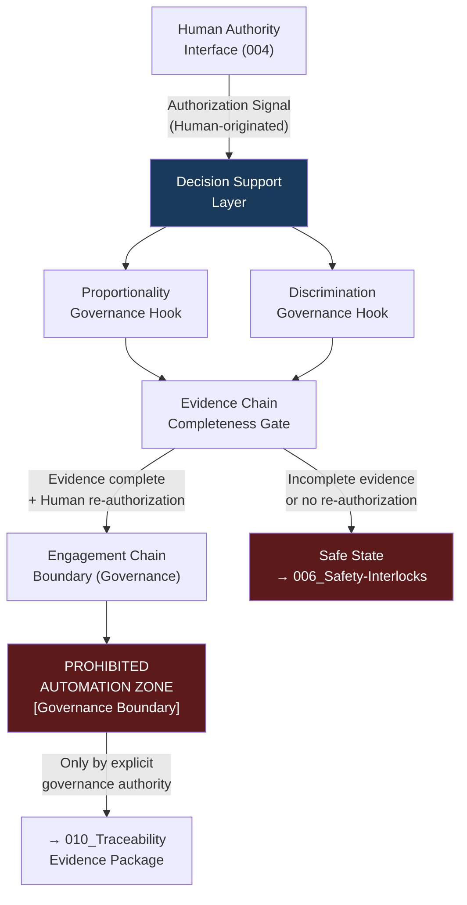

# DTTA 200-209 · Section 00 · Subsection 203 · Subsubject 005 — Decision Support and Engagement Chain Boundaries

## 1. Purpose

This subsubject establishes the governance boundaries of decision-support functions and engagement chain governance within fire-control system taxonomy. It defines what constitutes permissible decision-support (presentation of information to human authorities) and what constitutes a prohibited engagement chain (automated or autonomous engagement logic).

The purpose is strictly taxonomic and boundary-defining for governance, traceability and evidence-packaging purposes only.

## 2. Scope

- Covers the *Decision Support and Engagement Chain Boundaries* subsubject (`005`) of subsection `203`.
- Concepts in scope:
  - **Decision-support boundary definition** — The governance demarcation between permissible decision-support functions (information presentation to human authorities) and any form of engagement logic. Decision support ends where autonomous action would begin.
  - **Engagement chain governance** — The abstract governance model of an engagement chain: the sequence of human-authorized steps from authorization signal through to physical effect, treated as a traceability construct only.
  - **Prohibited automation zone** — The governance concept of a "prohibited automation zone" — the portion of any engagement chain where automated decision-making is forbidden without explicit governance authority and evidence package.
  - **Proportionality and discrimination governance hooks** — The governance requirement that decision-support outputs must include traceable hooks to IHL proportionality and discrimination assessments before any authorization is considered governance-complete.
  - **Evidence chain completeness** — The governance requirement that each step in the engagement chain boundary model is represented in the evidence package, with human authority attribution at each decision node.
- Out of scope: algorithms or systems implementing decision support, engagement calculation engines, target-selection logic, weapon assignment optimization, rules-of-engagement databases, and any real-time or operational engagement management systems.

## 3. Diagram — Decision Support / Engagement Chain Boundary

## 4. Footprint

| Metric | Value |
|---|---|
| Architecture | `DTTA` — Defence Technology Type Architecture |
| Master range | `200–299` |
| Code range | `200-209` |
| Section | `00` — Sistemas de Combate y Armamento |
| Subsection | `203` — Sistemas de Control de Fuego No Operacional |
| Subsubject | `005` — Decision Support and Engagement Chain Boundaries |
| Primary Q-Division | Q-DATAGOV |
| Support Q-Divisions | Q-SPACE, Q-HORIZON, Q-HPC, Q-STRUCTURES, Q-INDUSTRY |
| ORB support | ORB-LEG, ORB-PMO, ORB-FIN |
| Governance class | `restricted` |
| Document | `005_Decision-Support-and-Engagement-Chain-Boundaries.md` (this file) |
| Subsection index | [`README.md`](./README.md) |
| Parent section | [`../README.md`](../README.md) |
| Parent baseline | [`organization/Q+ATLANTIDE.md`](../../../../organization/Q+ATLANTIDE.md) |

## 5. References & Citations

[^milstd882e]: **MIL-STD-882E** — DoD Standard Practice: System Safety. Hazard risk assessment and mitigation requirements (Table B-I) inform engagement chain boundary governance.
[^defstan]: **DEF STAN 00-056 Issue 5** — Safety Management Requirements for Defence Systems. Safety Case requirements inform evidence chain completeness governance.
[^geneva]: **Geneva Conventions (1949) Additional Protocol I, Articles 51–57** — IHL proportionality and discrimination principles; foundational to proportionality and discrimination governance hooks.
[^milstd1316f]: **MIL-STD-1316F** — Fuze Design, Safety Criteria for. Provides safety criteria context for automated zone prohibitions in weapon-related fire-control governance.
[^n006]: **Note N-006 (Restricted bands)** — Defence-related (`200-299` DTTA) bands require additional governance, evidence packages and access controls. See [`organization/Q+ATLANTIDE.md` §5.3](../../../../organization/Q+ATLANTIDE.md#53-restricted-band-templates-n-006).
