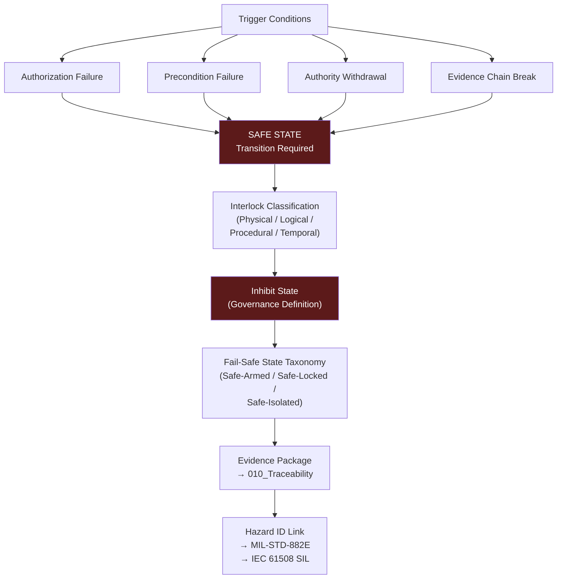

# DTTA 200-209 · Section 00 · Subsection 203 · Subsubject 006 — Safety Interlocks, Inhibits and Fail-Safe States

## 1. Purpose

This subsubject establishes the governance taxonomy of safety interlocks, inhibit mechanisms and fail-safe state definitions within fire-control system governance. It provides abstract governance classifications for safety-critical control states used in traceability, evidence packaging and regulatory mapping — not engineering implementations.

All concepts are defined at the governance layer only.

## 2. Scope

- Covers the *Safety Interlocks, Inhibits and Fail-Safe States* subsubject (`006`) of subsection `203`.
- Concepts in scope:
  - **Safety interlock governance classes** — The governance taxonomy of interlock types (physical, logical, procedural, temporal) as classification constructs for evidence packaging and regulatory mapping under MIL-STD-882E and IEC 61508.
  - **Inhibit state governance** — The governance definition of an inhibit state: a condition in which fire-control system authorization logic is blocked pending resolution of a defined governance condition; not an engineering state definition.
  - **Fail-safe state taxonomy** — The governance classification of fail-safe states (safe-armed, safe-locked, safe-isolated) as abstract governance references; not operational state machine definitions.
  - **Safe-state trigger governance** — The governance conditions under which a safe-state transition is required: authorization failure, precondition failure, authority withdrawal, and evidence-chain break.
  - **Interlock evidence requirements** — The governance requirements for evidence packaging of interlock classifications: each interlock must be traceable to a hazard identification, a safety integrity level assignment and a human authorization record.
- Out of scope: engineering implementations of safety interlocks, hardware or software interlock designs, specific safety integrity level calculations, fuze safety mechanisms, weapon system arming sequences, operational state machine specifications, and any material or energetic safety considerations.

## 3. Diagram — Safety Interlock and Fail-Safe Governance

## 4. Footprint

| Metric | Value |
|---|---|
| Architecture | `DTTA` — Defence Technology Type Architecture |
| Master range | `200–299` |
| Code range | `200-209` |
| Section | `00` — Sistemas de Combate y Armamento |
| Subsection | `203` — Sistemas de Control de Fuego No Operacional |
| Subsubject | `006` — Safety Interlocks, Inhibits and Fail-Safe States |
| Primary Q-Division | Q-DATAGOV |
| Support Q-Divisions | Q-SPACE, Q-HORIZON, Q-HPC, Q-STRUCTURES, Q-INDUSTRY |
| ORB support | ORB-LEG, ORB-PMO, ORB-FIN |
| Governance class | `restricted` |
| Document | `006_Safety-Interlocks-Inhibits-and-Fail-Safe-States.md` (this file) |
| Subsection index | [`README.md`](./README.md) |
| Parent section | [`../README.md`](../README.md) |
| Parent baseline | [`organization/Q+ATLANTIDE.md`](../../../../organization/Q+ATLANTIDE.md) |

## 5. References & Citations

[^milstd882e]: **MIL-STD-882E** — DoD Standard Practice: System Safety. Tasks 201–207 (hazard analysis and risk mitigation) and Appendix B (risk assessment matrix) provide safety interlock governance classification context.
[^iec61508]: **IEC 61508-3:2010** — Software aspects of functional safety. Safety Integrity Level requirements for software-implemented inhibit and fail-safe functions.
[^milstd1316f]: **MIL-STD-1316F** — Fuze Design, Safety Criteria for. Provides safety design criteria context for fail-safe state taxonomy in weapon-related fire-control systems.
[^defstan]: **DEF STAN 00-056 Issue 5** — Safety Management Requirements for Defence Systems. Safety function and safe-state requirement governance (Clause 7).
[^stanag4119]: **NATO STANAG 4119 Ed. 4** — Fuze Design Safety. Interlock and safe-arming standards relevant to fire-control interlock governance taxonomy.
[^n006]: **Note N-006 (Restricted bands)** — Defence-related (`200-299` DTTA) bands require additional governance, evidence packages and access controls. See [`organization/Q+ATLANTIDE.md` §5.3](../../../../organization/Q+ATLANTIDE.md#53-restricted-band-templates-n-006).
