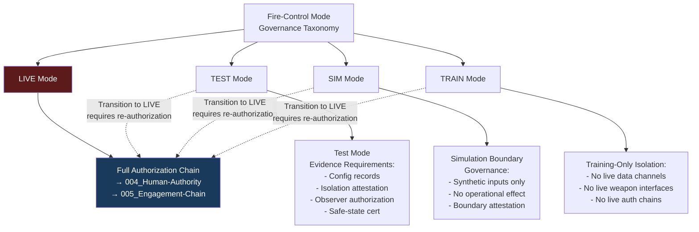

# DTTA 200-209 · Section 00 · Subsection 203 · Subsubject 007 — Test, Simulation and Training-Only Modes

## 1. Purpose

This subsubject defines the governance taxonomy of test, simulation and training-only operational modes within fire-control system governance. It establishes the boundary conditions and governance requirements that distinguish non-operational test and training contexts from operational fire-control governance, and defines the evidence requirements for mode transitions.

No engineering implementations of test modes, simulation systems or training platforms are described herein.

## 2. Scope

- Covers the *Test, Simulation and Training-Only Modes* subsubject (`007`) of subsection `203`.
- Concepts in scope:
  - **Mode governance taxonomy** — The classification of fire-control system modes at the governance layer: `LIVE`, `TEST`, `SIM`, and `TRAIN`; with explicit governance boundaries and evidence requirements for each.
  - **Training-only mode isolation governance** — The governance requirement that systems operating in `TRAIN` mode must be verifiably isolated from live data channels, live weapon interfaces and live authorization chains.
  - **Simulation boundary governance** — The governance definition of a simulation boundary: the governance attestation that all inputs, outputs and states are synthetic and carry no operational effect.
  - **Test mode evidence requirements** — The governance requirements for evidence packaging in `TEST` mode: test configuration records, isolation attestation, observer authorization and return-to-safe-state certification.
  - **Mode transition authorization** — The governance requirement that any transition from `TEST`, `SIM` or `TRAIN` to `LIVE` mode requires explicit human authority re-authorization per subsubject `004` and a new evidence package entry.
- Out of scope: engineering implementations of mode switching, simulation software architectures, training platform designs, test range procedures, live-fire test protocols and any system behaviour in `LIVE` mode.

## 3. Diagram — Mode Governance Taxonomy

## 4. Footprint

| Metric | Value |
|---|---|
| Architecture | `DTTA` — Defence Technology Type Architecture |
| Master range | `200–299` |
| Code range | `200-209` |
| Section | `00` — Sistemas de Combate y Armamento |
| Subsection | `203` — Sistemas de Control de Fuego No Operacional |
| Subsubject | `007` — Test, Simulation and Training-Only Modes |
| Primary Q-Division | Q-DATAGOV |
| Support Q-Divisions | Q-SPACE, Q-HORIZON, Q-HPC, Q-STRUCTURES, Q-INDUSTRY |
| ORB support | ORB-LEG, ORB-PMO, ORB-FIN |
| Governance class | `restricted` |
| Document | `007_Test-Simulation-and-Training-Only-Modes.md` (this file) |
| Subsection index | [`README.md`](./README.md) |
| Parent section | [`../README.md`](../README.md) |
| Parent baseline | [`organization/Q+ATLANTIDE.md`](../../../../organization/Q+ATLANTIDE.md) |

## 5. References & Citations

[^milstd882e]: **MIL-STD-882E** — DoD Standard Practice: System Safety. Task 205 (Functional Hazard Assessment) and Task 401 (Safety Assessment) provide test mode evidence requirement context.
[^iec61508]: **IEC 61508-4:2010** — Functional Safety: Definitions and abbreviations. Mode of operation definitions (Clause 3.2.5) inform mode governance taxonomy.
[^defstan]: **DEF STAN 00-056 Issue 5** — Safety Management Requirements for Defence Systems. Test and verification requirements (Clause 8) inform test mode evidence governance.
[^stanag4187]: **STANAG 4187** — NATO Standard for Fuze Functioning Safety. Test configuration governance requirements for fuze-related fire-control testing.
[^n006]: **Note N-006 (Restricted bands)** — Defence-related (`200-299` DTTA) bands require additional governance, evidence packages and access controls. See [`organization/Q+ATLANTIDE.md` §5.3](../../../../organization/Q+ATLANTIDE.md#53-restricted-band-templates-n-006).
