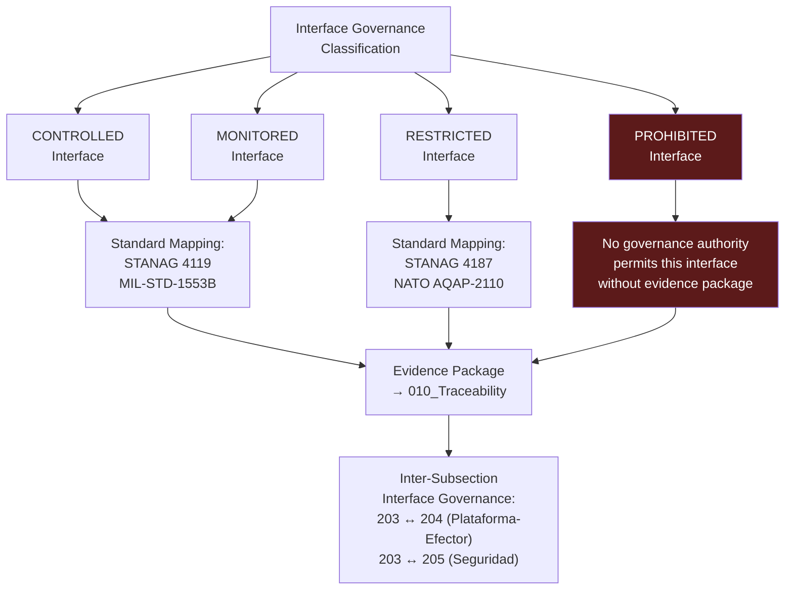

# DTTA 200-209 · Section 00 · Subsection 203 · Subsubject 008 — Interoperability Standards and Interface Governance

## 1. Purpose

This subsubject establishes the governance mapping of interoperability standards and interface governance requirements applicable to fire-control system governance within the DTTA `200-209` subsection `203`. It provides a regulatory reference map for interface governance, traceability and evidence packaging — not an engineering interoperability specification.

## 2. Scope

- Covers the *Interoperability Standards and Interface Governance* subsubject (`008`) of subsection `203`.
- Concepts in scope:
  - **Interface governance standard mapping** — The governance mapping of applicable interoperability standards (STANAG 4119, MIL-STD-1553B, STANAG 4187) to interface governance requirements within subsection `203` subsubjects.
  - **NATO interoperability governance requirements** — The governance requirements derived from NATO STANAG and AQAP standards as they apply to fire-control interface governance classification and evidence packaging.
  - **Interface governance classification** — The classification of fire-control interfaces at the governance layer: `CONTROLLED`, `MONITORED`, `RESTRICTED` and `PROHIBITED`; with traceability to applicable standards.
  - **Inter-subsection interface governance** — The governance mapping of interfaces between subsection `203` and adjacent subsections `204` (Integración Plataforma-Efector) and `205` (Seguridad de Armamento y Control de Riesgos).
  - **Evidence requirements for interface governance** — The governance requirements for interface evidence packages: standard citation, classification record, authorization record, and change-control attestation.
- Out of scope: engineering interface specifications, protocol implementations, network designs, data link layer configurations, MIL-STD-1553B bus implementations, and any operational data exchange content or parameters.

## 3. Diagram — Interface Governance Classification Map

## 4. Footprint

| Metric | Value |
|---|---|
| Architecture | `DTTA` — Defence Technology Type Architecture |
| Master range | `200–299` |
| Code range | `200-209` |
| Section | `00` — Sistemas de Combate y Armamento |
| Subsection | `203` — Sistemas de Control de Fuego No Operacional |
| Subsubject | `008` — Interoperability Standards and Interface Governance |
| Primary Q-Division | Q-DATAGOV |
| Support Q-Divisions | Q-SPACE, Q-HORIZON, Q-HPC, Q-STRUCTURES, Q-INDUSTRY |
| ORB support | ORB-LEG, ORB-PMO, ORB-FIN |
| Governance class | `restricted` |
| Document | `008_Interoperability-Standards-and-Interface-Governance.md` (this file) |
| Subsection index | [`README.md`](./README.md) |
| Parent section | [`../README.md`](../README.md) |
| Parent baseline | [`organization/Q+ATLANTIDE.md`](../../../../organization/Q+ATLANTIDE.md) |

## 5. References & Citations

[^stanag4119]: **NATO STANAG 4119 Ed. 4** — Common NATO Fuze Design Safety and Suitability for Service. Interface governance requirements for fuze-related fire-control interfaces.
[^stanag4187]: **STANAG 4187** — NATO Standard for Fuze Functioning Safety and Suitability for Service. Interface governance context for monitored and restricted interface classifications.
[^milstd1553b]: **MIL-STD-1553B** — Military Standard: Aircraft Internal Time Division Command/Response Multiplex Data Bus. Referenced as governance-layer standard mapping for fire-control data bus interfaces; no implementation details.
[^natoaqap]: **NATO AQAP-2110** — NATO Quality Assurance Requirements for Design, Development and Production. Interface quality governance requirements for restricted-classification interfaces.
[^milstd882e]: **MIL-STD-882E** — DoD Standard Practice: System Safety. Interface Hazard Analysis (Task 207) informs interface governance classification requirements.
[^n006]: **Note N-006 (Restricted bands)** — Defence-related (`200-299` DTTA) bands require additional governance, evidence packages and access controls. See [`organization/Q+ATLANTIDE.md` §5.3](../../../../organization/Q+ATLANTIDE.md#53-restricted-band-templates-n-006).
