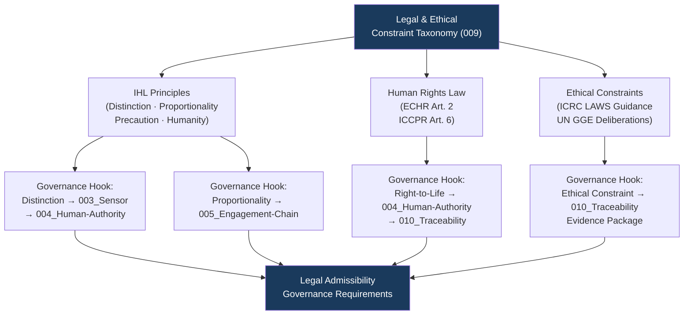

# DTTA 200-209 · Section 00 · Subsection 203 · Subsubject 009 — Legal, Ethical and Rules-of-Use Constraints

## 1. Purpose

This subsubject establishes the governance taxonomy of legal, ethical and rules-of-use constraints applicable to fire-control systems within the DTTA `200-209` subsection `203`. It maps International Humanitarian Law, human rights law, national legal frameworks and ethical principles to governance requirements at the taxonomy layer, for evidence-packaging and traceability purposes.

No operational Rules of Engagement, targeting law interpretation or specific legal advice is provided herein.

## 2. Scope

- Covers the *Legal, Ethical and Rules-of-Use Constraints* subsubject (`009`) of subsection `203`.
- Concepts in scope:
  - **IHL constraint taxonomy** — The governance classification of International Humanitarian Law principles (distinction, proportionality, precaution, humanity) as governance constraints on fire-control system taxonomy and evidence requirements.
  - **Human rights law governance hooks** — The governance requirement that human rights law instruments (ECHR Article 2, ICCPR Article 6) are mapped as governance constraints on any fire-control system human-authority interface.
  - **Ethical constraint governance** — The governance taxonomy of ethical constraints derived from international instruments and professional standards (ICRC LAWS guidance, UN GGE deliberations) applied as governance-layer requirements; not ethical certification or determination.
  - **Rules-of-Use governance boundary** — The governance concept of a rules-of-use boundary: the governance demarcation between permissible system use governed by IHL and prohibited system use; treated as a traceability construct only.
  - **Legal admissibility governance** — The governance requirements that fire-control system evidence packages must satisfy for legal admissibility review: chain of custody, human attribution, and IHL constraint traceability.
- Out of scope: specific Rules of Engagement text, legal advice on targeting or use of force, interpretation of IHL in specific operational contexts, ethical certification services, human rights assessments of specific systems and any operational deployment guidance.

## 3. Diagram — Legal and Ethical Governance Constraint Map

## 4. Footprint

| Metric | Value |
|---|---|
| Architecture | `DTTA` — Defence Technology Type Architecture |
| Master range | `200–299` |
| Code range | `200-209` |
| Section | `00` — Sistemas de Combate y Armamento |
| Subsection | `203` — Sistemas de Control de Fuego No Operacional |
| Subsubject | `009` — Legal, Ethical and Rules-of-Use Constraints |
| Primary Q-Division | Q-DATAGOV |
| Support Q-Divisions | Q-SPACE, Q-HORIZON, Q-HPC, Q-STRUCTURES, Q-INDUSTRY |
| ORB support | ORB-LEG, ORB-PMO, ORB-FIN |
| Governance class | `restricted` |
| Document | `009_Legal-Ethical-and-Rules-of-Use-Constraints.md` (this file) |
| Subsection index | [`README.md`](./README.md) |
| Parent section | [`../README.md`](../README.md) |
| Parent baseline | [`organization/Q+ATLANTIDE.md`](../../../../organization/Q+ATLANTIDE.md) |

## 5. References & Citations

[^geneva]: **Geneva Conventions (1949) and Additional Protocols I & II** — Fundamental IHL instruments; distinction (AP I Art. 48), proportionality (AP I Art. 51.5b), precaution (AP I Art. 57), and humanity principles are mapped as governance constraints.
[^echr]: **European Convention on Human Rights, Article 2** — Right to life; mapped as human rights law governance hook for human-authority interface requirements.
[^iccpr]: **International Covenant on Civil and Political Rights, Article 6** — Right to life; maps as human rights law governance constraint on fire-control authorization chains.
[^icrclaws]: **ICRC (2019) — Autonomy, artificial intelligence and robotics: Technical aspects of human control.** Provides ethical constraint taxonomy context for autonomous system governance hooks.
[^ungge]: **UN Group of Governmental Experts on LAWS (2021) — Report to the CCW.** Ethical principle guidance from GGE deliberations mapped as governance-layer ethical constraints.
[^n006]: **Note N-006 (Restricted bands)** — Defence-related (`200-299` DTTA) bands require additional governance, evidence packages and access controls. See [`organization/Q+ATLANTIDE.md` §5.3](../../../../organization/Q+ATLANTIDE.md#53-restricted-band-templates-n-006).
