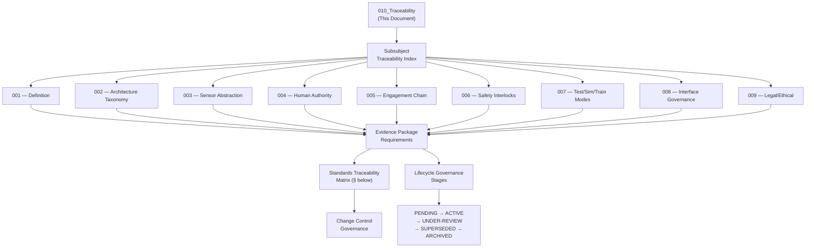

# DTTA 200-209 · Section 00 · Subsection 203 · Subsubject 010 — Traceability, Evidence and Lifecycle Governance

## 1. Purpose

This subsubject is the closing governance document for subsection `203`. It establishes the traceability architecture, evidence-packaging requirements and lifecycle governance framework for all subsubjects `001`–`009`. It provides the standards traceability matrix and lifecycle governance model used for audit, legal admissibility and evidence package certification across the full subsection.

## 2. Scope

- Covers the *Traceability, Evidence and Lifecycle Governance* subsubject (`010`) of subsection `203`.
- Concepts in scope:
  - **Traceability architecture** — The governance-layer model linking each subsubject `001`–`009` document to its applicable standards citations, evidence package identifiers and human authority records.
  - **Evidence package requirements** — The minimum content requirements for a governance-complete evidence package at the subsection `203` level: document ID, version, human authority attribution, standards citation, and hazard/risk traceability.
  - **Standards traceability matrix** — The mapping of applicable standards (see §5) to the specific subsubjects they govern, with traceability to governance requirements within each subsubject.
  - **Lifecycle governance stages** — The governance lifecycle stages applicable to fire-control system governance documents: `PENDING`, `ACTIVE`, `UNDER-REVIEW`, `SUPERSEDED`, `ARCHIVED`; with governance requirements for each stage transition.
  - **Change control governance** — The governance requirements for change control within subsection `203`: change initiator identification, impact assessment, re-authorization, and evidence package update.
- Out of scope: operational lifecycle management of fire-control systems, engineering change management procedures, software configuration management systems, and any system operational lifecycle events.

## 3. Diagram — Traceability and Evidence Architecture

## 4. Standards Traceability Matrix

| Standard | Subsubjects Governed | Key Requirement Mapped |
|---|---|---|
| **MIL-STD-882E** | 001, 002, 003, 005, 006, 007, 009 | System safety hazard analysis, risk mitigation, interface hazard analysis |
| **MIL-STD-1316F** | 001, 005, 006 | Fuze design safety criteria; arming/firing chain governance |
| **IEC 61508 (Parts 1-4)** | 001, 002, 006, 007 | Functional safety, SIL classification, mode governance |
| **DEF STAN 00-056 Issue 5** | 001, 002, 004, 006, 007, 008, 009 | Safety management, safety case, interface hazard analysis |
| **NATO STANAG 4119 Ed. 4** | 001, 002, 008 | Fuze design safety; interface classification governance |
| **NATO STANAG 4187** | 004, 007, 008 | Fuze functioning safety; test/authorization interface governance |
| **Geneva Conventions / AP I & II** | 001, 004, 005, 009 | IHL principles: distinction, proportionality, precaution, humanity |
| **ECHR Article 2 / ICCPR Article 6** | 004, 009 | Human rights law governance hooks for authority interface |
| **NATO AQAP-2110** | 008 | Quality assurance for interface governance classification |
| **ICRC LAWS Guidance (2019)** | 009 | Ethical constraint taxonomy; human control requirements |
| **UN GGE on LAWS (2021)** | 009 | Ethical governance hooks from multilateral deliberations |

## 5. Footprint

| Metric | Value |
|---|---|
| Architecture | `DTTA` — Defence Technology Type Architecture |
| Master range | `200–299` |
| Code range | `200-209` |
| Section | `00` — Sistemas de Combate y Armamento |
| Subsection | `203` — Sistemas de Control de Fuego No Operacional |
| Subsubject | `010` — Traceability, Evidence and Lifecycle Governance |
| Primary Q-Division | Q-DATAGOV |
| Support Q-Divisions | Q-SPACE, Q-HORIZON, Q-HPC, Q-STRUCTURES, Q-INDUSTRY |
| ORB support | ORB-LEG, ORB-PMO, ORB-FIN |
| Governance class | `restricted` |
| Document | `010_Traceability-Evidence-and-Lifecycle-Governance.md` (this file) |
| Subsection index | [`README.md`](./README.md) |
| Parent section | [`../README.md`](../README.md) |
| Parent baseline | [`organization/Q+ATLANTIDE.md`](../../../../organization/Q+ATLANTIDE.md) |

## 6. References & Citations

[^milstd882e]: **MIL-STD-882E** — DoD Standard Practice: System Safety (2012). Task 102–207 hazard analysis tasks; Task 401 safety assessment. Primary system safety standard for subsection `203`.
[^milstd1316f]: **MIL-STD-1316F** — Fuze Design, Safety Criteria for. Safety criteria for arming and firing chain governance within fire-control taxonomy.
[^iec61508]: **IEC 61508 (Parts 1–4):2010** — Functional Safety of E/E/PE Safety-related Systems. SIL classification and functional safety lifecycle governance.
[^defstan]: **DEF STAN 00-056 Issue 5** — Safety Management Requirements for Defence Systems. Safety case and safety management lifecycle for defence systems.
[^stanag4119]: **NATO STANAG 4119 Ed. 4** — Common NATO Fuze Design Safety and Suitability for Service. Interface and safety governance standards.
[^stanag4187]: **STANAG 4187** — NATO Standard for Fuze Functioning Safety and Suitability for Service.
[^geneva]: **Geneva Conventions (1949) and Additional Protocols I & II** — Foundational IHL instruments governing all fire-control system legal constraints.
[^n006]: **Note N-006 (Restricted bands)** — Defence-related (`200-299` DTTA) bands require additional governance, evidence packages and access controls. See [`organization/Q+ATLANTIDE.md` §5.3](../../../../organization/Q+ATLANTIDE.md#53-restricted-band-templates-n-006).
