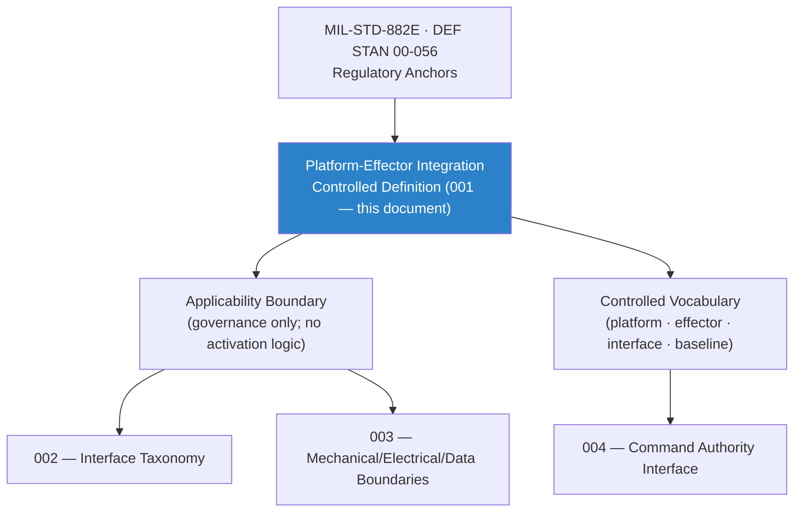

# DTTA 200-209 · Section 00 · Subsection 204 · Subsubject 001 — Platform-Effector Integration Controlled Definition

## 1. Purpose

Establishes the **normative controlled definition and governance scope of platform-effector integration** within the Q+ATLANTIDE DTTA band. This subsubject defines the term *platform-effector integration* in a restricted, non-operational, taxonomy context — covering what constitutes an integration relationship, the applicable governance boundaries, and the controlled vocabulary used throughout subsection `204`.

**Non-operational boundary.** This definition does not specify installation procedures, activation logic, targeting integration sequences, live-use configurations, tactical employment methods or performance parameters. All references remain abstract, governance-scoped and legally reviewable.

## 2. Scope

- Covers the *Platform-Effector Integration Controlled Definition* subsubject (`001`) of subsection `204`.
- Inherits Q-Division authority and ORB support from the parent row in [`../../README.md` §3](../../README.md#3-architecture-table)[^archtable].
- Concepts in scope:
  - **Controlled definition** — Platform-effector integration as the structured, governed relationship between a host platform and a carried or attached effector system, defined through interface specifications, compatibility records, and authorization governance — not through operational or activation logic.
  - **Applicability boundary** — Applies to integration relationships subject to DTTA governance within the `200-209` code range; excludes real-time engagement logic, targeting algorithms, and live-use activation sequences.
  - **Controlled vocabulary** — *platform*, *effector*, *integration interface*, *compatibility record*, *configuration baseline*, *authorization gate*, *safe-state*, *inhibit boundary*.
  - **Governance relationship** — Integration is a governance concept; it is expressed through interface-control documents, qualification evidence, configuration baselines, and authorization records, not operational instructions.
  - **Regulatory anchors** — Cross-map to MIL-STD-882E[^milstd882e], DEF STAN 00-056[^defstan056], NATO AQAP-2110[^aqap2110], and AS9100D[^as9100d].
- Out of scope: specific interface taxonomy (`002`), mechanical/electrical/data boundary definitions (`003`), and command-authority structures (`004`).

## 3. Diagram — Platform-Effector Integration Definition Framework

## 4. Footprint

| Metric | Value |
|---|---|
| Architecture | `DTTA` — Defence Technology Type Architecture |
| Master range | `200–299` |
| Code range | `200-209` |
| Section | `00` — Sistemas de Combate y Armamento |
| Subsection | `204` — Integración Plataforma-Efector |
| Subsubject | `001` — Platform-Effector Integration Controlled Definition |
| Primary Q-Division | Q-DATAGOV[^qdiv] |
| Support Q-Divisions | Q-SPACE, Q-HORIZON, Q-HPC, Q-STRUCTURES, Q-INDUSTRY |
| ORB support | ORB-LEG, ORB-PMO, ORB-FIN |
| Governance class | `restricted`[^gov] |
| Folder path | `Q+ATLANTIDE/200-299_DTTA/200-209_Sistemas-de-Combate-y-Armamento/204_Integracion-Plataforma-Efector/` |
| Document | `001_Platform-Effector-Integration-Controlled-Definition.md` (this file) |
| Parent subsection | [`README.md`](./README.md) · [`000_Overview.md`](./000_Overview.md) |
| Parent architecture | [`../../README.md`](../../README.md) |
| Parent baseline | [`organization/Q+ATLANTIDE.md`](../../../../organization/Q+ATLANTIDE.md) |

## 5. References & Citations

[^baseline]: **Q+ATLANTIDE controlled baseline (v1.0.0)** — [`organization/Q+ATLANTIDE.md`](../../../../organization/Q+ATLANTIDE.md).

[^archtable]: **§3 — Architecture Table (parent)** — [`../../README.md` §3](../../README.md#3-architecture-table).

[^qdiv]: **Q-Division authority** — Q-Divisions provide technical authority over an architecture row (Q+ATLANTIDE Note N-002). See [`organization/Q+ATLANTIDE.md` §4](../../../../organization/Q+ATLANTIDE.md#4-notes).

[^gov]: **Governance class** — `restricted` per N-006 for DTTA band documents.

[^milstd882e]: **MIL-STD-882E — System Safety** — US DoD standard for system safety programme requirements, hazard identification, risk assessment and mitigation across defence systems lifecycle.

[^defstan056]: **DEF STAN 00-056 Issue 5 — Safety Management Requirements for Defence Systems** — UK MoD standard establishing safety management, safety case and safety argument requirements for defence acquisition.

[^aqap2110]: **NATO AQAP-2110 — NATO Quality Assurance Requirements for Design, Development and Production** — NATO quality assurance standard for defence procurement and integration programmes.

[^as9100d]: **AS9100D — Quality Management Systems — Requirements for Aviation, Space and Defence Organizations** — Industry quality management standard governing design, development, integration and production quality assurance.

### Applicable standards

- MIL-STD-882E — System Safety[^milstd882e]
- DEF STAN 00-056 Issue 5 — Safety Management Requirements for Defence Systems[^defstan056]
- NATO AQAP-2110 — Quality Assurance Requirements[^aqap2110]
- AS9100D — Quality Management Systems for Defence[^as9100d]
