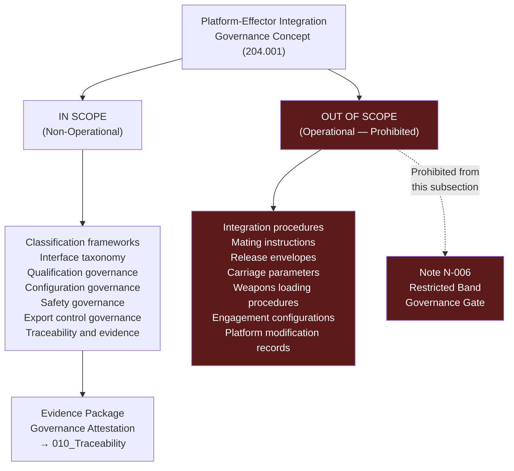

# DTTA 200-209 · Section 00 · Subsection 204 · Subsubject 001 — Platform-Effector Integration Non-Operational Definition

## 1. Purpose

This subsubject establishes the foundational non-operational definition of platform-effector integration within the DTTA `200-209` subsection `204`. It defines the governance boundary that distinguishes admissible non-operational documentation (governance, taxonomy, traceability) from prohibited operational content (integration specifications, deployment procedures, engagement configurations).

## 2. Scope

- Covers the *Platform-Effector Integration Non-Operational Definition* subsubject (`001`) of subsection `204`.
- Concepts in scope:
  - **Non-operational definition boundary** — The explicit governance demarcation between non-operational platform-effector integration governance content (admissible within this subsection) and operational integration engineering content (not admissible).
  - **Platform-effector integration concept** — The abstract governance concept of "platform-effector integration" as a taxonomy node: the relationship between a delivery platform and an effector system as classified at the governance layer, without specification of technical integration parameters.
  - **Governance scope of subsection 204** — The formal statement of what subsection `204` governs: classification, interface taxonomy, qualification governance, configuration governance, safety governance, export control governance and traceability — not integration engineering.
  - **Prohibited operational content** — The explicit list of content types that are never admissible in subsection `204`: integration procedures, mating instructions, release envelopes, carriage parameters, weapons loading procedures, platform modification records and engagement configurations.
  - **Evidence package scope** — The governance requirement that all evidence packages in subsection `204` must contain only governance-layer content and explicitly attest to the absence of operational engineering data.
- Out of scope: any technical integration specifications, interface engineering designs, hardware mating procedures, software integration specifications, system performance data, weapons delivery envelope parameters and operational release authority procedures.

## 3. Diagram — Platform-Effector Integration Governance Boundary

## 4. Footprint

| Metric | Value |
|---|---|
| Architecture | `DTTA` — Defence Technology Type Architecture |
| Master range | `200–299` |
| Code range | `200-209` |
| Section | `00` — Sistemas de Combate y Armamento |
| Subsection | `204` — Integración Plataforma-Efector |
| Subsubject | `001` — Platform-Effector Integration Non-Operational Definition |
| Primary Q-Division | Q-DATAGOV |
| Support Q-Divisions | Q-SPACE, Q-HORIZON, Q-HPC, Q-STRUCTURES, Q-INDUSTRY |
| ORB support | ORB-LEG, ORB-PMO, ORB-FIN |
| Governance class | `restricted` |
| Document | `001_Platform-Effector-Integration-Non-Operational-Definition.md` (this file) |
| Subsection index | [`README.md`](./README.md) |
| Parent section | [`../README.md`](../README.md) |
| Parent baseline | [`organization/Q+ATLANTIDE.md`](../../../../organization/Q+ATLANTIDE.md) |

## 5. References & Citations

[^milstd882e]: **MIL-STD-882E** — DoD Standard Practice: System Safety (2012). Provides system safety scope and definition context for platform-effector integration governance boundary.
[^defstan]: **DEF STAN 00-056 Issue 5** — Safety Management Requirements for Defence Systems. Scope definition for defence system safety governance.
[^natoaqap]: **NATO AQAP-2110** — NATO Quality Assurance Requirements for Design, Development and Production. Scope of quality governance for platform-effector integration taxonomy.
[^itar]: **ITAR/EAR** — International Traffic in Arms Regulations / Export Administration Regulations. Export control scope definition informs prohibited operational content classification.
[^n006]: **Note N-006 (Restricted bands)** — Defence-related (`200-299` DTTA) bands require additional governance, evidence packages and access controls. See [`organization/Q+ATLANTIDE.md` §5.3](../../../../organization/Q+ATLANTIDE.md#53-restricted-band-templates-n-006).
