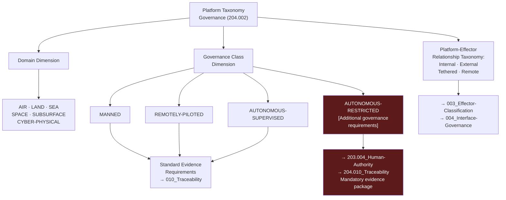

# DTTA 200-209 · Section 00 · Subsection 204 · Subsubject 002 — Platform Classification and Taxonomy

## 1. Purpose

This subsubject establishes the governance taxonomy of platform types within the DTTA `200-209` subsection `204`. It provides abstract classification dimensions for platforms as governance constructs, used for interface governance mapping, evidence packaging and traceability — not for engineering specification or operational platform characterization.

## 2. Scope

- Covers the *Platform Classification and Taxonomy* subsubject (`002`) of subsection `204`.
- Concepts in scope:
  - **Platform domain taxonomy** — The governance classification of platform domains: `AIR`, `LAND`, `SEA`, `SPACE`, `SUBSURFACE`, `CYBER-PHYSICAL` — as abstract governance dimension identifiers only.
  - **Platform governance class** — The governance classification of platforms by governance class: `MANNED`, `REMOTELY-PILOTED`, `AUTONOMOUS-SUPERVISED`, `AUTONOMOUS-RESTRICTED` — each with associated governance requirements and evidence obligations.
  - **Platform-effector relationship taxonomy** — The abstract governance taxonomy of platform-effector relationship types (internal carriage, external carriage, tethered, remote) as classification constructs for interface governance mapping only.
  - **Taxonomy inheritance and governance constraints** — The rules by which platform governance classes inherit governance constraints from parent taxonomy entries and propagate constraints to interface governance subsubjects `003`–`004`.
  - **Restricted platform class governance** — The additional governance requirements for `AUTONOMOUS-RESTRICTED` platform class: mandatory human-authority interface per subsubject `004` of subsection `203`, and mandatory evidence package per `010`.
- Out of scope: specific platform designations, platform engineering specifications, flight performance data, naval architecture specifications, ground mobility specifications, and any characterization of specific operational platform types.

## 3. Diagram — Platform Taxonomy Governance Structure

## 4. Footprint

| Metric | Value |
|---|---|
| Architecture | `DTTA` — Defence Technology Type Architecture |
| Master range | `200–299` |
| Code range | `200-209` |
| Section | `00` — Sistemas de Combate y Armamento |
| Subsection | `204` — Integración Plataforma-Efector |
| Subsubject | `002` — Platform Classification and Taxonomy |
| Primary Q-Division | Q-DATAGOV |
| Support Q-Divisions | Q-SPACE, Q-HORIZON, Q-HPC, Q-STRUCTURES, Q-INDUSTRY |
| ORB support | ORB-LEG, ORB-PMO, ORB-FIN |
| Governance class | `restricted` |
| Document | `002_Platform-Classification-and-Taxonomy.md` (this file) |
| Subsection index | [`README.md`](./README.md) |
| Parent section | [`../README.md`](../README.md) |
| Parent baseline | [`organization/Q+ATLANTIDE.md`](../../../../organization/Q+ATLANTIDE.md) |

## 5. References & Citations

[^milstd882e]: **MIL-STD-882E** — DoD Standard Practice: System Safety. Platform-level hazard analysis taxonomy context for platform governance classification.
[^defstan]: **DEF STAN 00-056 Issue 5** — Safety Management Requirements for Defence Systems. Platform category definitions in safety management governance.
[^stanag4235]: **NATO STANAG 4235** — Insensitive Munitions Requirements. Platform domain classification context for effector carriage governance.
[^as9100d]: **AS9100D** — Quality Management Systems for Aviation, Space, and Defense. Platform governance class quality requirements context.
[^natoaqap]: **NATO AQAP-2110** — NATO Quality Assurance Requirements. Quality governance requirements inherited by platform taxonomy classes.
[^n006]: **Note N-006 (Restricted bands)** — Defence-related (`200-299` DTTA) bands require additional governance, evidence packages and access controls. See [`organization/Q+ATLANTIDE.md` §5.3](../../../../organization/Q+ATLANTIDE.md#53-restricted-band-templates-n-006).
