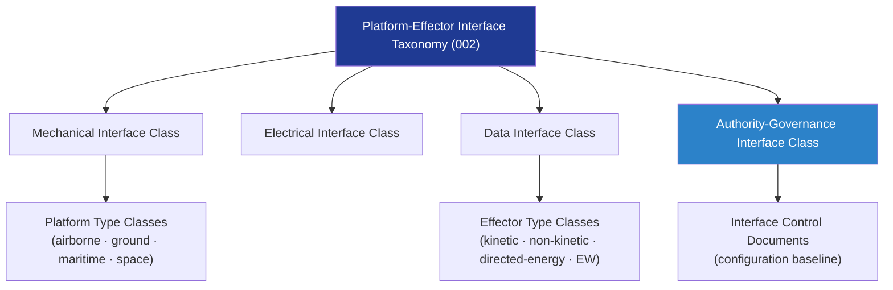

# DTTA 200-209 · Section 00 · Subsection 204 · Subsubject 002 — Platform-Effector Interface Taxonomy

## 1. Purpose

Establishes the **classification taxonomy for platform-effector interfaces** within the DTTA band — defining the categories, interface types, and governance labels used to classify integration relationships between host platforms and effector systems in a non-operational, abstract, and evidence-based manner.

**Non-operational boundary.** This taxonomy categorises interface types for governance and traceability purposes only. It does not specify integration procedures, physical mounting configurations, activation logic, targeting data exchange formats, or operational interface parameters.

## 2. Scope

- Covers the *Platform-Effector Interface Taxonomy* subsubject (`002`) of subsection `204`.
- Inherits Q-Division authority and ORB support from the parent row in [`../../README.md` §3](../../README.md#3-architecture-table)[^archtable].
- Concepts in scope:
  - **Interface category taxonomy** — Classification of integration interfaces into mechanical, electrical, data, and authority-governance categories, each with governance-only descriptors.
  - **Platform type classes** — Taxonomy of platform classes (airborne, ground, maritime, space) as interface hosts within the governance structure; not tactical or operational descriptions.
  - **Effector type classes** — Taxonomy of effector system types (kinetic, non-kinetic, directed-energy, electronic) as abstract governance categories; not weapon performance classifications.
  - **Interface identification convention** — Naming and identifier conventions for interface-control documents within the configuration baseline.
  - **Taxonomy governance rules** — Rules for assigning taxonomy codes, maintaining taxonomy currency, and resolving classification ambiguities under DTTA governance.
- Out of scope: mechanical/electrical/data boundary details (`003`), command-authority logic (`004`), and compatibility records (`006`).

## 3. Diagram — Interface Taxonomy Structure

## 4. Footprint

| Metric | Value |
|---|---|
| Architecture | `DTTA` — Defence Technology Type Architecture |
| Master range | `200–299` |
| Code range | `200-209` |
| Section | `00` — Sistemas de Combate y Armamento |
| Subsection | `204` — Integración Plataforma-Efector |
| Subsubject | `002` — Platform-Effector Interface Taxonomy |
| Primary Q-Division | Q-DATAGOV[^qdiv] |
| Support Q-Divisions | Q-SPACE, Q-HORIZON, Q-HPC, Q-STRUCTURES, Q-INDUSTRY |
| ORB support | ORB-LEG, ORB-PMO, ORB-FIN |
| Governance class | `restricted`[^gov] |
| Folder path | `Q+ATLANTIDE/200-299_DTTA/200-209_Sistemas-de-Combate-y-Armamento/204_Integracion-Plataforma-Efector/` |
| Document | `002_Platform-Effector-Interface-Taxonomy.md` (this file) |
| Parent subsection | [`README.md`](./README.md) · [`000_Overview.md`](./000_Overview.md) |
| Parent architecture | [`../../README.md`](../../README.md) |
| Parent baseline | [`organization/Q+ATLANTIDE.md`](../../../../organization/Q+ATLANTIDE.md) |

## 5. References & Citations

[^baseline]: **Q+ATLANTIDE controlled baseline (v1.0.0)** — [`organization/Q+ATLANTIDE.md`](../../../../organization/Q+ATLANTIDE.md).

[^archtable]: **§3 — Architecture Table (parent)** — [`../../README.md` §3](../../README.md#3-architecture-table).

[^qdiv]: **Q-Division authority** — Q-Divisions provide technical authority over an architecture row (Q+ATLANTIDE Note N-002). See [`organization/Q+ATLANTIDE.md` §4](../../../../organization/Q+ATLANTIDE.md#4-notes).

[^gov]: **Governance class** — `restricted` per N-006 for DTTA band documents.

[^stanag4235]: **NATO STANAG 4235 — Adopted Items of NATO Equipment and NATO Codification** — NATO codification standard for equipment and interface identification within allied integration programmes.

[^milstd882e]: **MIL-STD-882E — System Safety** — Provides hazard taxonomy and interface classification guidance for defence system integration.

[^defstan056]: **DEF STAN 00-056 Issue 5 — Safety Management Requirements for Defence Systems** — UK MoD safety management standard governing interface safety classification and evidence requirements.

### Applicable standards

- NATO STANAG 4235 — NATO Equipment Codification[^stanag4235]
- MIL-STD-882E — System Safety[^milstd882e]
- DEF STAN 00-056 Issue 5 — Safety Management Requirements[^defstan056]
