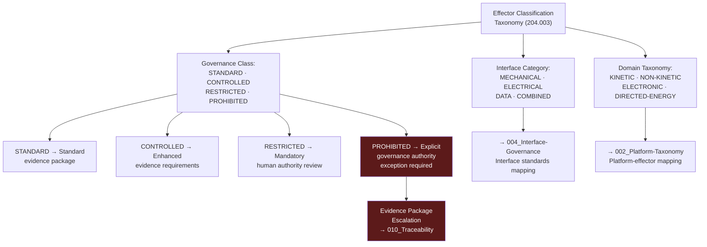

# DTTA 200-209 · Section 00 · Subsection 204 · Subsubject 003 — Effector Classification and Interface Taxonomy

## 1. Purpose

This subsubject establishes the governance taxonomy of effector types and their abstract interface categories within subsection `204`. It defines effector classification dimensions for governance, traceability and evidence-packaging purposes, without specifying the engineering characteristics, performance parameters or operational employment of any effector type.

## 2. Scope

- Covers the *Effector Classification and Interface Taxonomy* subsubject (`003`) of subsection `204`.
- Concepts in scope:
  - **Effector governance taxonomy** — The abstract governance classification of effector types by domain (`KINETIC`, `NON-KINETIC`, `ELECTRONIC`, `DIRECTED-ENERGY`) as governance-layer identifiers only; no performance or design characterization.
  - **Interface category taxonomy** — The governance classification of effector-platform interface categories: `MECHANICAL`, `ELECTRICAL`, `DATA`, `COMBINED` — as abstract interface governance constructs for mapping to subsubject `004`.
  - **Effector governance class** — The governance classification of effectors by authorization governance class: `STANDARD`, `CONTROLLED`, `RESTRICTED`, `PROHIBITED` — with associated evidence and authorization requirements.
  - **PROHIBITED effector class governance** — The governance rule that effectors classified as `PROHIBITED` in this taxonomy must not appear in any evidence package without an explicit governance authority exception, and that such classification triggers an automatic evidence-package escalation.
  - **Effector-to-platform mapping governance** — The abstract governance requirement for traceability between effector classification and platform classification (subsubject `002`), ensuring compatible governance classes are paired for evidence purposes.
- Out of scope: specific effector designations, munition specifications, weapon system performance parameters, lethality assessments, blast and fragmentation data, directed-energy system specifications and any operational effector employment data.

## 3. Diagram — Effector Classification Governance Structure

## 4. Footprint

| Metric | Value |
|---|---|
| Architecture | `DTTA` — Defence Technology Type Architecture |
| Master range | `200–299` |
| Code range | `200-209` |
| Section | `00` — Sistemas de Combate y Armamento |
| Subsection | `204` — Integración Plataforma-Efector |
| Subsubject | `003` — Effector Classification and Interface Taxonomy |
| Primary Q-Division | Q-DATAGOV |
| Support Q-Divisions | Q-SPACE, Q-HORIZON, Q-HPC, Q-STRUCTURES, Q-INDUSTRY |
| ORB support | ORB-LEG, ORB-PMO, ORB-FIN |
| Governance class | `restricted` |
| Document | `003_Effector-Classification-and-Interface-Taxonomy.md` (this file) |
| Subsection index | [`README.md`](./README.md) |
| Parent section | [`../README.md`](../README.md) |
| Parent baseline | [`organization/Q+ATLANTIDE.md`](../../../../organization/Q+ATLANTIDE.md) |

## 5. References & Citations

[^milstd882e]: **MIL-STD-882E** — DoD Standard Practice: System Safety. Subsystem hazard analysis (Task 202) provides classification context for effector governance taxonomy.
[^stanag4235]: **NATO STANAG 4235** — Insensitive Munitions Requirements. Effector domain classification governance context for kinetic effectors.
[^defstan]: **DEF STAN 00-056 Issue 5** — Safety Management Requirements for Defence Systems. Effector classification requirements within system safety management.
[^milstd1553b]: **MIL-STD-1553B** — Military Standard: Aircraft Internal Time Division Data Bus. Data interface category governance context for effector-platform interface taxonomy.
[^natoaqap]: **NATO AQAP-2110** — NATO Quality Assurance Requirements. Quality requirements for effector governance class CONTROLLED and RESTRICTED.
[^n006]: **Note N-006 (Restricted bands)** — Defence-related (`200-299` DTTA) bands require additional governance, evidence packages and access controls. See [`organization/Q+ATLANTIDE.md` §5.3](../../../../organization/Q+ATLANTIDE.md#53-restricted-band-templates-n-006).
