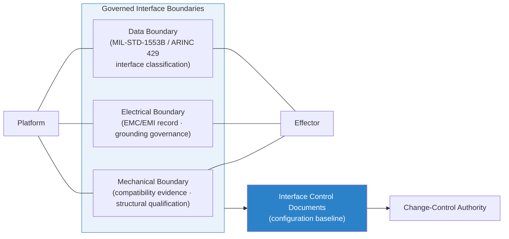

# DTTA 200-209 · Section 00 · Subsection 204 · Subsubject 003 — Mechanical, Electrical and Data Interface Boundaries

## 1. Purpose

Defines the **governance boundaries and evidence requirements for mechanical, electrical and data interfaces** in platform-effector integration within the DTTA band. This subsubject establishes the interface-boundary classification model, the governance obligations at each boundary type, and the traceability requirements that interface-control documents must satisfy.

**Non-operational boundary.** This subsubject defines boundary categories and governance obligations only. It does not specify physical connector types, electrical power levels, data protocol implementations, mounting torque values, or any parameter that enables operational integration or activation.

## 2. Scope

- Covers the *Mechanical, Electrical and Data Interface Boundaries* subsubject (`003`) of subsection `204`.
- Inherits Q-Division authority and ORB support from the parent row in [`../../README.md` §3](../../README.md#3-architecture-table)[^archtable].
- Concepts in scope:
  - **Mechanical boundary governance** — The governance obligation at the physical attachment boundary: compatibility evidence, structural qualification records, and interface-control document requirements; not load calculations or installation torques.
  - **Electrical boundary governance** — The governance obligation at the power and signal boundary: electrical compatibility records, grounding/bonding governance, EMC/EMI classification, and interface-control document traceability; not wiring diagrams or power budgets.
  - **Data boundary governance** — The governance obligation at the data exchange boundary: data interface classification (MIL-STD-1553B[^milstd1553], ARINC 429[^arinc429], etc.), data-ownership and authority-control records, and interface-control document traceability; not protocol implementations or message formats.
  - **Boundary change-control** — Governance rules for authorising boundary changes, updating interface-control documents, and maintaining traceability across configuration baselines.
  - **Evidence obligations** — Minimum evidence sets required at each boundary type to support lifecycle governance and audit.
- Out of scope: command-authority logic at the interface (`004`), safety interlock implementations (`005`), and compatibility verification procedures (`006`).

## 3. Diagram — Interface Boundary Governance Model

## 4. Footprint

| Metric | Value |
|---|---|
| Architecture | `DTTA` — Defence Technology Type Architecture |
| Master range | `200–299` |
| Code range | `200-209` |
| Section | `00` — Sistemas de Combate y Armamento |
| Subsection | `204` — Integración Plataforma-Efector |
| Subsubject | `003` — Mechanical, Electrical and Data Interface Boundaries |
| Primary Q-Division | Q-DATAGOV[^qdiv] |
| Support Q-Divisions | Q-SPACE, Q-HORIZON, Q-HPC, Q-STRUCTURES, Q-INDUSTRY |
| ORB support | ORB-LEG, ORB-PMO, ORB-FIN |
| Governance class | `restricted`[^gov] |
| Folder path | `Q+ATLANTIDE/200-299_DTTA/200-209_Sistemas-de-Combate-y-Armamento/204_Integracion-Plataforma-Efector/` |
| Document | `003_Mechanical-Electrical-and-Data-Interface-Boundaries.md` (this file) |
| Parent subsection | [`README.md`](./README.md) · [`000_Overview.md`](./000_Overview.md) |
| Parent architecture | [`../../README.md`](../../README.md) |
| Parent baseline | [`organization/Q+ATLANTIDE.md`](../../../../organization/Q+ATLANTIDE.md) |

## 5. References & Citations

[^baseline]: **Q+ATLANTIDE controlled baseline (v1.0.0)** — [`organization/Q+ATLANTIDE.md`](../../../../organization/Q+ATLANTIDE.md).

[^archtable]: **§3 — Architecture Table (parent)** — [`../../README.md` §3](../../README.md#3-architecture-table).

[^qdiv]: **Q-Division authority** — Q-Divisions provide technical authority over an architecture row (Q+ATLANTIDE Note N-002). See [`organization/Q+ATLANTIDE.md` §4](../../../../organization/Q+ATLANTIDE.md#4-notes).

[^gov]: **Governance class** — `restricted` per N-006 for DTTA band documents.

[^milstd1553]: **MIL-STD-1553B — Aircraft Internal Time Division Command/Response Multiplex Data Bus** — Standard governing the data bus architecture and interface classifications for avionics and stores integration.

[^arinc429]: **ARINC 429 — Mark 33 Digital Information Transfer System** — Civil/military standard governing data bus interface classification and labelling conventions for avionic integration.

[^milstd882e]: **MIL-STD-882E — System Safety** — Governs interface hazard identification and evidence obligations at mechanical, electrical and data boundaries.

[^defstan056]: **DEF STAN 00-056 Issue 5 — Safety Management Requirements for Defence Systems** — Governs interface boundary safety evidence and change-control obligations.

### Applicable standards

- MIL-STD-1553B — Aircraft Internal Time Division Command/Response Multiplex Data Bus[^milstd1553]
- ARINC 429 — Mark 33 Digital Information Transfer System[^arinc429]
- MIL-STD-882E — System Safety[^milstd882e]
- DEF STAN 00-056 Issue 5 — Safety Management Requirements[^defstan056]
