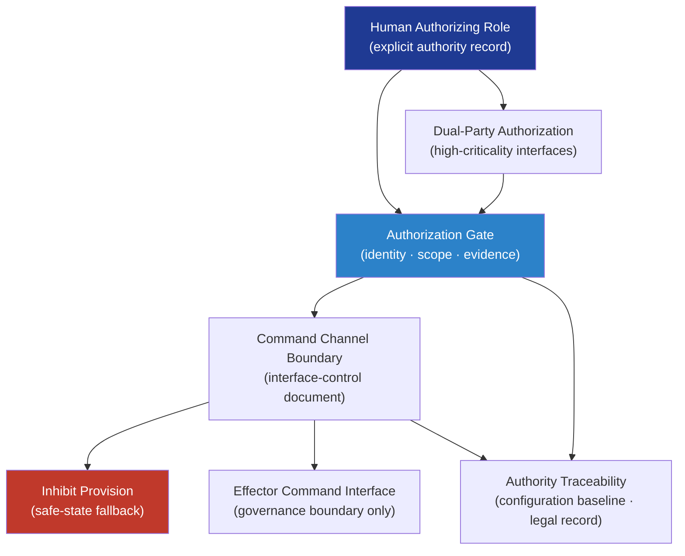

# DTTA 200-209 · Section 00 · Subsection 204 · Subsubject 004 — Command Authority and Authorization Interface

## 1. Purpose

Defines the **command authority and authorization interface governance model** for platform-effector integration within the DTTA band. This subsubject establishes how human authority, authorization gates, and command-control boundaries are structured in the integration governance architecture — ensuring that human authority is explicit, documented, and traceable at every integration boundary where a command channel exists.

**Non-operational boundary.** This subsubject defines authority structures, authorization gate governance, and interface models only. It does not define command protocols, activation sequences, engagement logic, fire-control integration, or any mechanism enabling effector activation or operational use.

## 2. Scope

- Covers the *Command Authority and Authorization Interface* subsubject (`004`) of subsection `204`.
- Inherits Q-Division authority and ORB support from the parent row in [`../../README.md` §3](../../README.md#3-architecture-table)[^archtable].
- Concepts in scope:
  - **Human authority principle** — All integration interfaces that include a command channel must be governed by an explicit human authority model: no autonomous or automated effector activation is within scope of this governance node.
  - **Authorization gate governance** — Definition and classification of authorization gates: identity of authorizing role, scope of authority, evidence of authorization, and traceability to configuration baseline.
  - **Command channel boundary** — Governance model for the boundary at which a command is passed from the platform command system to the effector; includes interface-control document obligations and inhibit provisions.
  - **Dual-party authorization controls** — Governance provision for dual-party or two-person authorization requirements at high-criticality integration interfaces, consistent with safe-custody obligations.
  - **Authority traceability** — Requirements for tracing authorization records to configuration baselines, lifecycle governance evidence packages, and legal admissibility records.
- Out of scope: safety interlock implementations (`005`), compatibility verification (`006`), and test/simulation boundary governance (`007`).

## 3. Diagram — Command Authority and Authorization Structure

## 4. Footprint

| Metric | Value |
|---|---|
| Architecture | `DTTA` — Defence Technology Type Architecture |
| Master range | `200–299` |
| Code range | `200-209` |
| Section | `00` — Sistemas de Combate y Armamento |
| Subsection | `204` — Integración Plataforma-Efector |
| Subsubject | `004` — Command Authority and Authorization Interface |
| Primary Q-Division | Q-DATAGOV[^qdiv] |
| Support Q-Divisions | Q-SPACE, Q-HORIZON, Q-HPC, Q-STRUCTURES, Q-INDUSTRY |
| ORB support | ORB-LEG, ORB-PMO, ORB-FIN |
| Governance class | `restricted`[^gov] |
| Folder path | `Q+ATLANTIDE/200-299_DTTA/200-209_Sistemas-de-Combate-y-Armamento/204_Integracion-Plataforma-Efector/` |
| Document | `004_Command-Authority-and-Authorization-Interface.md` (this file) |
| Parent subsection | [`README.md`](./README.md) · [`000_Overview.md`](./000_Overview.md) |
| Parent architecture | [`../../README.md`](../../README.md) |
| Parent baseline | [`organization/Q+ATLANTIDE.md`](../../../../organization/Q+ATLANTIDE.md) |

## 5. References & Citations

[^baseline]: **Q+ATLANTIDE controlled baseline (v1.0.0)** — [`organization/Q+ATLANTIDE.md`](../../../../organization/Q+ATLANTIDE.md).

[^archtable]: **§3 — Architecture Table (parent)** — [`../../README.md` §3](../../README.md#3-architecture-table).

[^qdiv]: **Q-Division authority** — Q-Divisions provide technical authority over an architecture row (Q+ATLANTIDE Note N-002). See [`organization/Q+ATLANTIDE.md` §4](../../../../organization/Q+ATLANTIDE.md#4-notes).

[^gov]: **Governance class** — `restricted` per N-006 for DTTA band documents.

[^milstd882e]: **MIL-STD-882E — System Safety** — Governs authority and authorization requirements for hazardous system interfaces.

[^defstan056]: **DEF STAN 00-056 Issue 5 — Safety Management Requirements for Defence Systems** — Governs human authority and authorization gate requirements for safety-critical defence interfaces.

[^ihl]: **International Humanitarian Law — Geneva Conventions and Additional Protocols** — Legal framework requiring explicit human authority and accountability for the use of force; anchors the human authority principle at all effector integration governance interfaces.

### Applicable standards

- MIL-STD-882E — System Safety[^milstd882e]
- DEF STAN 00-056 Issue 5 — Safety Management Requirements[^defstan056]
- International Humanitarian Law — Geneva Conventions and Additional Protocols[^ihl]
