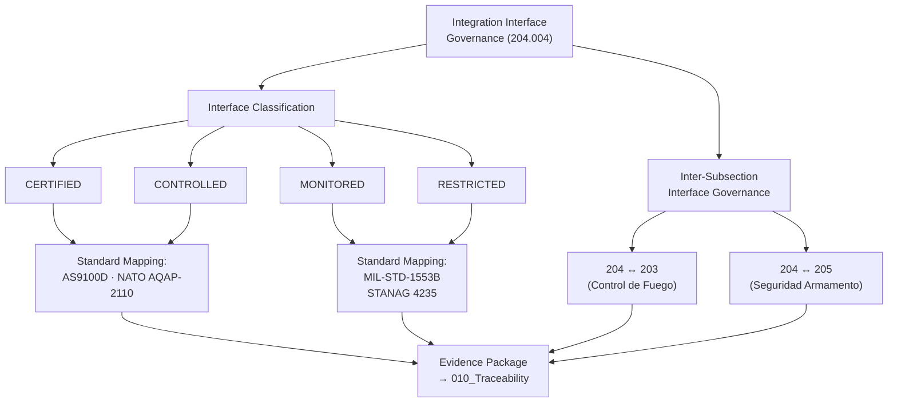

# DTTA 200-209 · Section 00 · Subsection 204 · Subsubject 004 — Integration Interface Governance and Standards

## 1. Purpose

This subsubject establishes the governance mapping of integration interface standards and interface governance requirements applicable to platform-effector integration within subsection `204`. It provides a regulatory reference map for interface governance at the taxonomy layer — not an engineering interface specification or implementation guide.

## 2. Scope

- Covers the *Integration Interface Governance and Standards* subsubject (`004`) of subsection `204`.
- Concepts in scope:
  - **Interface governance standard mapping** — The mapping of applicable standards (MIL-STD-1553B, STANAG 4235, NATO AQAP-2110, AS9100D) to interface governance requirements in subsection `204` subsubjects.
  - **Interface governance classification** — The classification of platform-effector integration interfaces: `CERTIFIED`, `CONTROLLED`, `MONITORED`, `RESTRICTED` — with traceability to applicable standards and evidence requirements.
  - **NATO interface governance requirements** — The governance requirements derived from NATO STANAGs applicable to platform-effector integration interface governance classification and evidence packaging.
  - **Data bus interface governance** — The abstract governance reference to MIL-STD-1553B and equivalent data bus standards as governance-layer interface classification anchors; no bus implementation or protocol content.
  - **Inter-subsection interface governance** — The governance mapping of interfaces between subsection `204` and adjacent subsections `203` (Control de Fuego) and `205` (Seguridad de Armamento), establishing cross-subsection interface evidence requirements.
- Out of scope: engineering interface specifications, MIL-STD-1553B protocol implementation, electrical interface drawings, mechanical interface dimensional data, software interface control documents and any operational data exchange content.

## 3. Diagram — Integration Interface Governance Classification

## 4. Footprint

| Metric | Value |
|---|---|
| Architecture | `DTTA` — Defence Technology Type Architecture |
| Master range | `200–299` |
| Code range | `200-209` |
| Section | `00` — Sistemas de Combate y Armamento |
| Subsection | `204` — Integración Plataforma-Efector |
| Subsubject | `004` — Integration Interface Governance and Standards |
| Primary Q-Division | Q-DATAGOV |
| Support Q-Divisions | Q-SPACE, Q-HORIZON, Q-HPC, Q-STRUCTURES, Q-INDUSTRY |
| ORB support | ORB-LEG, ORB-PMO, ORB-FIN |
| Governance class | `restricted` |
| Document | `004_Integration-Interface-Governance-and-Standards.md` (this file) |
| Subsection index | [`README.md`](./README.md) |
| Parent section | [`../README.md`](../README.md) |
| Parent baseline | [`organization/Q+ATLANTIDE.md`](../../../../organization/Q+ATLANTIDE.md) |

## 5. References & Citations

[^milstd1553b]: **MIL-STD-1553B** — Military Standard: Aircraft Internal Time Division Command/Response Multiplex Data Bus. Referenced as governance-layer data bus standard; no implementation content.
[^stanag4235]: **NATO STANAG 4235** — Insensitive Munitions Requirements. Integration interface classification governance context.
[^natoaqap]: **NATO AQAP-2110** — NATO Quality Assurance Requirements for Design, Development and Production. CERTIFIED and CONTROLLED interface quality governance requirements.
[^as9100d]: **AS9100D** — Quality Management Systems for Aviation, Space, and Defense. Interface certification and quality management governance requirements.
[^milstd882e]: **MIL-STD-882E** — DoD Standard Practice: System Safety. Interface Hazard Analysis (Task 207) informs interface governance classification.
[^defstan]: **DEF STAN 00-056 Issue 5** — Safety Management Requirements for Defence Systems. Interface safety governance for platform-effector integration.
[^n006]: **Note N-006 (Restricted bands)** — Defence-related (`200-299` DTTA) bands require additional governance, evidence packages and access controls. See [`organization/Q+ATLANTIDE.md` §5.3](../../../../organization/Q+ATLANTIDE.md#53-restricted-band-templates-n-006).
