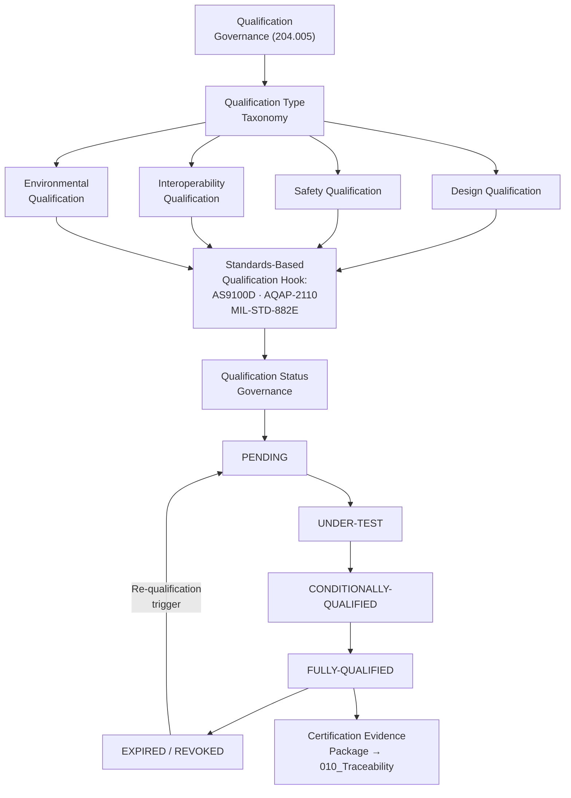

# DTTA 200-209 · Section 00 · Subsection 204 · Subsubject 005 — Qualification and Certification Governance

## 1. Purpose

This subsubject establishes the governance taxonomy of qualification and certification processes applicable to platform-effector integration within subsection `204`. It defines governance requirements for qualification evidence packages, certification evidence records and the governance lifecycle of qualification status — not the engineering or test procedures that produce them.

## 2. Scope

- Covers the *Qualification and Certification Governance* subsubject (`005`) of subsection `204`.
- Concepts in scope:
  - **Qualification governance taxonomy** — The governance classification of qualification types (design qualification, safety qualification, interoperability qualification, environmental qualification) as governance constructs for evidence packaging and traceability.
  - **Certification evidence requirements** — The minimum content requirements for a governance-complete certification evidence package: certification authority identity, standards cited, qualification test reference (not results), and validity period.
  - **Qualification status governance** — The governance lifecycle of qualification status: `PENDING`, `UNDER-TEST`, `CONDITIONALLY-QUALIFIED`, `FULLY-QUALIFIED`, `EXPIRED`, `REVOKED` — with governance requirements for each transition.
  - **Standards-based qualification hooks** — The governance requirement that each qualification type maps to at least one applicable standard (AS9100D, NATO AQAP-2110, MIL-STD-882E) with an explicit governance citation in the evidence package.
  - **Re-qualification trigger governance** — The governance rules for when re-qualification is required: configuration change, standard update, safety authority finding, or evidence-package expiry.
- Out of scope: qualification test procedures, test data, test results, certification test reports, environmental test parameters, safety test protocols and any operational qualification verification activities.

## 3. Diagram — Qualification Governance Lifecycle

## 4. Footprint

| Metric | Value |
|---|---|
| Architecture | `DTTA` — Defence Technology Type Architecture |
| Master range | `200–299` |
| Code range | `200-209` |
| Section | `00` — Sistemas de Combate y Armamento |
| Subsection | `204` — Integración Plataforma-Efector |
| Subsubject | `005` — Qualification and Certification Governance |
| Primary Q-Division | Q-DATAGOV |
| Support Q-Divisions | Q-SPACE, Q-HORIZON, Q-HPC, Q-STRUCTURES, Q-INDUSTRY |
| ORB support | ORB-LEG, ORB-PMO, ORB-FIN |
| Governance class | `restricted` |
| Document | `005_Qualification-and-Certification-Governance.md` (this file) |
| Subsection index | [`README.md`](./README.md) |
| Parent section | [`../README.md`](../README.md) |
| Parent baseline | [`organization/Q+ATLANTIDE.md`](../../../../organization/Q+ATLANTIDE.md) |

## 5. References & Citations

[^as9100d]: **AS9100D** — Quality Management Systems — Requirements for Aviation, Space, and Defense Organizations. Design qualification and certification evidence governance.
[^natoaqap]: **NATO AQAP-2110** — NATO Quality Assurance Requirements for Design, Development and Production. NATO qualification and certification governance requirements.
[^milstd882e]: **MIL-STD-882E** — DoD Standard Practice: System Safety. Safety qualification governance; Task 401 (Safety Assessment) evidence requirements.
[^defstan]: **DEF STAN 00-056 Issue 5** — Safety Management Requirements for Defence Systems. Safety qualification lifecycle governance (Clause 8).
[^stanag4235]: **NATO STANAG 4235** — Insensitive Munitions Requirements. Qualification governance requirements for effector insensitive munitions certification.
[^n006]: **Note N-006 (Restricted bands)** — Defence-related (`200-299` DTTA) bands require additional governance, evidence packages and access controls. See [`organization/Q+ATLANTIDE.md` §5.3](../../../../organization/Q+ATLANTIDE.md#53-restricted-band-templates-n-006).
