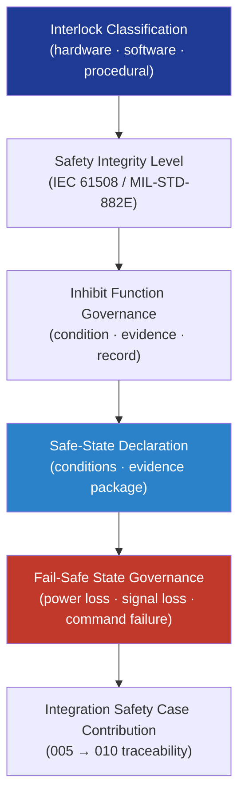

# DTTA 200-209 · Section 00 · Subsection 204 · Subsubject 005 — Safety Interlocks, Inhibits and Safe-State Logic

## 1. Purpose

Defines the **governance model for safety interlocks, inhibit functions and safe-state logic** in platform-effector integration within the DTTA band. This subsubject establishes the classification of interlock and inhibit mechanisms, the evidence obligations for safe-state declarations, and the governance requirements for demonstrating that integration interfaces transition to defined safe states under specified conditions.

**Non-operational boundary.** This subsubject defines interlock classification, inhibit governance models, and safe-state declaration requirements only. It does not specify interlock implementation circuits, software inhibit algorithms, activation-prevention mechanisms, or any operational fail-safe parameter enabling or disabling effector function.

## 2. Scope

- Covers the *Safety Interlocks, Inhibits and Safe-State Logic* subsubject (`005`) of subsection `204`.
- Inherits Q-Division authority and ORB support from the parent row in [`../../README.md` §3](../../README.md#3-architecture-table)[^archtable].
- Concepts in scope:
  - **Interlock classification** — Taxonomy of safety interlock types (hardware, software, procedural, combined) at the integration interface, classified for governance purposes under MIL-STD-882E[^milstd882e] and IEC 61508[^iec61508] safety integrity levels.
  - **Inhibit function governance** — Definition and classification of inhibit functions: which integration states require an inhibit condition, the evidence obligations for inhibit verification, and the governance record requirements.
  - **Safe-state declaration** — Governance model for declaring a safe state at an integration interface: conditions, evidence package structure, and traceability to the safety case.
  - **Fail-safe state governance** — Requirements for fail-to-safe behaviour at integration boundaries under power loss, signal loss, or command-channel failure conditions; expressed as governance obligations, not implementation specifications.
  - **Integration safety case contribution** — How interlock and inhibit governance records contribute to the integration safety case (subsubject `010`) and the broader armament safety case (node `205`).
- Out of scope: compatibility and configuration records (`006`), test and simulation boundary governance (`007`), and lifecycle traceability (`010`).

## 3. Diagram — Safety Interlock and Safe-State Governance

## 4. Footprint

| Metric | Value |
|---|---|
| Architecture | `DTTA` — Defence Technology Type Architecture |
| Master range | `200–299` |
| Code range | `200-209` |
| Section | `00` — Sistemas de Combate y Armamento |
| Subsection | `204` — Integración Plataforma-Efector |
| Subsubject | `005` — Safety Interlocks, Inhibits and Safe-State Logic |
| Primary Q-Division | Q-DATAGOV[^qdiv] |
| Support Q-Divisions | Q-SPACE, Q-HORIZON, Q-HPC, Q-STRUCTURES, Q-INDUSTRY |
| ORB support | ORB-LEG, ORB-PMO, ORB-FIN |
| Governance class | `restricted`[^gov] |
| Folder path | `Q+ATLANTIDE/200-299_DTTA/200-209_Sistemas-de-Combate-y-Armamento/204_Integracion-Plataforma-Efector/` |
| Document | `005_Safety-Interlocks-Inhibits-and-Safe-State-Logic.md` (this file) |
| Parent subsection | [`README.md`](./README.md) · [`000_Overview.md`](./000_Overview.md) |
| Parent architecture | [`../../README.md`](../../README.md) |
| Parent baseline | [`organization/Q+ATLANTIDE.md`](../../../../organization/Q+ATLANTIDE.md) |

## 5. References & Citations

[^baseline]: **Q+ATLANTIDE controlled baseline (v1.0.0)** — [`organization/Q+ATLANTIDE.md`](../../../../organization/Q+ATLANTIDE.md).

[^archtable]: **§3 — Architecture Table (parent)** — [`../../README.md` §3](../../README.md#3-architecture-table).

[^qdiv]: **Q-Division authority** — Q-Divisions provide technical authority over an architecture row (Q+ATLANTIDE Note N-002). See [`organization/Q+ATLANTIDE.md` §4](../../../../organization/Q+ATLANTIDE.md#4-notes).

[^gov]: **Governance class** — `restricted` per N-006 for DTTA band documents.

[^milstd882e]: **MIL-STD-882E — System Safety** — Governing standard for hazard identification, safety interlock classification, and fail-safe state requirements in defence system integration.

[^iec61508]: **IEC 61508 — Functional Safety of E/E/PE Safety-related Systems** — International standard for functional safety integrity levels governing interlock and inhibit classification at safety-critical integration interfaces.

[^defstan056]: **DEF STAN 00-056 Issue 5 — Safety Management Requirements for Defence Systems** — UK MoD standard for safety case structure, safe-state evidence obligations, and inhibit governance in defence integration.

### Applicable standards

- MIL-STD-882E — System Safety[^milstd882e]
- IEC 61508 — Functional Safety of E/E/PE Safety-related Systems[^iec61508]
- DEF STAN 00-056 Issue 5 — Safety Management Requirements[^defstan056]
