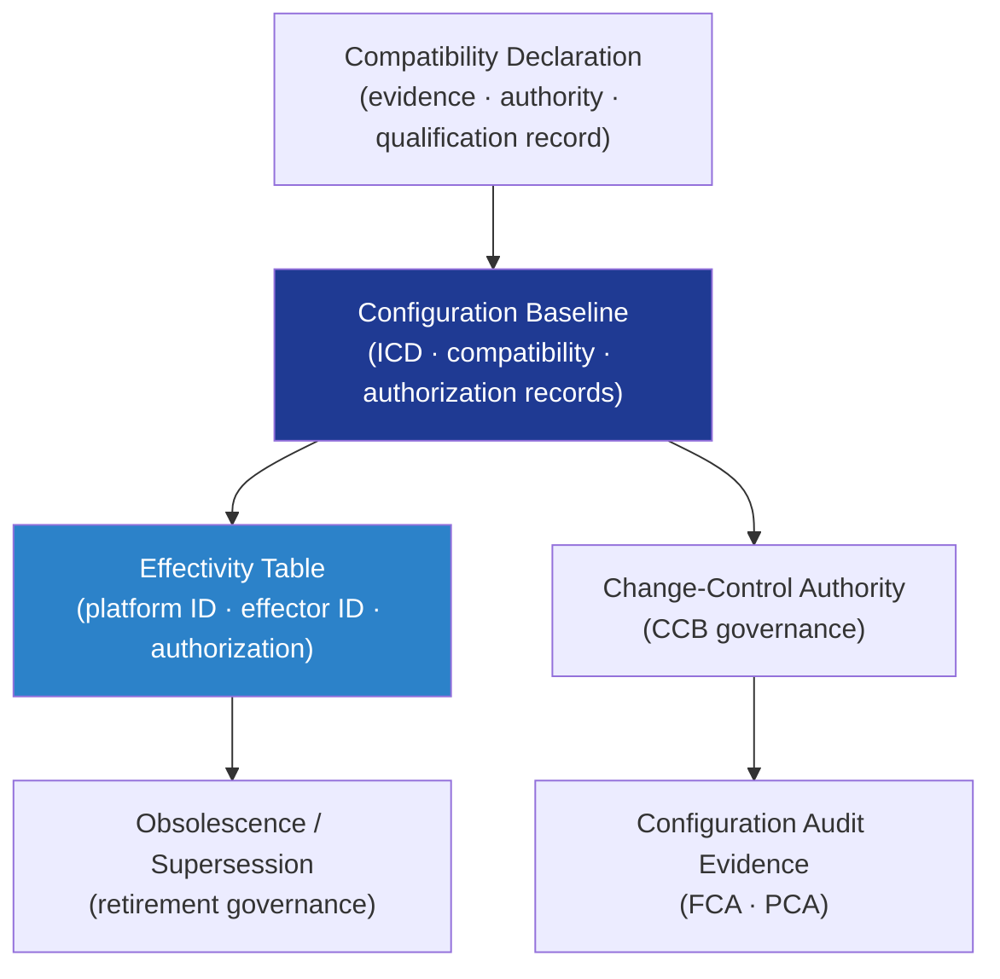

# DTTA 200-209 · Section 00 · Subsection 204 · Subsubject 006 — Compatibility, Configuration and Effectivity Control

## 1. Purpose

Defines the **governance model for compatibility records, configuration baseline management and effectivity control** in platform-effector integration within the DTTA band. This subsubject establishes how integration compatibility is declared, how the configuration baseline is maintained, and how effectivity tables are governed to ensure that only authorized and verified platform-effector combinations are recorded in the baseline.

**Non-operational boundary.** This subsubject defines compatibility classification, configuration baseline governance, and effectivity governance only. It does not specify physical installation verification methods, operational test procedures, effector software load procedures, or any configuration step enabling live integration.

## 2. Scope

- Covers the *Compatibility, Configuration and Effectivity Control* subsubject (`006`) of subsection `204`.
- Inherits Q-Division authority and ORB support from the parent row in [`../../README.md` §3](../../README.md#3-architecture-table)[^archtable].
- Concepts in scope:
  - **Compatibility declaration** — Governance model for declaring an integration combination as compatible: evidence requirements, authority roles, and traceability to qualification records.
  - **Configuration baseline** — The controlled set of interface-control documents, compatibility records, and authorization records that constitute the integration configuration baseline; change-control obligations and CCB authority.
  - **Effectivity table governance** — Structure and governance rules for effectivity tables: platform serial/block identifiers, effector type/version identifiers, and the authorization records that link them; not operational load lists.
  - **Obsolescence and supersession** — Governance model for retiring integration combinations from the baseline, managing effectivity gaps, and maintaining traceability to superseded configurations.
  - **Configuration audit evidence** — Evidence obligations for functional and physical configuration audits at integration baseline changes.
- Out of scope: test/simulation modes (`007`), interoperability standards mapping (`008`), and export-control governance (`009`).

## 3. Diagram — Compatibility and Configuration Governance

## 4. Footprint

| Metric | Value |
|---|---|
| Architecture | `DTTA` — Defence Technology Type Architecture |
| Master range | `200–299` |
| Code range | `200-209` |
| Section | `00` — Sistemas de Combate y Armamento |
| Subsection | `204` — Integración Plataforma-Efector |
| Subsubject | `006` — Compatibility, Configuration and Effectivity Control |
| Primary Q-Division | Q-DATAGOV[^qdiv] |
| Support Q-Divisions | Q-SPACE, Q-HORIZON, Q-HPC, Q-STRUCTURES, Q-INDUSTRY |
| ORB support | ORB-LEG, ORB-PMO, ORB-FIN |
| Governance class | `restricted`[^gov] |
| Folder path | `Q+ATLANTIDE/200-299_DTTA/200-209_Sistemas-de-Combate-y-Armamento/204_Integracion-Plataforma-Efector/` |
| Document | `006_Compatibility-Configuration-and-Effectivity-Control.md` (this file) |
| Parent subsection | [`README.md`](./README.md) · [`000_Overview.md`](./000_Overview.md) |
| Parent architecture | [`../../README.md`](../../README.md) |
| Parent baseline | [`organization/Q+ATLANTIDE.md`](../../../../organization/Q+ATLANTIDE.md) |

## 5. References & Citations

[^baseline]: **Q+ATLANTIDE controlled baseline (v1.0.0)** — [`organization/Q+ATLANTIDE.md`](../../../../organization/Q+ATLANTIDE.md).

[^archtable]: **§3 — Architecture Table (parent)** — [`../../README.md` §3](../../README.md#3-architecture-table).

[^qdiv]: **Q-Division authority** — Q-Divisions provide technical authority over an architecture row (Q+ATLANTIDE Note N-002). See [`organization/Q+ATLANTIDE.md` §4](../../../../organization/Q+ATLANTIDE.md#4-notes).

[^gov]: **Governance class** — `restricted` per N-006 for DTTA band documents.

[^aqap2110]: **NATO AQAP-2110 — NATO Quality Assurance Requirements for Design, Development and Production** — Governs compatibility evidence, configuration baseline, and effectivity control obligations for NATO defence integration programmes.

[^as9100d]: **AS9100D — Quality Management Systems for Defence** — Governs configuration management, compatibility verification, and effectivity baseline governance for aerospace and defence systems.

[^milstd882e]: **MIL-STD-882E — System Safety** — Safety evidence obligations at configuration baseline changes in platform-effector integration.

### Applicable standards

- NATO AQAP-2110 — Quality Assurance Requirements[^aqap2110]
- AS9100D — Quality Management Systems for Defence[^as9100d]
- MIL-STD-882E — System Safety[^milstd882e]
