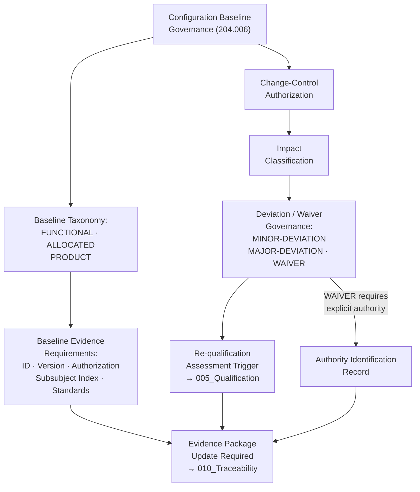

# DTTA 200-209 · Section 00 · Subsection 204 · Subsubject 006 — Configuration Management and Baseline Governance

## 1. Purpose

This subsubject establishes the governance model for configuration management baselines and change-control governance in platform-effector integration taxonomy within subsection `204`. It defines governance requirements for baseline establishment, change-control authorization and evidence packaging — not the engineering configuration management procedures for specific systems.

## 2. Scope

- Covers the *Configuration Management and Baseline Governance* subsubject (`006`) of subsection `204`.
- Concepts in scope:
  - **Governance baseline taxonomy** — The governance classification of configuration baselines at the taxonomy layer: `FUNCTIONAL-BASELINE`, `ALLOCATED-BASELINE`, `PRODUCT-BASELINE` — as governance constructs for evidence-package anchoring and traceability.
  - **Baseline change-control authorization** — The governance requirements for change-control authorization: change initiator identity, impact classification, affected subsubject mapping, and re-qualification trigger assessment per subsubject `005`.
  - **Configuration baseline evidence requirements** — The minimum content for a governance-complete baseline evidence package: baseline identifier, version, authorization record, affected subsubject index and standards mapping.
  - **Deviation and waiver governance** — The governance taxonomy of deviations and waivers: `MINOR-DEVIATION`, `MAJOR-DEVIATION`, `WAIVER` — with associated authorization and evidence requirements. Waivers require explicit authority identification.
  - **Baseline-to-qualification relationship** — The governance rule that any change to a configuration baseline triggers a re-qualification assessment per subsubject `005`, with mandatory evidence package update.
- Out of scope: engineering configuration management systems, specific configuration item lists, hardware or software version control systems, engineering change order procedures and any operational configuration management activities.

## 3. Diagram — Configuration Baseline Governance Model

## 4. Footprint

| Metric | Value |
|---|---|
| Architecture | `DTTA` — Defence Technology Type Architecture |
| Master range | `200–299` |
| Code range | `200-209` |
| Section | `00` — Sistemas de Combate y Armamento |
| Subsection | `204` — Integración Plataforma-Efector |
| Subsubject | `006` — Configuration Management and Baseline Governance |
| Primary Q-Division | Q-DATAGOV |
| Support Q-Divisions | Q-SPACE, Q-HORIZON, Q-HPC, Q-STRUCTURES, Q-INDUSTRY |
| ORB support | ORB-LEG, ORB-PMO, ORB-FIN |
| Governance class | `restricted` |
| Document | `006_Configuration-Management-and-Baseline-Governance.md` (this file) |
| Subsection index | [`README.md`](./README.md) |
| Parent section | [`../README.md`](../README.md) |
| Parent baseline | [`organization/Q+ATLANTIDE.md`](../../../../organization/Q+ATLANTIDE.md) |

## 5. References & Citations

[^as9100d]: **AS9100D** — Quality Management Systems for Aviation, Space, and Defense. Configuration management and baseline governance requirements (Clause 8.5.6).
[^natoaqap]: **NATO AQAP-2110** — NATO Quality Assurance Requirements. Configuration management governance for NATO-qualified platform-effector integrations.
[^milstd882e]: **MIL-STD-882E** — DoD Standard Practice: System Safety. Configuration change impact assessment in system safety governance (Task 206).
[^defstan]: **DEF STAN 00-056 Issue 5** — Safety Management Requirements for Defence Systems. Configuration control requirements for safety-governed defence systems.
[^n006]: **Note N-006 (Restricted bands)** — Defence-related (`200-299` DTTA) bands require additional governance, evidence packages and access controls. See [`organization/Q+ATLANTIDE.md` §5.3](../../../../organization/Q+ATLANTIDE.md#53-restricted-band-templates-n-006).
