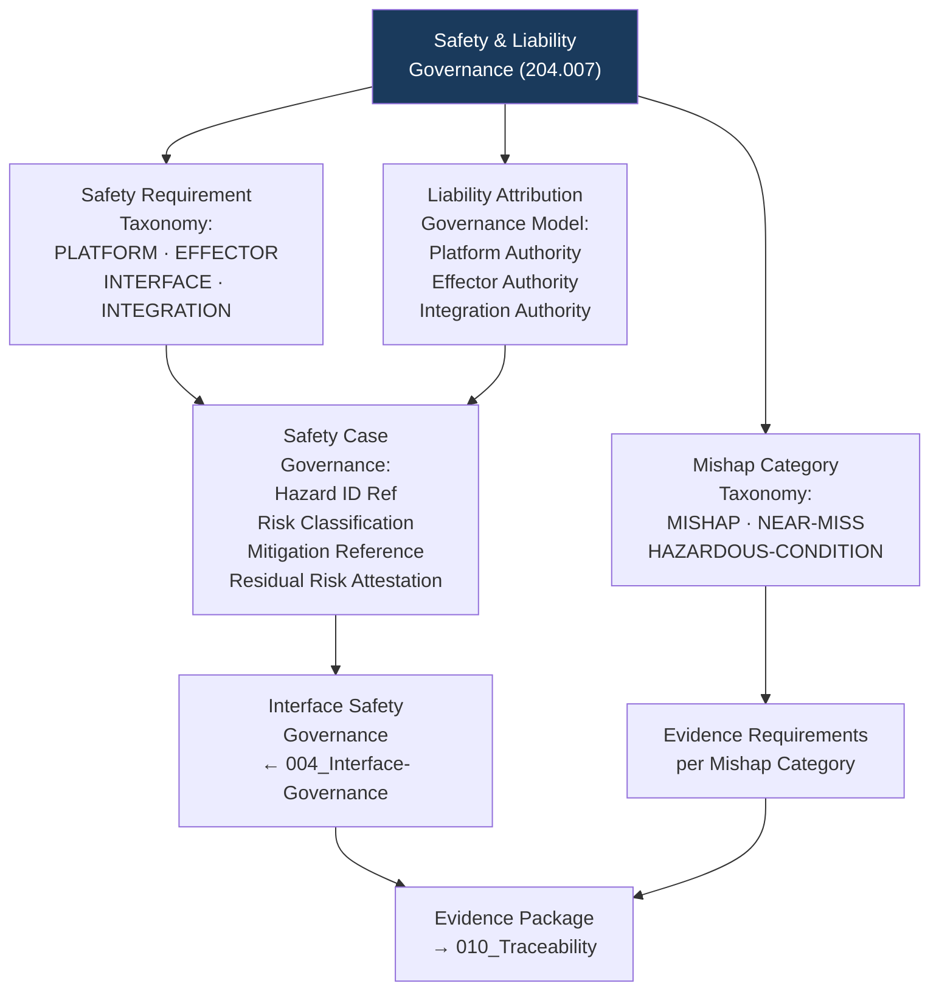

# DTTA 200-209 · Section 00 · Subsection 204 · Subsubject 007 — Safety and Liability Governance

## 1. Purpose

This subsubject establishes the governance taxonomy of safety requirements and liability allocation applicable to platform-effector integration within subsection `204`. It defines governance-layer safety requirement classifications, liability attribution models and evidence requirements — not the engineering safety analyses or legal liability determinations for specific systems.

## 2. Scope

- Covers the *Safety and Liability Governance* subsubject (`007`) of subsection `204`.
- Concepts in scope:
  - **Safety governance requirement taxonomy** — The governance classification of safety requirements at the platform-effector integration level: `PLATFORM-LEVEL`, `EFFECTOR-LEVEL`, `INTERFACE-LEVEL` and `INTEGRATION-LEVEL` — as governance constructs for hazard traceability and evidence packaging.
  - **Liability attribution governance model** — The abstract governance model of liability attribution in platform-effector integration: identifying responsible governance parties (platform authority, effector authority, integration authority) for evidence-chain purposes — not a legal determination.
  - **Safety case governance** — The governance requirements for a safety case at the integration level: hazard identification reference, risk classification, mitigation measure reference and residual risk attestation — all at governance abstraction level only.
  - **Mishap investigation governance** — The governance taxonomy of mishap categories (`MISHAP`, `NEAR-MISS`, `HAZARDOUS-CONDITION`) and the governance evidence requirements triggered by each category.
  - **Interface safety governance** — The governance requirement that interface safety requirements (subsubject `004`) propagate into integration-level safety governance with explicit traceability and authority attribution.
- Out of scope: engineering safety analyses, specific hazard logs, safety test results, liability legal opinions, insurance considerations, specific accident investigation findings and any operational safety management procedures.

## 3. Diagram — Safety and Liability Governance Model

## 4. Footprint

| Metric | Value |
|---|---|
| Architecture | `DTTA` — Defence Technology Type Architecture |
| Master range | `200–299` |
| Code range | `200-209` |
| Section | `00` — Sistemas de Combate y Armamento |
| Subsection | `204` — Integración Plataforma-Efector |
| Subsubject | `007` — Safety and Liability Governance |
| Primary Q-Division | Q-DATAGOV |
| Support Q-Divisions | Q-SPACE, Q-HORIZON, Q-HPC, Q-STRUCTURES, Q-INDUSTRY |
| ORB support | ORB-LEG, ORB-PMO, ORB-FIN |
| Governance class | `restricted` |
| Document | `007_Safety-and-Liability-Governance.md` (this file) |
| Subsection index | [`README.md`](./README.md) |
| Parent section | [`../README.md`](../README.md) |
| Parent baseline | [`organization/Q+ATLANTIDE.md`](../../../../organization/Q+ATLANTIDE.md) |

## 5. References & Citations

[^milstd882e]: **MIL-STD-882E** — DoD Standard Practice: System Safety. Safety requirement taxonomy (Tasks 101–207), mishap category definitions (Table A-I), safety case governance (Task 401).
[^defstan]: **DEF STAN 00-056 Issue 5** — Safety Management Requirements for Defence Systems. Safety case and safety argument governance requirements (Clause 7).
[^stanag4235]: **NATO STANAG 4235** — Insensitive Munitions Requirements. Integration-level safety governance context for effector munition types.
[^natoaqap]: **NATO AQAP-2110** — NATO Quality Assurance Requirements. Interface and integration safety governance quality requirements.
[^n006]: **Note N-006 (Restricted bands)** — Defence-related (`200-299` DTTA) bands require additional governance, evidence packages and access controls. See [`organization/Q+ATLANTIDE.md` §5.3](../../../../organization/Q+ATLANTIDE.md#53-restricted-band-templates-n-006).
