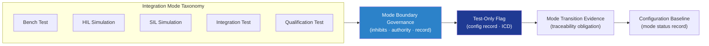

# DTTA 200-209 · Section 00 · Subsection 204 · Subsubject 007 — Test, Simulation and Non-Operational Integration Modes

## 1. Purpose

Defines the **governance model for test, simulation and non-operational integration modes** in platform-effector integration within the DTTA band. This subsubject establishes how integration testing and simulation activities are classified, bounded, and governed — ensuring that test and simulation modes are clearly separated from operational modes in governance records, configuration baselines, and evidence packages.

**Non-operational boundary.** This subsubject defines mode classification, boundary governance, and evidence obligations for test and simulation activities only. It does not specify test procedures, simulation model implementations, stimulation signal parameters, or any procedure enabling live effector activation during test.

## 2. Scope

- Covers the *Test, Simulation and Non-Operational Integration Modes* subsubject (`007`) of subsection `204`.
- Inherits Q-Division authority and ORB support from the parent row in [`../../README.md` §3](../../README.md#3-architecture-table)[^archtable].
- Concepts in scope:
  - **Mode taxonomy** — Classification of integration modes as: bench test, hardware-in-the-loop (HIL) simulation, software-in-the-loop (SIL) simulation, integration test, qualification test, and non-operational verification; each with distinct governance status in the configuration baseline.
  - **Mode boundary governance** — Governance rules establishing which interfaces are active, which inhibit functions must be engaged, and which authority authorizations are required for each mode classification.
  - **Test-only flag governance** — Governance model for applying and removing test-only flags in configuration records and interface-control documents, with traceability obligations.
  - **Simulation data governance** — Governance rules for simulation stimuli data: classification, access control, version traceability, and separation from operational data records.
  - **Mode transition evidence** — Evidence obligations for transitions between test/simulation modes and non-operational/operational modes in the configuration baseline.
- Out of scope: interoperability standards (`008`), export-control governance (`009`), and lifecycle traceability (`010`).

## 3. Diagram — Test and Simulation Mode Governance

## 4. Footprint

| Metric | Value |
|---|---|
| Architecture | `DTTA` — Defence Technology Type Architecture |
| Master range | `200–299` |
| Code range | `200-209` |
| Section | `00` — Sistemas de Combate y Armamento |
| Subsection | `204` — Integración Plataforma-Efector |
| Subsubject | `007` — Test, Simulation and Non-Operational Integration Modes |
| Primary Q-Division | Q-DATAGOV[^qdiv] |
| Support Q-Divisions | Q-SPACE, Q-HORIZON, Q-HPC, Q-STRUCTURES, Q-INDUSTRY |
| ORB support | ORB-LEG, ORB-PMO, ORB-FIN |
| Governance class | `restricted`[^gov] |
| Folder path | `Q+ATLANTIDE/200-299_DTTA/200-209_Sistemas-de-Combate-y-Armamento/204_Integracion-Plataforma-Efector/` |
| Document | `007_Test-Simulation-and-Non-Operational-Integration-Modes.md` (this file) |
| Parent subsection | [`README.md`](./README.md) · [`000_Overview.md`](./000_Overview.md) |
| Parent architecture | [`../../README.md`](../../README.md) |
| Parent baseline | [`organization/Q+ATLANTIDE.md`](../../../../organization/Q+ATLANTIDE.md) |

## 5. References & Citations

[^baseline]: **Q+ATLANTIDE controlled baseline (v1.0.0)** — [`organization/Q+ATLANTIDE.md`](../../../../organization/Q+ATLANTIDE.md).

[^archtable]: **§3 — Architecture Table (parent)** — [`../../README.md` §3](../../README.md#3-architecture-table).

[^qdiv]: **Q-Division authority** — Q-Divisions provide technical authority over an architecture row (Q+ATLANTIDE Note N-002). See [`organization/Q+ATLANTIDE.md` §4](../../../../organization/Q+ATLANTIDE.md#4-notes).

[^gov]: **Governance class** — `restricted` per N-006 for DTTA band documents.

[^milstd882e]: **MIL-STD-882E — System Safety** — Governs test and simulation safety evidence obligations and mode boundary requirements.

[^defstan056]: **DEF STAN 00-056 Issue 5 — Safety Management Requirements for Defence Systems** — Governs test-mode governance and mode-transition evidence obligations in defence integration.

[^aqap2110]: **NATO AQAP-2110 — Quality Assurance Requirements** — Governs test evidence obligations, simulation data governance, and mode classification in NATO integration programmes.

### Applicable standards

- MIL-STD-882E — System Safety[^milstd882e]
- DEF STAN 00-056 Issue 5 — Safety Management Requirements[^defstan056]
- NATO AQAP-2110 — Quality Assurance Requirements[^aqap2110]
