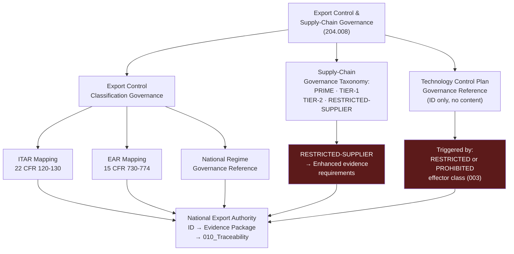

# DTTA 200-209 · Section 00 · Subsection 204 · Subsubject 008 — Export Control and Supply-Chain Governance

## 1. Purpose

This subsubject establishes the governance taxonomy of export control and supply-chain governance requirements applicable to platform-effector integration documentation within subsection `204`. It maps ITAR/EAR, national export control regimes and NATO supply-chain standards to governance requirements at the taxonomy layer — not as export-control compliance advice or legal guidance.

## 2. Scope

- Covers the *Export Control and Supply-Chain Governance* subsubject (`008`) of subsection `204`.
- Concepts in scope:
  - **Export control classification governance** — The governance requirement that all documentation in subsection `204` must carry an explicit export-control classification identifier, mapped to ITAR/EAR or applicable national regime at the governance layer.
  - **ITAR/EAR governance mapping** — The abstract governance reference to ITAR (22 CFR Part 120–130) and EAR (15 CFR Parts 730–774) as the applicable export-control governance framework for platform-effector integration taxonomy documentation.
  - **Supply-chain governance taxonomy** — The governance classification of supply-chain actors at the abstract governance layer: `PRIME`, `TIER-1`, `TIER-2`, `RESTRICTED-SUPPLIER` — with associated evidence and authorization requirements.
  - **Technology control plan governance** — The governance requirement that any evidence package for a `RESTRICTED` or `PROHIBITED` effector class (per subsubject `003`) must reference a Technology Control Plan identifier — not the plan content itself.
  - **National export authority governance** — The governance requirement that national competent export authority identification is recorded in evidence packages for all documentation in the `RESTRICTED` governance class.
- Out of scope: ITAR/EAR compliance legal advice, specific export licence applications, technology control plan content, detailed supply-chain mapping for specific programmes, end-user certificate content and any classification determinations for specific systems.

## 3. Diagram — Export Control and Supply-Chain Governance Map

## 4. Footprint

| Metric | Value |
|---|---|
| Architecture | `DTTA` — Defence Technology Type Architecture |
| Master range | `200–299` |
| Code range | `200-209` |
| Section | `00` — Sistemas de Combate y Armamento |
| Subsection | `204` — Integración Plataforma-Efector |
| Subsubject | `008` — Export Control and Supply-Chain Governance |
| Primary Q-Division | Q-DATAGOV |
| Support Q-Divisions | Q-SPACE, Q-HORIZON, Q-HPC, Q-STRUCTURES, Q-INDUSTRY |
| ORB support | ORB-LEG, ORB-PMO, ORB-FIN |
| Governance class | `restricted` |
| Document | `008_Export-Control-and-Supply-Chain-Governance.md` (this file) |
| Subsection index | [`README.md`](./README.md) |
| Parent section | [`../README.md`](../README.md) |
| Parent baseline | [`organization/Q+ATLANTIDE.md`](../../../../organization/Q+ATLANTIDE.md) |

## 5. References & Citations

[^itar]: **ITAR — 22 CFR Parts 120–130** — International Traffic in Arms Regulations. Export control governance framework for defence articles and services; referenced as governance-layer classification anchor.
[^ear]: **EAR — 15 CFR Parts 730–774** — Export Administration Regulations. Dual-use export control governance framework; referenced as governance-layer classification anchor.
[^natoaqap]: **NATO AQAP-2110** — NATO Quality Assurance Requirements for Design, Development and Production. Supply-chain governance and quality assurance requirements.
[^as9100d]: **AS9100D** — Quality Management Systems for Aviation, Space, and Defense. Supply-chain quality governance and supplier management requirements (Clause 8.4).
[^milstd882e]: **MIL-STD-882E** — DoD Standard Practice: System Safety. Supply-chain safety risk identification context (Task 203).
[^n006]: **Note N-006 (Restricted bands)** — Defence-related (`200-299` DTTA) bands require additional governance, evidence packages and access controls. See [`organization/Q+ATLANTIDE.md` §5.3](../../../../organization/Q+ATLANTIDE.md#53-restricted-band-templates-n-006).
