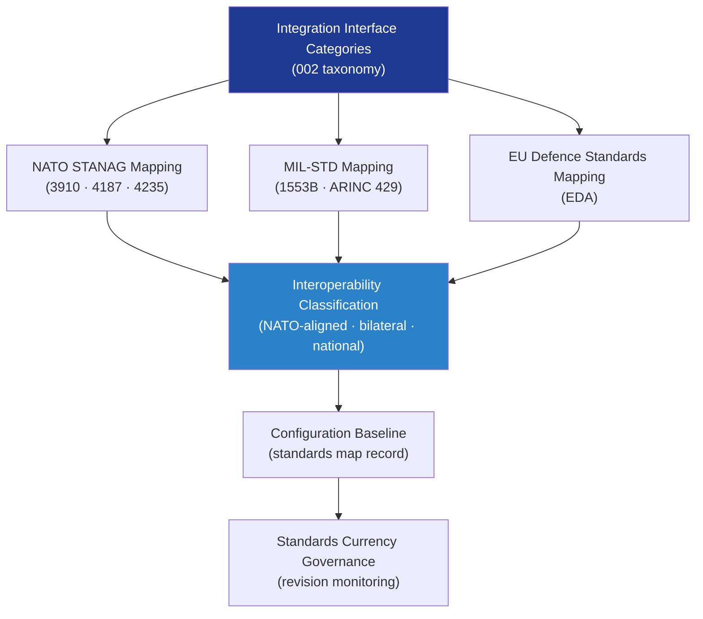

# DTTA 200-209 · Section 00 · Subsection 204 · Subsubject 008 — Interoperability, NATO/EU and Standards Mapping

## 1. Purpose

Provides the **interoperability classification and NATO/EU standards mapping** for platform-effector integration within the DTTA band. This subsubject establishes how integration interfaces are mapped to relevant NATO STANAG, EU defence, and international standards — and defines the governance obligations for maintaining standards traceability across the integration configuration baseline.

**Non-operational boundary.** This subsubject provides standards mapping and interoperability classification for governance and traceability purposes only. It does not define interface implementation requirements, interoperability test procedures, NATO operational integration protocols, or any parameter enabling cross-platform operational use.

## 2. Scope

- Covers the *Interoperability, NATO/EU and Standards Mapping* subsubject (`008`) of subsection `204`.
- Inherits Q-Division authority and ORB support from the parent row in [`../../README.md` §3](../../README.md#3-architecture-table)[^archtable].
- Concepts in scope:
  - **NATO STANAG mapping** — Cross-reference of integration interface categories to applicable NATO STANAGs (STANAG 3910[^stanag3910], STANAG 4187[^stanag4187], STANAG 4235[^stanag4235]) for interface governance purposes.
  - **EU defence standards mapping** — Cross-reference to applicable European Defence Agency (EDA) and EU standards for integration governance.
  - **MIL-STD interface standards mapping** — Cross-reference of data interface categories to MIL-STD-1553B[^milstd1553] and ARINC 429[^arinc429] for governance classification.
  - **Interoperability classification** — Classification of integration interfaces as NATO-aligned, bilateral, or national-only for configuration baseline and export-control governance purposes.
  - **Standards currency governance** — Governance obligations for monitoring standards revisions, updating the mapping table, and maintaining traceability across configuration baseline versions.
- Out of scope: export-control governance (`009`) and lifecycle traceability (`010`).

## 3. Diagram — Standards Mapping Structure

## 4. Footprint

| Metric | Value |
|---|---|
| Architecture | `DTTA` — Defence Technology Type Architecture |
| Master range | `200–299` |
| Code range | `200-209` |
| Section | `00` — Sistemas de Combate y Armamento |
| Subsection | `204` — Integración Plataforma-Efector |
| Subsubject | `008` — Interoperability, NATO/EU and Standards Mapping |
| Primary Q-Division | Q-DATAGOV[^qdiv] |
| Support Q-Divisions | Q-SPACE, Q-HORIZON, Q-HPC, Q-STRUCTURES, Q-INDUSTRY |
| ORB support | ORB-LEG, ORB-PMO, ORB-FIN |
| Governance class | `restricted`[^gov] |
| Folder path | `Q+ATLANTIDE/200-299_DTTA/200-209_Sistemas-de-Combate-y-Armamento/204_Integracion-Plataforma-Efector/` |
| Document | `008_Interoperability-NATO-EU-and-Standards-Mapping.md` (this file) |
| Parent subsection | [`README.md`](./README.md) · [`000_Overview.md`](./000_Overview.md) |
| Parent architecture | [`../../README.md`](../../README.md) |
| Parent baseline | [`organization/Q+ATLANTIDE.md`](../../../../organization/Q+ATLANTIDE.md) |

## 5. References & Citations

[^baseline]: **Q+ATLANTIDE controlled baseline (v1.0.0)** — [`organization/Q+ATLANTIDE.md`](../../../../organization/Q+ATLANTIDE.md).

[^archtable]: **§3 — Architecture Table (parent)** — [`../../README.md` §3](../../README.md#3-architecture-table).

[^qdiv]: **Q-Division authority** — Q-Divisions provide technical authority over an architecture row (Q+ATLANTIDE Note N-002). See [`organization/Q+ATLANTIDE.md` §4](../../../../organization/Q+ATLANTIDE.md#4-notes).

[^gov]: **Governance class** — `restricted` per N-006 for DTTA band documents.

[^stanag3910]: **NATO STANAG 3910 — High Speed Data Bus** — NATO standard governing high-speed fibre-optic data bus interface classification for avionics and stores integration.

[^stanag4187]: **NATO STANAG 4187 — Fuze Safety Design Requirements** — NATO standard for fuze and effector interface safety requirements applicable to integration governance classification.

[^stanag4235]: **NATO STANAG 4235 — Adopted Items of NATO Equipment and NATO Codification** — Codification standard for NATO interface equipment identification and classification.

[^milstd1553]: **MIL-STD-1553B — Aircraft Internal Time Division Command/Response Multiplex Data Bus** — Standard for data bus interface classification in avionics integration mapping.

[^arinc429]: **ARINC 429 — Mark 33 Digital Information Transfer System** — Civil/military standard for data interface classification in integration governance mapping.

### Applicable standards

- NATO STANAG 3910 — High Speed Data Bus[^stanag3910]
- NATO STANAG 4187 — Fuze Safety Design Requirements[^stanag4187]
- NATO STANAG 4235 — NATO Equipment Codification[^stanag4235]
- MIL-STD-1553B — Aircraft Internal Time Division Command/Response Multiplex Data Bus[^milstd1553]
- ARINC 429 — Mark 33 Digital Information Transfer System[^arinc429]
