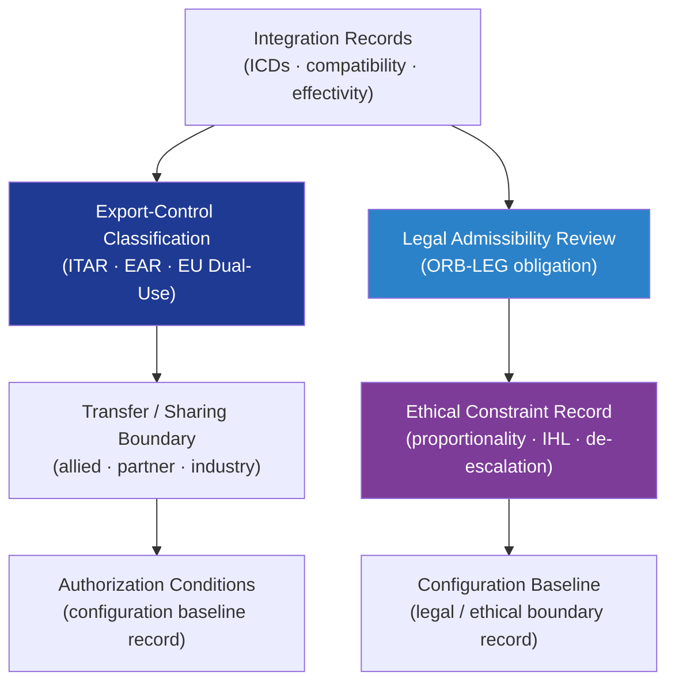

# DTTA 200-209 · Section 00 · Subsection 204 · Subsubject 009 — Export Control, Legal and Ethical Boundaries

## 1. Purpose

Defines the **export-control classification, legal boundary and ethical constraint framework** for platform-effector integration governance within the DTTA band. This subsubject establishes how integration configuration records, interface-control documents, and compatibility data are subject to export-control classification, legal review obligations, and ethical boundary constraints.

**Non-operational boundary.** This subsubject defines classification, legal review obligations, and ethical constraints for integration governance records only. It does not define export procedures, licence application content, national security review processes, or any operational step enabling export or transfer.

## 2. Scope

- Covers the *Export Control, Legal and Ethical Boundaries* subsubject (`009`) of subsection `204`.
- Inherits Q-Division authority and ORB support from the parent row in [`../../README.md` §3](../../README.md#3-architecture-table)[^archtable].
- Concepts in scope:
  - **Export-control classification** — Governance model for classifying integration configuration records, interface-control documents, and compatibility data under applicable export-control regimes (ITAR[^itar], EAR[^ear], EU Dual-Use Regulation[^eudu]) — abstract classification for governance purposes.
  - **Legal admissibility boundary** — Requirements for ensuring that integration governance records satisfy legal admissibility standards for review, audit, and regulatory inspection.
  - **Ethical constraint framework** — Ethical boundaries applicable to integration governance: proportionality, humanitarian law compliance, non-discrimination constraints, and de-escalation obligation records; not operational engagement rules.
  - **ORB-LEG review obligations** — Governance obligations for legal review by ORB-LEG before configuration baseline changes that affect export-controlled integration records.
  - **Transfer and sharing boundary** — Classification of integration records for information-sharing governance: which records may be shared with allied nations, partners, or industry under what authorization conditions.
- Out of scope: lifecycle traceability and evidence governance (`010`).

## 3. Diagram — Export Control and Legal Governance

## 4. Footprint

| Metric | Value |
|---|---|
| Architecture | `DTTA` — Defence Technology Type Architecture |
| Master range | `200–299` |
| Code range | `200-209` |
| Section | `00` — Sistemas de Combate y Armamento |
| Subsection | `204` — Integración Plataforma-Efector |
| Subsubject | `009` — Export Control, Legal and Ethical Boundaries |
| Primary Q-Division | Q-DATAGOV[^qdiv] |
| Support Q-Divisions | Q-SPACE, Q-HORIZON, Q-HPC, Q-STRUCTURES, Q-INDUSTRY |
| ORB support | ORB-LEG, ORB-PMO, ORB-FIN |
| Governance class | `restricted`[^gov] |
| Folder path | `Q+ATLANTIDE/200-299_DTTA/200-209_Sistemas-de-Combate-y-Armamento/204_Integracion-Plataforma-Efector/` |
| Document | `009_Export-Control-Legal-and-Ethical-Boundaries.md` (this file) |
| Parent subsection | [`README.md`](./README.md) · [`000_Overview.md`](./000_Overview.md) |
| Parent architecture | [`../../README.md`](../../README.md) |
| Parent baseline | [`organization/Q+ATLANTIDE.md`](../../../../organization/Q+ATLANTIDE.md) |

## 5. References & Citations

[^baseline]: **Q+ATLANTIDE controlled baseline (v1.0.0)** — [`organization/Q+ATLANTIDE.md`](../../../../organization/Q+ATLANTIDE.md).

[^archtable]: **§3 — Architecture Table (parent)** — [`../../README.md` §3](../../README.md#3-architecture-table).

[^qdiv]: **Q-Division authority** — Q-Divisions provide technical authority over an architecture row (Q+ATLANTIDE Note N-002). See [`organization/Q+ATLANTIDE.md` §4](../../../../organization/Q+ATLANTIDE.md#4-notes).

[^gov]: **Governance class** — `restricted` per N-006 for DTTA band documents.

[^itar]: **ITAR — International Traffic in Arms Regulations (22 CFR Parts 120–130)** — US export-control framework for defence articles and services; governs classification and transfer of integration records for US-derived technology.

[^ear]: **EAR — Export Administration Regulations (15 CFR Parts 730–774)** — US dual-use export-control framework governing integration records with dual-use technology classification.

[^eudu]: **EU Dual-Use Regulation (EU) 2021/821** — EU export-control framework for dual-use items; governs classification and transfer governance of integration configuration records involving EU-regulated technology.

[^ihl]: **International Humanitarian Law — Geneva Conventions and Additional Protocols** — Ethical and legal framework anchoring proportionality, IHL compliance, and de-escalation obligations in integration governance records.

### Applicable standards and frameworks

- ITAR — International Traffic in Arms Regulations[^itar]
- EAR — Export Administration Regulations[^ear]
- EU Dual-Use Regulation (EU) 2021/821[^eudu]
- International Humanitarian Law — Geneva Conventions and Additional Protocols[^ihl]
