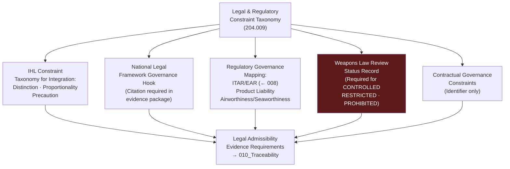

# DTTA 200-209 · Section 00 · Subsection 204 · Subsubject 009 — Legal and Regulatory Constraints

## 1. Purpose

This subsubject establishes the governance taxonomy of legal and regulatory constraints applicable to platform-effector integration documentation within subsection `204`. It maps IHL obligations, national legal frameworks, regulatory standards and NATO governance instruments to governance requirements at the taxonomy layer — providing traceability hooks for evidence packaging and legal admissibility review.

## 2. Scope

- Covers the *Legal and Regulatory Constraints* subsubject (`009`) of subsection `204`.
- Concepts in scope:
  - **IHL constraint taxonomy for integration** — The governance classification of IHL principles (distinction, proportionality, precaution) as they apply specifically to platform-effector integration governance: ensuring integration documentation supports lawful use governance.
  - **National legal framework governance hooks** — The governance requirement that all evidence packages in subsection `204` include a national legal framework citation establishing the applicable legal regime for platform-effector integration governance.
  - **Regulatory governance mapping** — The governance mapping of regulatory instruments (ITAR/EAR from subsubject `008`, product liability frameworks, airworthiness/seaworthiness regulations) to evidence requirements at the governance taxonomy layer.
  - **Weapons law review governance** — The governance requirement that platform-effector integration taxonomy entries for effectors classified `CONTROLLED`, `RESTRICTED` or `PROHIBITED` include a weapons law review status record — not the review content.
  - **Contractual governance constraints** — The governance requirement that evidence packages reference applicable contractual legal instruments (defence procurement contracts, end-user agreements) by identifier only, without revealing content.
- Out of scope: legal advice on IHL compliance, specific weapons law review findings, national legal interpretations, product liability assessments, specific contract terms, and any operational legal clearance procedures.

## 3. Diagram — Legal and Regulatory Constraint Governance Map

## 4. Footprint

| Metric | Value |
|---|---|
| Architecture | `DTTA` — Defence Technology Type Architecture |
| Master range | `200–299` |
| Code range | `200-209` |
| Section | `00` — Sistemas de Combate y Armamento |
| Subsection | `204` — Integración Plataforma-Efector |
| Subsubject | `009` — Legal and Regulatory Constraints |
| Primary Q-Division | Q-DATAGOV |
| Support Q-Divisions | Q-SPACE, Q-HORIZON, Q-HPC, Q-STRUCTURES, Q-INDUSTRY |
| ORB support | ORB-LEG, ORB-PMO, ORB-FIN |
| Governance class | `restricted` |
| Document | `009_Legal-and-Regulatory-Constraints.md` (this file) |
| Subsection index | [`README.md`](./README.md) |
| Parent section | [`../README.md`](../README.md) |
| Parent baseline | [`organization/Q+ATLANTIDE.md`](../../../../organization/Q+ATLANTIDE.md) |

## 5. References & Citations

[^geneva]: **Geneva Conventions (1949) and Additional Protocols I & II** — IHL constraint taxonomy for integration governance: distinction (AP I Art. 48), proportionality (AP I Art. 51.5b), precaution (AP I Art. 57).
[^itar]: **ITAR — 22 CFR Parts 120–130** — Export control legal framework; referenced as regulatory governance mapping anchor from subsubject `008`.
[^ear]: **EAR — 15 CFR Parts 730–774** — Dual-use export control legal framework; regulatory governance mapping.
[^milstd882e]: **MIL-STD-882E** — DoD Standard Practice: System Safety. Legal and regulatory context for mishap liability governance.
[^defstan]: **DEF STAN 00-056 Issue 5** — Safety Management Requirements for Defence Systems. Legal regulatory constraint context for defence system safety governance.
[^natoaqap]: **NATO AQAP-2110** — NATO Quality Assurance Requirements. Contractual governance requirements for NATO platform-effector integration.
[^n006]: **Note N-006 (Restricted bands)** — Defence-related (`200-299` DTTA) bands require additional governance, evidence packages and access controls. See [`organization/Q+ATLANTIDE.md` §5.3](../../../../organization/Q+ATLANTIDE.md#53-restricted-band-templates-n-006).
