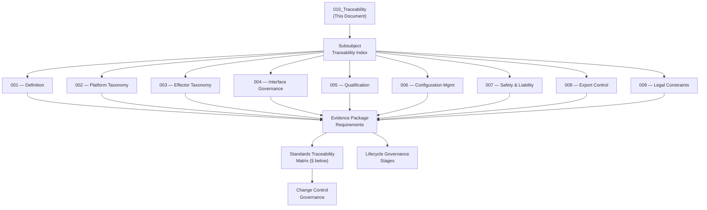

# DTTA 200-209 · Section 00 · Subsection 204 · Subsubject 010 — Traceability, Evidence and Lifecycle Governance

## 1. Purpose

This subsubject is the closing governance document for subsection `204`. It establishes the traceability architecture, evidence-packaging requirements and lifecycle governance framework for all subsubjects `001`–`009`. It provides the standards traceability matrix and lifecycle governance model used for audit, legal admissibility and evidence package certification across the full subsection.

## 2. Scope

- Covers the *Traceability, Evidence and Lifecycle Governance* subsubject (`010`) of subsection `204`.
- Concepts in scope:
  - **Traceability architecture** — The governance-layer model linking each subsubject `001`–`009` document to its applicable standards citations, evidence package identifiers and human authority records.
  - **Evidence package requirements** — The minimum content requirements for a governance-complete evidence package: document ID, version, authority attribution, standards citation, export-control classification and hazard/risk traceability.
  - **Standards traceability matrix** — The mapping of applicable standards to the specific subsubjects they govern, with traceability to governance requirements within each subsubject.
  - **Lifecycle governance stages** — The governance lifecycle stages: `PENDING`, `ACTIVE`, `UNDER-REVIEW`, `SUPERSEDED`, `ARCHIVED` — with governance requirements for each stage transition.
  - **Change control governance** — The governance requirements for change control: change initiator identification, impact assessment, re-authorization and evidence package update.
- Out of scope: operational lifecycle management, engineering change management systems, software configuration management tools, and any system operational lifecycle events.

## 3. Diagram — Traceability and Evidence Architecture

## 4. Standards Traceability Matrix

| Standard | Subsubjects Governed | Key Requirement Mapped |
|---|---|---|
| **MIL-STD-882E** | 001, 002, 003, 005, 007, 008, 009 | System safety hazard analysis, interface hazard analysis, mishap categories |
| **DEF STAN 00-056 Issue 5** | 001, 002, 005, 006, 007, 009 | Safety management, safety case, configuration control, defence system lifecycle |
| **NATO STANAG 4235** | 002, 003, 005, 007 | Insensitive munitions requirements; effector and platform classification governance |
| **MIL-STD-1553B** | 003, 004 | Data bus interface category governance; abstract classification anchor |
| **NATO AQAP-2110** | 004, 005, 006, 008, 009 | Quality assurance, supply-chain governance, qualification, contractual governance |
| **AS9100D** | 005, 006, 008 | Certification governance, configuration management, supply-chain quality |
| **ITAR — 22 CFR 120–130** | 001, 003, 008, 009 | Export control classification; restricted and prohibited effector governance |
| **EAR — 15 CFR 730–774** | 008, 009 | Dual-use export control governance mapping |
| **Geneva Conventions / AP I & II** | 001, 009 | IHL constraint taxonomy for integration governance |

## 5. Footprint

| Metric | Value |
|---|---|
| Architecture | `DTTA` — Defence Technology Type Architecture |
| Master range | `200–299` |
| Code range | `200-209` |
| Section | `00` — Sistemas de Combate y Armamento |
| Subsection | `204` — Integración Plataforma-Efector |
| Subsubject | `010` — Traceability, Evidence and Lifecycle Governance |
| Primary Q-Division | Q-DATAGOV |
| Support Q-Divisions | Q-SPACE, Q-HORIZON, Q-HPC, Q-STRUCTURES, Q-INDUSTRY |
| ORB support | ORB-LEG, ORB-PMO, ORB-FIN |
| Governance class | `restricted` |
| Document | `010_Traceability-Evidence-and-Lifecycle-Governance.md` (this file) |
| Subsection index | [`README.md`](./README.md) |
| Parent section | [`../README.md`](../README.md) |
| Parent baseline | [`organization/Q+ATLANTIDE.md`](../../../../organization/Q+ATLANTIDE.md) |

## 6. References & Citations

[^milstd882e]: **MIL-STD-882E** — DoD Standard Practice: System Safety (2012). Primary system safety standard for subsection `204`.
[^defstan]: **DEF STAN 00-056 Issue 5** — Safety Management Requirements for Defence Systems. Safety case and lifecycle governance.
[^stanag4235]: **NATO STANAG 4235** — Insensitive Munitions Requirements. Platform and effector classification governance.
[^milstd1553b]: **MIL-STD-1553B** — Military Standard: Aircraft Internal Time Division Data Bus. Interface governance anchor.
[^natoaqap]: **NATO AQAP-2110** — NATO Quality Assurance Requirements. Quality and supply-chain governance.
[^as9100d]: **AS9100D** — Quality Management Systems for Aviation, Space, and Defense.
[^itar]: **ITAR/EAR** — International Traffic in Arms Regulations / Export Administration Regulations.
[^geneva]: **Geneva Conventions (1949) and Additional Protocols I & II** — IHL foundational instruments.
[^n006]: **Note N-006 (Restricted bands)** — See [`organization/Q+ATLANTIDE.md` §5.3](../../../../organization/Q+ATLANTIDE.md#53-restricted-band-templates-n-006).
