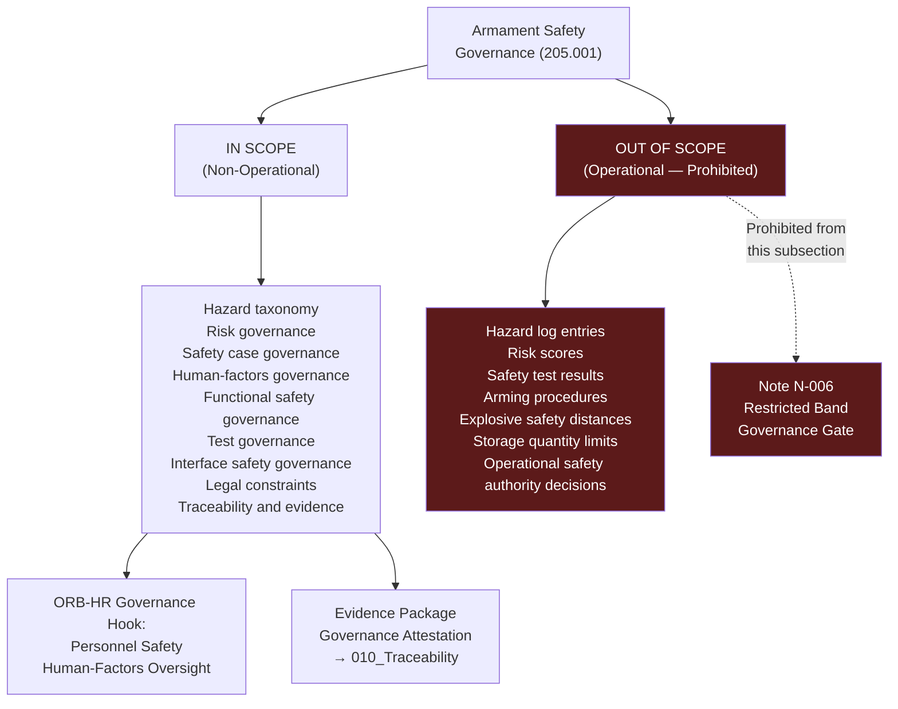

# DTTA 200-209 · Section 00 · Subsection 205 · Subsubject 001 — Armament Safety Non-Operational Definition

## 1. Purpose

This subsubject establishes the foundational non-operational definition of armament safety governance within DTTA `200-209` subsection `205`. It defines the governance boundary distinguishing admissible non-operational content (governance taxonomy, classification, traceability, evidence packaging) from prohibited operational content (hazard analysis results, safety test data, operational risk controls, arming/firing safety procedures).

## 2. Scope

- Covers the *Armament Safety Non-Operational Definition* subsubject (`001`) of subsection `205`.
- Concepts in scope:
  - **Non-operational definition boundary** — The explicit governance demarcation between non-operational armament safety governance content (admissible) and operational armament safety engineering content (not admissible in this subsection).
  - **Armament safety governance concept** — The abstract governance concept of "armament safety" as a taxonomy node: the set of governance processes, classifications, evidence requirements and lifecycle controls that govern armament safety at the non-operational governance layer.
  - **Governance scope of subsection 205** — The formal statement of what subsection `205` governs: hazard taxonomy, risk governance, safety case governance, human-factors governance, functional safety governance, test governance, interface safety governance, legal constraints and traceability. Not engineering safety analyses or operational procedures.
  - **Prohibited operational content** — The explicit list of content types excluded: hazard log entries, risk assessment scores, safety test results, arming procedure specifications, explosive safety distances, storage quantity limits, and operational safety authority decisions.
  - **ORB-HR governance rationale** — The governance justification for `ORB-HR` inclusion: armament safety governance has direct implications for personnel safety and human-factors governance, requiring HR function oversight at the governance layer.
- Out of scope: all items listed under prohibited operational content above, plus weapon system performance specifications, explosive ordnance disposal procedures, and any operational armament safety management activities.

## 3. Diagram — Armament Safety Governance Boundary

## 4. Footprint

| Metric | Value |
|---|---|
| Architecture | `DTTA` — Defence Technology Type Architecture |
| Master range | `200–299` |
| Code range | `200-209` |
| Section | `00` — Sistemas de Combate y Armamento |
| Subsection | `205` — Seguridad de Armamento y Control de Riesgos |
| Subsubject | `001` — Armament Safety Non-Operational Definition |
| Primary Q-Division | Q-DATAGOV |
| Support Q-Divisions | Q-SPACE, Q-HORIZON, Q-HPC, Q-STRUCTURES, Q-INDUSTRY |
| ORB support | ORB-LEG, ORB-PMO, ORB-FIN, **ORB-HR** |
| Governance class | `restricted` |
| Document | `001_Armament-Safety-Non-Operational-Definition.md` (this file) |
| Subsection index | [`README.md`](./README.md) |
| Parent section | [`../README.md`](../README.md) |
| Parent baseline | [`organization/Q+ATLANTIDE.md`](../../../../organization/Q+ATLANTIDE.md) |

## 5. References & Citations

[^milstd882e]: **MIL-STD-882E** — DoD Standard Practice: System Safety (2012). Scope definition context for armament safety governance versus operational safety engineering.
[^defstan]: **DEF STAN 00-056 Issue 5** — Safety Management Requirements for Defence Systems. Governance scope for defence system safety management.
[^stanag4119]: **NATO STANAG 4119 Ed. 4** — Common NATO Fuze Design Safety and Suitability for Service. Armament safety governance scope context.
[^iso31000]: **ISO 31000:2018** — Risk Management: Guidelines. Non-operational risk governance principles informing subsection `205` scope.
[^n006]: **Note N-006 (Restricted bands)** — Defence-related (`200-299` DTTA) bands require additional governance, evidence packages and access controls. See [`organization/Q+ATLANTIDE.md` §5.3](../../../../organization/Q+ATLANTIDE.md#53-restricted-band-templates-n-006).
