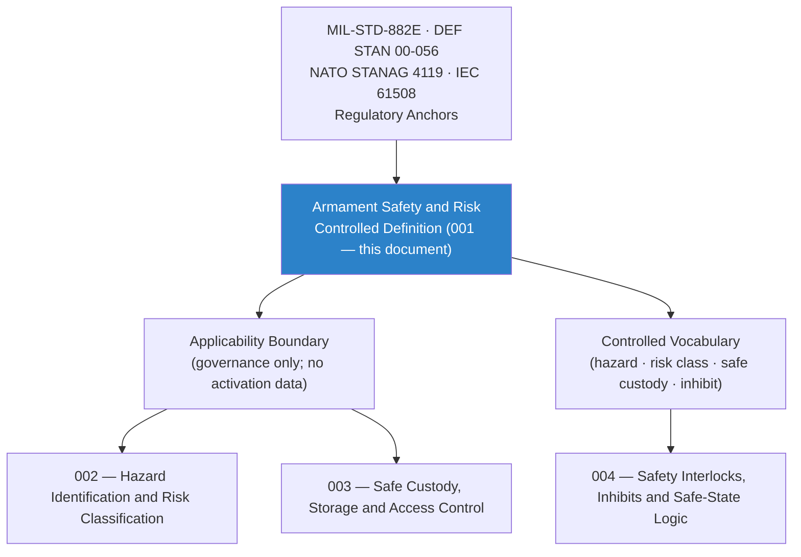

# DTTA 200-209 · Section 00 · Subsection 205 · Subsubject 001 — Armament Safety and Risk Controlled Definition

## 1. Purpose

Establishes the **normative controlled definition and governance scope of armament safety and risk control** within the Q+ATLANTIDE DTTA band. This subsubject defines the terms *armament safety* and *armament risk control* in a restricted, non-operational, taxonomy context — covering the controlled vocabulary, applicability boundaries, and regulatory anchors governing all armament safety governance activities within the `205` subsection.

**Non-operational boundary.** This definition does not specify weapon construction, activation methods, tactical employment, targeting, deployment procedures, safety device implementation, or any parameter enabling or disabling armament functions. All references remain abstract, governance-scoped and legally reviewable.

## 2. Scope

- Covers the *Armament Safety and Risk Controlled Definition* subsubject (`001`) of subsection `205`.
- Inherits Q-Division authority and ORB support from the parent row in [`../../README.md` §3](../../README.md#3-architecture-table)[^archtable].
- Concepts in scope:
  - **Controlled definition of armament safety** — The aggregate of governance measures, design constraints, custody protocols, authorization requirements, and lifecycle evidence obligations that ensure armament systems and items do not cause unintended harm throughout their governed lifecycle.
  - **Controlled definition of risk control** — The systematic identification, classification, and governance response to armament-related hazards — expressed as governance taxonomy and evidence obligations, not operational risk calculations.
  - **Applicability boundary** — Applies to armament systems, sub-systems, and items subject to DTTA governance within `200-209`; excludes weapon construction data, activation parameters, and operational safety procedures.
  - **Controlled vocabulary** — *armament*, *hazard*, *risk class*, *safe custody*, *inhibit*, *authorization gate*, *safe state*, *lifecycle evidence*, *two-person control*.
  - **Regulatory anchors** — Cross-map to MIL-STD-882E[^milstd882e], DEF STAN 00-056[^defstan056], NATO STANAG 4119[^stanag4119], IEC 61508[^iec61508], and ISO 31000[^iso31000].
- Out of scope: specific hazard identification and classification (`002`), safe custody governance (`003`), and safety interlock classifications (`004`).

## 3. Diagram — Armament Safety and Risk Definition Framework

## 4. Footprint

| Metric | Value |
|---|---|
| Architecture | `DTTA` — Defence Technology Type Architecture |
| Master range | `200–299` |
| Code range | `200-209` |
| Section | `00` — Sistemas de Combate y Armamento |
| Subsection | `205` — Seguridad de Armamento y Control de Riesgos |
| Subsubject | `001` — Armament Safety and Risk Controlled Definition |
| Primary Q-Division | Q-DATAGOV[^qdiv] |
| Support Q-Divisions | Q-SPACE, Q-HORIZON, Q-HPC, Q-STRUCTURES, Q-INDUSTRY |
| ORB support | ORB-LEG, ORB-PMO, ORB-FIN, ORB-HR |
| Governance class | `restricted`[^gov] |
| Folder path | `Q+ATLANTIDE/200-299_DTTA/200-209_Sistemas-de-Combate-y-Armamento/205_Seguridad-de-Armamento-y-Control-de-Riesgos/` |
| Document | `001_Armament-Safety-and-Risk-Controlled-Definition.md` (this file) |
| Parent subsection | [`README.md`](./README.md) · [`000_Overview.md`](./000_Overview.md) |
| Parent architecture | [`../../README.md`](../../README.md) |
| Parent baseline | [`organization/Q+ATLANTIDE.md`](../../../../organization/Q+ATLANTIDE.md) |

## 5. References & Citations

[^baseline]: **Q+ATLANTIDE controlled baseline (v1.0.0)** — [`organization/Q+ATLANTIDE.md`](../../../../organization/Q+ATLANTIDE.md).

[^archtable]: **§3 — Architecture Table (parent)** — [`../../README.md` §3](../../README.md#3-architecture-table).

[^qdiv]: **Q-Division authority** — Q-Divisions provide technical authority over an architecture row (Q+ATLANTIDE Note N-002). See [`organization/Q+ATLANTIDE.md` §4](../../../../organization/Q+ATLANTIDE.md#4-notes).

[^gov]: **Governance class** — `restricted` per N-006 for DTTA band documents.

[^milstd882e]: **MIL-STD-882E — System Safety** — Governing US DoD standard for hazard identification, risk assessment and mitigation across defence system lifecycles.

[^defstan056]: **DEF STAN 00-056 Issue 5 — Safety Management Requirements for Defence Systems** — UK MoD standard for safety case structure, hazard log governance, and risk control evidence.

[^stanag4119]: **NATO STANAG 4119 — Adoption of a Common NATO Fuze Interface** — NATO standard providing safety and interface classification for armament-fuze governance.

[^iec61508]: **IEC 61508 — Functional Safety of E/E/PE Safety-related Systems** — International functional safety standard governing safety integrity levels for armament safety-critical functions.

[^iso31000]: **ISO 31000 — Risk Management — Guidelines** — International standard establishing the risk management framework and vocabulary used in armament risk classification governance.

### Applicable standards

- MIL-STD-882E — System Safety[^milstd882e]
- DEF STAN 00-056 Issue 5 — Safety Management Requirements[^defstan056]
- NATO STANAG 4119 — Common NATO Fuze Interface[^stanag4119]
- IEC 61508 — Functional Safety[^iec61508]
- ISO 31000 — Risk Management Guidelines[^iso31000]
