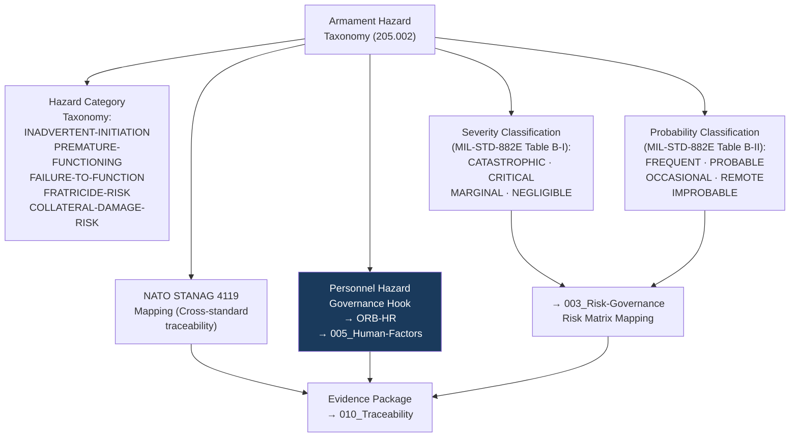

# DTTA 200-209 · Section 00 · Subsection 205 · Subsubject 002 — Armament Hazard Classification and Taxonomy

## 1. Purpose

This subsubject establishes the governance taxonomy of armament hazard types within subsection `205`. It provides abstract hazard classification dimensions used for governance traceability, evidence packaging and regulatory mapping — not for producing hazard analyses or logging specific hazards for any system.

## 2. Scope

- Covers the *Armament Hazard Classification and Taxonomy* subsubject (`002`) of subsection `205`.
- Concepts in scope:
  - **Hazard category taxonomy** — The governance classification of armament hazard categories: `INADVERTENT-INITIATION`, `PREMATURE-FUNCTIONING`, `FAILURE-TO-FUNCTION`, `FRATRICIDE-RISK`, `COLLATERAL-DAMAGE-RISK` — as abstract governance identifiers for traceability only.
  - **Hazard severity classification** — The governance taxonomy of hazard severity levels (derived from MIL-STD-882E Table B-I): `CATASTROPHIC`, `CRITICAL`, `MARGINAL`, `NEGLIGIBLE` — as governance-layer classification constructs for risk governance (subsubject `003`) mapping.
  - **Hazard probability classification** — The governance taxonomy of hazard probability levels (derived from MIL-STD-882E Table B-II): `FREQUENT`, `PROBABLE`, `OCCASIONAL`, `REMOTE`, `IMPROBABLE` — as governance constructs for evidence traceability.
  - **NATO hazard classification mapping** — The abstract governance mapping of NATO STANAG 4119 hazard categories to MIL-STD-882E hazard severity taxonomy for cross-standard traceability.
  - **Personnel hazard governance hook** — The governance taxonomy of personnel hazard categories — those hazard types with direct implications for personnel safety — as the governance basis for `ORB-HR` function support in this subsection.
- Out of scope: specific hazard log entries, hazard analysis results, probability calculations, consequence modelling, explosive fragmentation hazard assessments, shock and blast hazard parameters, and any system-specific hazard characterization.

## 3. Diagram — Armament Hazard Classification Taxonomy

## 4. Footprint

| Metric | Value |
|---|---|
| Architecture | `DTTA` — Defence Technology Type Architecture |
| Master range | `200–299` |
| Code range | `200-209` |
| Section | `00` — Sistemas de Combate y Armamento |
| Subsection | `205` — Seguridad de Armamento y Control de Riesgos |
| Subsubject | `002` — Armament Hazard Classification and Taxonomy |
| Primary Q-Division | Q-DATAGOV |
| Support Q-Divisions | Q-SPACE, Q-HORIZON, Q-HPC, Q-STRUCTURES, Q-INDUSTRY |
| ORB support | ORB-LEG, ORB-PMO, ORB-FIN, **ORB-HR** |
| Governance class | `restricted` |
| Document | `002_Armament-Hazard-Classification-and-Taxonomy.md` (this file) |
| Subsection index | [`README.md`](./README.md) |
| Parent section | [`../README.md`](../README.md) |
| Parent baseline | [`organization/Q+ATLANTIDE.md`](../../../../organization/Q+ATLANTIDE.md) |

## 5. References & Citations

[^milstd882e]: **MIL-STD-882E** — DoD Standard Practice: System Safety. Hazard category definitions (Appendix A); severity classification (Table B-I); probability classification (Table B-II). Primary hazard classification source for subsection `205`.
[^stanag4119]: **NATO STANAG 4119 Ed. 4** — Common NATO Fuze Design Safety and Suitability for Service. NATO hazard classification context for cross-standard traceability mapping.
[^defstan]: **DEF STAN 00-056 Issue 5** — Safety Management Requirements for Defence Systems. Defence-specific hazard classification governance (Clause 6).
[^stanag2888]: **STANAG 2888** — NATO Standard for Storage and Transport of Military Ammunition and Explosives. Storage and transport hazard classification governance context.
[^n006]: **Note N-006 (Restricted bands)** — Defence-related (`200-299` DTTA) bands require additional governance, evidence packages and access controls. See [`organization/Q+ATLANTIDE.md` §5.3](../../../../organization/Q+ATLANTIDE.md#53-restricted-band-templates-n-006).
