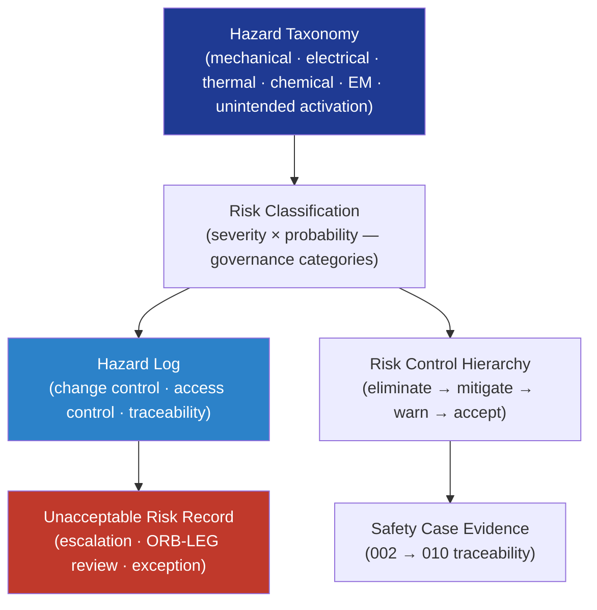

# DTTA 200-209 · Section 00 · Subsection 205 · Subsubject 002 — Hazard Identification and Risk Classification

## 1. Purpose

Defines the **governance framework for armament hazard identification and risk classification** within the DTTA band. This subsubject establishes the hazard taxonomy, risk classification criteria, and hazard log governance obligations applicable to armament systems and items — providing the structured basis for risk control, safety case construction, and lifecycle evidence generation.

**Non-operational boundary.** This subsubject defines hazard taxonomy categories and risk classification governance only. It does not specify hazard calculations, quantitative risk thresholds, weapon-specific hazard parameters, explosive material properties, or operational risk-acceptance criteria.

## 2. Scope

- Covers the *Hazard Identification and Risk Classification* subsubject (`002`) of subsection `205`.
- Inherits Q-Division authority and ORB support from the parent row in [`../../README.md` §3](../../README.md#3-architecture-table)[^archtable].
- Concepts in scope:
  - **Hazard taxonomy** — Classification of armament hazard categories under MIL-STD-882E[^milstd882e]: mechanical, electrical, thermal, chemical, electromagnetic, and unintended activation; each defined as a governance category with associated evidence obligations.
  - **Risk classification criteria** — Governance model for classifying risks by severity and probability categories per MIL-STD-882E and ISO 31000[^iso31000]; expressed as governance criteria, not quantitative calculation methods.
  - **Hazard log governance** — Structure, authority, maintenance, and access-control obligations for the armament hazard log; including change-control requirements and traceability to the safety case.
  - **Unacceptable risk governance** — Governance model for recording unacceptable risk determinations, escalation obligations, ORB-LEG review triggers, and authorized exception records.
  - **Risk control hierarchy** — Governance description of the preferred risk control priority order (eliminate → mitigate → warn → accept); expressed as governance policy, not engineering methods.
- Out of scope: safe custody governance (`003`), safety interlock classification (`004`), and human authority controls (`005`).

## 3. Diagram — Hazard Identification and Risk Classification Governance

## 4. Footprint

| Metric | Value |
|---|---|
| Architecture | `DTTA` — Defence Technology Type Architecture |
| Master range | `200–299` |
| Code range | `200-209` |
| Section | `00` — Sistemas de Combate y Armamento |
| Subsection | `205` — Seguridad de Armamento y Control de Riesgos |
| Subsubject | `002` — Hazard Identification and Risk Classification |
| Primary Q-Division | Q-DATAGOV[^qdiv] |
| Support Q-Divisions | Q-SPACE, Q-HORIZON, Q-HPC, Q-STRUCTURES, Q-INDUSTRY |
| ORB support | ORB-LEG, ORB-PMO, ORB-FIN, ORB-HR |
| Governance class | `restricted`[^gov] |
| Folder path | `Q+ATLANTIDE/200-299_DTTA/200-209_Sistemas-de-Combate-y-Armamento/205_Seguridad-de-Armamento-y-Control-de-Riesgos/` |
| Document | `002_Hazard-Identification-and-Risk-Classification.md` (this file) |
| Parent subsection | [`README.md`](./README.md) · [`000_Overview.md`](./000_Overview.md) |
| Parent architecture | [`../../README.md`](../../README.md) |
| Parent baseline | [`organization/Q+ATLANTIDE.md`](../../../../organization/Q+ATLANTIDE.md) |

## 5. References & Citations

[^baseline]: **Q+ATLANTIDE controlled baseline (v1.0.0)** — [`organization/Q+ATLANTIDE.md`](../../../../organization/Q+ATLANTIDE.md).

[^archtable]: **§3 — Architecture Table (parent)** — [`../../README.md` §3](../../README.md#3-architecture-table).

[^qdiv]: **Q-Division authority** — Q-Divisions provide technical authority over an architecture row (Q+ATLANTIDE Note N-002). See [`organization/Q+ATLANTIDE.md` §4](../../../../organization/Q+ATLANTIDE.md#4-notes).

[^gov]: **Governance class** — `restricted` per N-006 for DTTA band documents.

[^milstd882e]: **MIL-STD-882E — System Safety** — Primary governing standard for armament hazard identification taxonomy, severity and probability classification, and risk control hierarchy.

[^defstan056]: **DEF STAN 00-056 Issue 5 — Safety Management Requirements for Defence Systems** — Governs hazard log structure, unacceptable risk escalation, and safety case evidence obligations.

[^iso31000]: **ISO 31000 — Risk Management — Guidelines** — Provides risk classification vocabulary and governance framework for armament risk control.

### Applicable standards

- MIL-STD-882E — System Safety[^milstd882e]
- DEF STAN 00-056 Issue 5 — Safety Management Requirements[^defstan056]
- ISO 31000 — Risk Management Guidelines[^iso31000]
