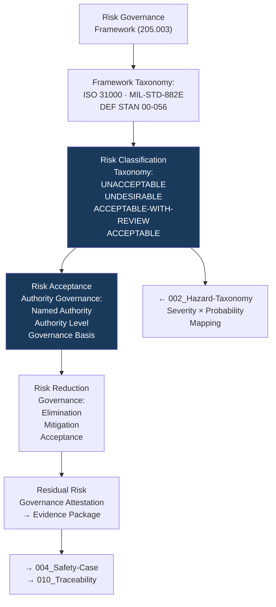

# DTTA 200-209 · Section 00 · Subsection 205 · Subsubject 003 — Risk Governance Framework and Risk Classification

## 1. Purpose

This subsubject establishes the governance framework for risk classification and risk acceptance governance within armament safety subsection `205`. It maps ISO 31000 and MIL-STD-882E risk governance principles to armament safety evidence requirements — not as a risk management execution framework, but as a governance taxonomy for evidence packaging and traceability.

## 2. Scope

- Covers the *Risk Governance Framework and Risk Classification* subsubject (`003`) of subsection `205`.
- Concepts in scope:
  - **Risk governance framework taxonomy** — The governance classification of risk governance frameworks applicable to armament safety: ISO 31000 risk management principles, MIL-STD-882E risk matrix, and DEF STAN 00-056 risk acceptance criteria — as governance-layer framework identifiers.
  - **Risk classification taxonomy** — The governance classification of risk levels derived from hazard severity (subsubject `002`) × hazard probability: `UNACCEPTABLE`, `UNDESIRABLE`, `ACCEPTABLE-WITH-REVIEW`, `ACCEPTABLE` — as governance constructs for evidence-package risk classification records.
  - **Risk acceptance authority governance** — The abstract governance model of risk acceptance authority: the governance requirement that each risk classification record identifies a named risk acceptance authority, their authority level, and the governance basis for their acceptance.
  - **Risk reduction governance** — The governance taxonomy of risk reduction approaches (hazard elimination, risk mitigation, risk acceptance) as abstract governance categories — not engineering mitigation measures.
  - **Residual risk governance attestation** — The governance requirement that all evidence packages in subsection `205` include a residual risk governance attestation: a governance-level statement that residual risks have been reviewed by the risk acceptance authority.
- Out of scope: specific risk scores, risk matrix calculations, mitigation measure engineering specifications, risk acceptance records for specific systems, and any operational risk management activities.

## 3. Diagram — Risk Governance Framework

## 4. Footprint

| Metric | Value |
|---|---|
| Architecture | `DTTA` — Defence Technology Type Architecture |
| Master range | `200–299` |
| Code range | `200-209` |
| Section | `00` — Sistemas de Combate y Armamento |
| Subsection | `205` — Seguridad de Armamento y Control de Riesgos |
| Subsubject | `003` — Risk Governance Framework and Risk Classification |
| Primary Q-Division | Q-DATAGOV |
| Support Q-Divisions | Q-SPACE, Q-HORIZON, Q-HPC, Q-STRUCTURES, Q-INDUSTRY |
| ORB support | ORB-LEG, ORB-PMO, ORB-FIN, **ORB-HR** |
| Governance class | `restricted` |
| Document | `003_Risk-Governance-Framework-and-Risk-Classification.md` (this file) |
| Subsection index | [`README.md`](./README.md) |
| Parent section | [`../README.md`](../README.md) |
| Parent baseline | [`organization/Q+ATLANTIDE.md`](../../../../organization/Q+ATLANTIDE.md) |

## 5. References & Citations

[^iso31000]: **ISO 31000:2018** — Risk Management: Guidelines. Risk governance framework principles, risk classification model, and risk acceptance governance concepts.
[^milstd882e]: **MIL-STD-882E** — DoD Standard Practice: System Safety. Risk assessment matrix (Table B-III); risk acceptance criteria; risk reduction approach taxonomy (Appendix B).
[^defstan]: **DEF STAN 00-056 Issue 5** — Safety Management Requirements for Defence Systems. Risk acceptance criteria and residual risk governance requirements (Clause 7).
[^stanag4119]: **NATO STANAG 4119 Ed. 4** — Common NATO Fuze Design Safety and Suitability for Service. NATO risk classification context for cross-standard mapping.
[^natoaqap]: **NATO AQAP-2110** — NATO Quality Assurance Requirements. Quality governance requirements for risk classification records in evidence packages.
[^n006]: **Note N-006 (Restricted bands)** — Defence-related (`200-299` DTTA) bands require additional governance, evidence packages and access controls. See [`organization/Q+ATLANTIDE.md` §5.3](../../../../organization/Q+ATLANTIDE.md#53-restricted-band-templates-n-006).
