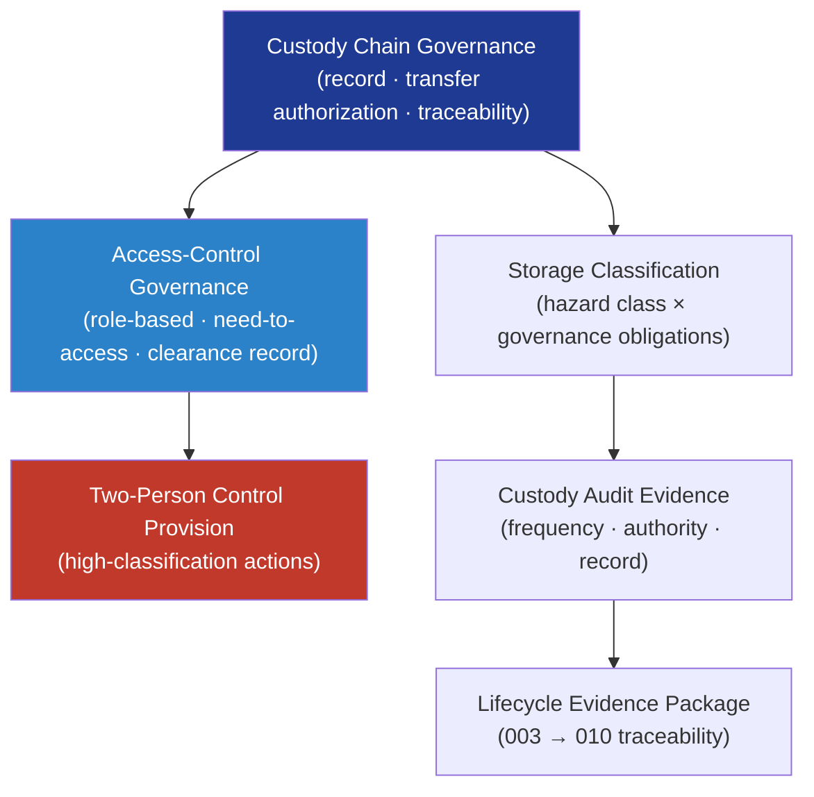

# DTTA 200-209 · Section 00 · Subsection 205 · Subsubject 003 — Safe Custody, Storage and Access Control

## 1. Purpose

Defines the **governance model for safe custody, storage classification and access-control requirements** for armament systems and items within the DTTA band. This subsubject establishes how custody records, storage classification, and access-control governance obligations are structured — ensuring that armament items are tracked, classified for custody risk, and subject to authorized-access governance throughout their lifecycle.

**Non-operational boundary.** This subsubject defines custody governance structures, storage classification categories, and access-control governance models only. It does not specify physical storage facility designs, lock and key specifications, guard protocols, explosive storage separation distances, or any operational custody procedure.

## 2. Scope

- Covers the *Safe Custody, Storage and Access Control* subsubject (`003`) of subsection `205`.
- Inherits Q-Division authority and ORB support from the parent row in [`../../README.md` §3](../../README.md#3-architecture-table)[^archtable].
- Concepts in scope:
  - **Custody chain governance** — Governance model for the continuous, accountable chain of custody for armament items: custody record structure, transfer authorization obligations, and traceability requirements.
  - **Storage classification** — Taxonomy of storage classification categories for armament items based on hazard class and access-control requirements; each category carries defined governance obligations.
  - **Access-control governance** — Governance model for who may access, handle, or be proximate to armament items: role-based authorization, need-to-access principle, background clearance record obligations, and access-log traceability.
  - **Two-person control provision** — Governance provision requiring two authorized personnel for high-classification custody actions; defined as a governance policy, not an operational procedure.
  - **Custody audit evidence** — Evidence obligations for custody audits: frequency, authority, record structure, and traceability to the lifecycle evidence package.
- Out of scope: safety interlock classification (`004`), human authority and two-person authorization controls (`005`), and incident reporting (`006`).

## 3. Diagram — Safe Custody and Access Control Governance

## 4. Footprint

| Metric | Value |
|---|---|
| Architecture | `DTTA` — Defence Technology Type Architecture |
| Master range | `200–299` |
| Code range | `200-209` |
| Section | `00` — Sistemas de Combate y Armamento |
| Subsection | `205` — Seguridad de Armamento y Control de Riesgos |
| Subsubject | `003` — Safe Custody, Storage and Access Control |
| Primary Q-Division | Q-DATAGOV[^qdiv] |
| Support Q-Divisions | Q-SPACE, Q-HORIZON, Q-HPC, Q-STRUCTURES, Q-INDUSTRY |
| ORB support | ORB-LEG, ORB-PMO, ORB-FIN, ORB-HR |
| Governance class | `restricted`[^gov] |
| Folder path | `Q+ATLANTIDE/200-299_DTTA/200-209_Sistemas-de-Combate-y-Armamento/205_Seguridad-de-Armamento-y-Control-de-Riesgos/` |
| Document | `003_Safe-Custody-Storage-and-Access-Control.md` (this file) |
| Parent subsection | [`README.md`](./README.md) · [`000_Overview.md`](./000_Overview.md) |
| Parent architecture | [`../../README.md`](../../README.md) |
| Parent baseline | [`organization/Q+ATLANTIDE.md`](../../../../organization/Q+ATLANTIDE.md) |

## 5. References & Citations

[^baseline]: **Q+ATLANTIDE controlled baseline (v1.0.0)** — [`organization/Q+ATLANTIDE.md`](../../../../organization/Q+ATLANTIDE.md).

[^archtable]: **§3 — Architecture Table (parent)** — [`../../README.md` §3](../../README.md#3-architecture-table).

[^qdiv]: **Q-Division authority** — Q-Divisions provide technical authority over an architecture row (Q+ATLANTIDE Note N-002). See [`organization/Q+ATLANTIDE.md` §4](../../../../organization/Q+ATLANTIDE.md#4-notes).

[^gov]: **Governance class** — `restricted` per N-006 for DTTA band documents.

[^stanag2888]: **NATO STANAG 2888 — Marking of Hazardous Areas** — NATO standard for hazard marking and access-control classification in armament storage areas.

[^milstd882e]: **MIL-STD-882E — System Safety** — Governs custody chain safety evidence obligations and access-control requirements for hazardous armament items.

[^defstan056]: **DEF STAN 00-056 Issue 5 — Safety Management Requirements for Defence Systems** — Governs safe-custody governance obligations and audit evidence requirements for UK MoD armament programmes.

### Applicable standards

- NATO STANAG 2888 — Marking of Hazardous Areas[^stanag2888]
- MIL-STD-882E — System Safety[^milstd882e]
- DEF STAN 00-056 Issue 5 — Safety Management Requirements[^defstan056]
